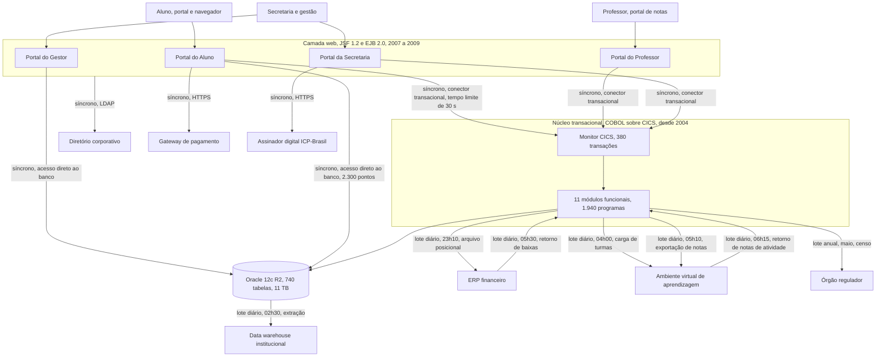

# Arquitetura de linha de base

A ACME é uma universidade privada brasileira fictícia, com 38.400 alunos ativos, cujo sistema acadêmico foi construído ao longo de duas décadas. Esta página descreve a arquitetura em operação em 2026, chamada de linha de base, com a composição dos módulos, a idade de cada componente, a ordem de grandeza do código, o efetivo que sustenta cada parte, o tipo de cada integração e a dívida técnica medida.

Arquitetura de linha de base é a descrição da estrutura existente antes de qualquer decisão de evolução. Ela serve de referência para o relatório de lacunas e para o dimensionamento do esforço de transição.

## Visão geral dos componentes

O sistema tem quatro camadas. O núcleo transacional em COBOL executa sob o monitor CICS em ambiente de grande porte e concentra as regras acadêmicas. O banco Oracle guarda o estado. A camada web em Java serve os quatro portais de acesso. A camada de integração move arquivos entre a ACME, o ERP financeiro e o ambiente virtual de aprendizagem.

## Módulos do núcleo transacional

O núcleo reúne 11 módulos funcionais, com 2,8 milhões de linhas de COBOL distribuídas em 1.940 programas, 620 mapas de tela do CICS e 380 transações. O ano indicado é o da primeira entrada em produção do módulo.

| Módulo | Ano | Linhas de COBOL | Observação |
| --- | --- | --- | --- |
| Cadastro acadêmico | 2004 | 210.000 | Registro de aluno, curso e situação |
| Oferta e grade curricular | 2004 | 240.000 | Montagem semestral da oferta de 4.900 turmas |
| Matrícula | 2005 | 460.000 | Maior módulo e maior concentração de regra de negócio |
| Avaliação e notas | 2006 | 320.000 | Cálculo de média, situação e dependência |
| Frequência | 2006 | 150.000 | Apuração de faltas e reprovação por infrequência |
| Histórico e documentos | 2007 | 280.000 | Emissão de histórico, declaração e atestado |
| Bolsas e descontos | 2009 | 330.000 | Regras de financiamento estudantil e convênio |
| Biblioteca | 2010 | 190.000 | Empréstimo, reserva e débito |
| Censo e obrigações regulatórias | 2011 | 340.000 | Extração anual para o órgão regulador |
| Estágio e atividades complementares | 2013 | 160.000 | Convênio, termo e carga horária |
| Diploma digital | 2019 | 120.000 | Emissão assinada, único módulo posterior a 2015 |

O módulo de matrícula é o mais sensível do conjunto. Ele concentra 16% do código do núcleo, responde por 71% do volume transacional das janelas críticas e depende do módulo de bolsas e descontos para calcular o valor da parcela antes de confirmar a inscrição em disciplina.

## Camada web

A camada web tem 410.000 linhas de Java escritas entre 2007 e 2009, com JSF 1.2 e EJB 2.0 sobre servidor de aplicação cuja versão saiu de suporte do fornecedor em 2018. São 220 telas distribuídas em quatro aplicações.

| Aplicação | Ano | Telas | Público |
| --- | --- | --- | --- |
| Portal do Aluno | 2007 | 84 | 38.400 alunos ativos |
| Portal do Professor | 2008 | 46 | 2.150 professores |
| Portal da Secretaria | 2008 | 62 | 310 usuários administrativos |
| Portal do Gestor | 2009 | 28 | 95 coordenadores e diretores |

Nenhuma das quatro aplicações tem versão responsiva. O Portal do Aluno exige navegador com suporte a um componente de calendário descontinuado, o que restringe o uso em telefone celular e é a reclamação mais frequente registrada pelo service desk.

## Banco de dados

O banco é Oracle Database 12c Release 2, com 740 tabelas e 11 TB de dados em produção. O suporte estendido dessa versão encerrou em 31/03/2022, e a instituição opera sem correção de segurança do fornecedor desde então. O banco é compartilhado entre o núcleo COBOL e a camada Java, sem separação de esquema por responsabilidade.

Existem 2.300 pontos no código Java que leem ou gravam tabelas do núcleo diretamente, contornando as transações CICS. Esses pontos são a principal barreira à extração incremental de módulos, porque qualquer mudança de estrutura de tabela tem efeito em dois códigos-fonte mantidos por equipes distintas.

## Efetivo de sustentação

A sustentação do sistema acadêmico envolve 27 pessoas, entre equipe interna e fábrica contratada.

| Parte sustentada | Pessoas | Vínculo | Escassez |
| --- | --- | --- | --- |
| Núcleo COBOL e CICS | 6 | Fábrica contratada | Idade média de 54 anos, 2 aposentadorias previstas para 2027 |
| Camada web em Java | 9 | 6 internos e 3 da fábrica | Sem escassez, mas sem experiência em JSF 1.2 nos contratados desde 2021 |
| Banco de dados Oracle | 3 | Internos | 1 profissional acumula a função de segurança de dados |
| Integrações e execução de lotes | 4 | Internos | Operação noturna coberta por sobreaviso de 2 pessoas |
| Infraestrutura de grande porte | 3 | Fornecedor do contrato de capacidade | Serviço prestado remotamente, sem presença na instituição |
| Atendimento de segundo nível | 2 | Internos | Fila compartilhada com outros sistemas da instituição |

Entre os 6 profissionais de COBOL, apenas 1 domina o módulo de matrícula em profundidade suficiente para alterar a regra de prioridade de vaga. Essa concentração é o risco de pessoal mais citado nas atas do comitê de TI.

## Integrações síncronas

| Integração | Protocolo | Tempo limite | Observação |
| --- | --- | --- | --- |
| Portais para o núcleo CICS | Conector transacional proprietário | 30 s | Caminho de todas as operações acadêmicas |
| Camada Java para o Oracle | Conexão direta ao banco | 60 s | 2.300 pontos de acesso fora do núcleo |
| Portal do Aluno para gateway de pagamento | HTTPS | 15 s | Geração de boleto e cobrança em cartão |
| Portal da Secretaria para assinador digital | HTTPS | 45 s | Assinatura de histórico e diploma |
| Portais para o diretório corporativo | LDAP | 10 s | Autenticação de todos os perfis |

## Integrações em lote

Nenhuma troca com o ERP financeiro ou com o ambiente virtual de aprendizagem é síncrona. Toda propagação ocorre por arquivo, em janelas noturnas fixas.

| Lote | Horário de início | Duração média | Sentido | Conteúdo |
| --- | --- | --- | --- | --- |
| Exportação de lançamentos financeiros | 23h10 | 1h40 | ACME para ERP | Mensalidade, multa e desconto do dia |
| Extração para o data warehouse | 02h30 | 1h10 | Oracle para data warehouse | Cópia integral de 140 tabelas |
| Carga de turmas e matrículas | 04h00 | 55 min | ACME para ambiente virtual | Turma, matrícula e vínculo docente |
| Exportação de notas consolidadas | 05h10 | 50 min | ACME para ambiente virtual | Nota consolidada e situação por disciplina, 4.800 lançamentos em dia letivo comum e até 360.000 na janela de fechamento |
| Retorno de baixas de pagamento | 05h30 | 40 min | ERP para ACME | Confirmação de pagamento e inadimplência |
| Retorno de notas e frequência de atividades | 06h15 | 35 min | Ambiente virtual para ACME | Nota de atividade avaliativa e presença |
| Extração do censo da educação superior | Maio, anual | 6h20 | ACME para órgão regulador | Base completa de alunos, docentes e cursos |

Os lotes são sequenciais, com uma exceção. A exportação de notas das 05h10 e o retorno de baixas de pagamento das 05h30 correm em paralelo por 30 minutos. Os dois têm sentidos opostos, da ACME para o ambiente virtual e do ERP para a ACME, e não disputam o mesmo arquivo, mas disputam a mesma capacidade de processamento noturna. Essa concorrência é característica declarada da linha de base, não um erro de agendamento. A janela das 23h00 às 07h00 está saturada, porque os seis lotes diários somam 5h50 de execução em 8 horas de janela, e não há espaço para acrescentar um lote novo sem sobreposição.

A janela de lote vai das 23h00 às 07h00. A consequência operacional é a latência de propagação. Uma matrícula confirmada às 09h00 só aparece no ambiente virtual de aprendizagem no dia seguinte, às 04h55. Uma nota lançada pelo professor às 15h00 só chega ao ambiente virtual às 06h00 do dia seguinte, porque depende do lote de exportação de notas das 05h10. Um pagamento compensado só é refletido na situação do aluno cerca de 30 horas depois da transação bancária. O requisito R7 da [página inicial do caso](index.md), que pede propagação de nota em até 10 minutos, é incompatível com essa estrutura de lote.

## Dívida técnica medida

Os indicadores abaixo foram levantados pela Diretoria de TI no inventário técnico concluído em 31/08/2026.

| Indicador | Valor |
| --- | --- |
| Programas COBOL sem documentação atualizada | 312 de 1.940 |
| Programas em produção sem código-fonte correspondente identificado | 41 |
| Cobertura de teste automatizado no núcleo COBOL | 0% |
| Cobertura de teste automatizado na camada Java | 7% |
| Pontos de acesso direto ao banco fora do núcleo | 2.300 |
| Prazo médio entre pedido aprovado e entrega em produção | 34 dias úteis |
| Frequência da janela de implantação | Mensal, terceiro sábado |
| Alterações emergenciais fora de janela nos últimos 12 meses | 14 |
| Demandas abertas na fila de sustentação | 186 |
| Idade mediana das demandas abertas | 9 meses |
| Ambientes disponíveis | Produção e homologação, sem ambiente de teste de carga |

A ausência de ambiente de teste de carga explica por que os incidentes de janela crítica descritos nos [dados operacionais](dados-operacionais.md) só se manifestam em produção.
