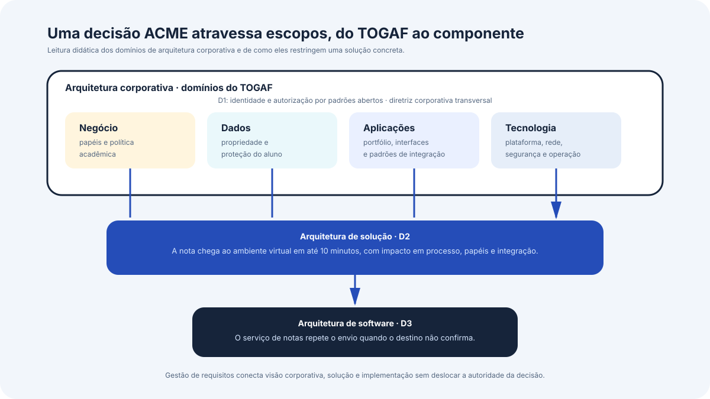

# Arquitetura de soluções e arquitetura de software

Este bloco responde à questão que organiza a disciplina inteira, o que distingue a arquitetura de soluções da arquitetura de software, e que tipo de decisão cabe a cada uma.

## Antes de começar

- [Arquitetura de solução](../referencia/glossario.md#arquitetura-de-solucao)
- [Arquitetura de software](../referencia/glossario.md#arquitetura-de-software)
- [Arquitetura corporativa](../referencia/glossario.md#arquitetura-corporativa)
- [Componentes da solução](../referencia/glossario.md#componentes-da-solucao)

## O que é Arquitetura de Solução?

Uma abordagem arquitetural de um problema faz três movimentos. Vê o problema inteiro e como ele pode ser resolvido de forma **conceitual**, decompõe o problema em componentes e constrói modelos que mostram como eles funcionam juntos de forma **lógica**, e enumera as mudanças **físicas** necessárias para sair da situação atual e chegar à solução, possivelmente em etapas. Essa abordagem se opõe ao ajuste pontual, que resolve o sintoma imediato de forma estreita e costuma precisar ser desfeito quando a organização retoma o caminho de longo prazo.

Arquitetura, nesse enquadramento, é a estrutura e o comportamento inerentes de um sistema, que existem como resultado de projeto, de evolução, ou dos dois. A estrutura são os componentes e suas conexões, e o comportamento são os efeitos da operação do sistema. Dizer que a arquitetura é inerente significa que todo sistema tem uma, mesmo quando ninguém a analisou, projetou ou documentou. O documento que descreve essa estrutura e esse comportamento é a descrição de arquitetura, objeto da norma ISO/IEC/IEEE 42010.

> [!TIP]
> **Arquitetura de solução** é a disciplina responsável pela produção e pela gestão do plano de uma solução completa, que atende a uma necessidade, um problema ou uma oportunidade de negócio e se integra ao negócio em alinhamento com a estratégia, minimizando impactos negativos. Produção e gestão são duas responsabilidades distintas: coordenar as atividades de projeto, e assegurar que cada mudança seja testada, validada e acordada em todas as etapas.

**Já a Arquitetura de software** é o desenvolvimento e a documentação da estrutura e do comportamento de um sistema ou componente de software, incluindo suas interfaces internas e externas. Ela atua em vários níveis, da unidade de granularidade fina ao sistema inteiro, e responde por manter o software em linha com as diretrizes estratégicas, por modularidade, por cumprimento de acordos de nível de serviço e por manutenibilidade.

As duas definições não se contradizem, e a diferença entre elas está no alcance. Uma solução resolve um problema de negócio e depende de pessoas, estruturas organizacionais, processos, informação e tecnologia, os cinco tipos de componente que o arquiteto de solução usa como lista de verificação. O software é um desses componentes. Uma solução que troque um formulário em papel por um aplicativo, sem mudar quem aprova o pedido nem o prazo do processo, não resolveu o problema de negócio, ainda que o software esteja bem construído.

## Componentes de uma Solução

{ .module-diagram }

Figura 1. Os cinco tipos de componente da solução e os três movimentos da abordagem arquitetural. A tecnologia é um dos cinco componentes, e o software é apenas uma parte dela.

O infográfico reúne os dois conceitos apresentados nesta seção, a lista de verificação dos cinco componentes e a sequência conceitual, lógica e física descrita no primeiro parágrafo. A leitura recomendada parte do círculo central, percorre os cinco componentes e só então desce para a faixa dos três movimentos.

## Granularidade da arquitetura

A distinção operacional entre as disciplinas está na granularidade. A **arquitetura corporativa** opera no nível mais alto e emite diretrizes, políticas e princípios válidos para a organização inteira, necessariamente generalizados, organizados nos domínios de negócio, aplicações, dados, infraestrutura e segurança. A **arquitetura de solução** opera no nível intermediário, responde por uma solução inteira e se sobrepõe a três desses domínios, negócio, dados e aplicações, refinando o que a arquitetura corporativa definiu e acrescentando o detalhe que só interessa àquela solução. A **arquitetura de software** opera no nível mais específico e projeta os componentes de software que fazem parte de uma solução ou que prestam um serviço de infraestrutura.

### Exemplo no caso prático do curso

{ .module-diagram }

Figura 2. Os três níveis de arquitetura por alcance, pergunta que responde e artefato típico, com os cinco domínios de referência da arquitetura corporativa na faixa inferior.

As setas verticais do infográfico representam a relação de refinamento descrita nos parágrafos anteriores: os princípios e as políticas corporativas restringem as soluções, e cada solução é detalhada em sistemas e componentes de software. O sentido inverso também ocorre na prática, quando uma restrição encontrada no nível do software obriga a revisar o plano da solução, mas essa leitura pertence ao Bloco 4, sobre o processo de definição da arquitetura.

A tabela abaixo situa as três disciplinas no caso usado em todo o curso. A ACME é uma universidade privada brasileira fictícia, com 38.400 alunos ativos, cujo sistema acadêmico entrou em operação em 2004 e sustenta matrícula, avaliação, emissão de documentos e integração financeira, hoje em processo de modernização.

| Dimensão              | Arquitetura corporativa                                                      | Arquitetura de solução                                                                                                                                | Arquitetura de software                                                                            |
| --------------------- | ---------------------------------------------------------------------------- | ----------------------------------------------------------------------------------------------------------------------------------------------------- | -------------------------------------------------------------------------------------------------- |
| Alcance               | A organização inteira                                                        | Uma solução, do problema de negócio à entrega                                                                                                         | Um sistema ou componente de software                                                               |
| Pergunta que responde | Quais regras valem para todas as iniciativas                                 | Como este problema de negócio é resolvido, por inteiro                                                                                                | Como este software é estruturado por dentro e nas suas interfaces                                  |
| Horizonte             | Plurianual, revisado por ciclo de planejamento                               | O ciclo de vida da solução, da ideia à sustentação                                                                                                    | O ciclo de vida do componente                                                                      |
| Exemplo na ACME       | Identidade e autorização seguem padrões abertos, não um produto proprietário | A propagação de nota ao ambiente virtual deixa de ser lote diário e passa a ocorrer em até 10 minutos, com efeito sobre processo, papéis e integração | O serviço de notas publica um evento por lançamento e repete o envio quando o destino não confirma |
| Artefato típico       | Princípio, política, modelo de referência                                    | Plano da solução, desenho lógico, roteiro de entrega                                                                                                  | Modelo de componentes, especificação de interface, modelo de dados                                 |

{ .module-diagram }

Figura 3. As três declarações da tabela acima aplicadas à modernização do sistema acadêmico da ACME, uma por nível de arquitetura.

As três frases entre aspas no infográfico são as mesmas da linha "Exemplo na ACME" da tabela, e servem de teste de classificação: cada uma decide algo de alcance diferente sobre a mesma iniciativa de modernização. O Exercício 1 deste bloco amplia esse conjunto para nove decisões, de D1 a D9.

Essas mesmas três decisões, identificadas como D1, D2 e D3 no exercício ao fim do bloco, podem ser lidas de outro ângulo, o da estrutura de domínios que a arquitetura corporativa usa para organizar suas diretrizes.

{ .module-diagram }

Figura 4. Percurso das decisões D1, D2 e D3 da ACME, da diretriz corporativa transversal aos quatro domínios do TOGAF até a decisão de componente de software.

A leitura do diagrama começa pela faixa superior, onde D1 aparece como diretriz transversal, válida para os quatro domínios ao mesmo tempo, e não como conteúdo de um deles. As setas que descem indicam restrição, não derivação automática: a decisão de solução D2 precisa respeitar o que cada domínio estabeleceu, e a decisão de software D3 precisa respeitar D2, sem que nenhuma delas seja consequência necessária da anterior. A linha inferior do diagrama nomeia o mecanismo que mantém os três níveis conectados, a gestão de requisitos, cujo insumo é o levantamento tratado na Aula 2.

Duas ressalvas evitam confusão com o infográfico da Figura 2. O diagrama usa os quatro domínios de arquitetura do TOGAF, que são negócio, dados, aplicações e tecnologia, enquanto a Figura 2 lista cinco domínios de referência, porque separa segurança e infraestrutura dentro do que o TOGAF reúne sob tecnologia. Nenhuma das duas divisões é canônica para toda organização, e a escolha entre elas depende de como a arquitetura corporativa daquela instituição está estruturada. O diagrama também é uma leitura didática montada para este curso, e não reproduz notação oficial do framework, cujo ciclo de desenvolvimento de arquitetura tem representação própria.

A relação típica entre as duas disciplinas mais próximas segue quatro passos. A arquitetura de solução produz um desenho que contém requisitos passíveis de realização por software, esses requisitos são entregues à arquitetura de software para projeto, a equipe de desenvolvimento constrói ou adquire os componentes conforme o projeto, e as duas funções governam o processo. Há um passo anterior que costuma ser esquecido, e ele decorre do objetivo de minimizar o impacto sobre o negócio: antes de especificar componente novo, o arquiteto de solução precisa descobrir se o componente já existe na organização, consultando o catálogo de aplicações e, quando o catálogo não basta, a própria função de arquitetura de software.

### Como aplicar o grão correto

O critério prático para saber qual disciplina responde por uma decisão é o alcance do efeito. Se a decisão muda apenas a estrutura interna de um componente de software, e nenhuma outra parte da organização precisa ser avisada, ela é de arquitetura de software. Se a decisão muda processo, papel, propriedade de dado ou a relação com um fornecedor, ela é de arquitetura de solução, ainda que a execução seja inteiramente técnica. Se a decisão vale para iniciativas que nem existem ainda, ela é de arquitetura corporativa.

Na ACME, decidir que a matrícula não pode parar em período letivo não é decisão do arquiteto, e sim restrição imposta pela Pró-Reitoria de Graduação. Decidir que a transição ocorre por extração incremental de módulos, com o núcleo em COBOL em operação durante todo o percurso, é decisão de arquitetura de solução, porque afeta o contrato de sustentação, o calendário acadêmico e a rotina das equipes. Decidir como o módulo extraído mantém consistência com o núcleo durante a coexistência é decisão de arquitetura de software.

## Uso pelo arquiteto

O arquiteto usa essa distinção para saber de quem é a decisão que tem diante de si, e para não responder sozinho por escolhas que pertencem a outro nível. Levar uma decisão de arquitetura corporativa para dentro de uma solução isolada produz divergência entre iniciativas, e tratar uma decisão de solução como se fosse de software costuma deixar de fora exatamente os componentes que não são técnicos, o processo que precisa mudar e a área que precisa assumir uma responsabilidade nova.

A distinção também organiza a conversa com as partes interessadas. O patrocinador de negócio decide sobre a solução, não sobre o desenho interno dos componentes, e cobrar dele uma escolha técnica desloca a decisão para quem não tem elementos para tomá-la. A recíproca vale: pedir ao time de desenvolvimento que decida quem passa a ser dono de um dado transfere ao time uma decisão de alcance organizacional.

## Exercício 1

A ACME é uma universidade privada brasileira fictícia, com 38.400 alunos ativos, 2.150 professores e 4 campi, cujo sistema acadêmico entrou em operação em 2004 e sustenta matrícula, avaliação, emissão de documentos e integração com o ERP financeiro. O custo anual de propriedade do sistema é de R$ 15,83 milhões, o prazo médio entre pedido aprovado e entrega em produção é de 34 dias úteis, e a manutenção do núcleo em COBOL depende de 6 especialistas, dos quais 2 se aposentam em 2027. A instituição decidiu modernizar o sistema de forma incremental, sem substituí-lo por produto de mercado e sem reescrita em entrega única.

O quadro abaixo lista nove decisões tomadas ou propostas nesse contexto.

| Código | Decisão                                                                                                                              |
| ------ | ------------------------------------------------------------------------------------------------------------------------------------ |
| D1     | Identidade e autorização seguem padrões abertos, sem produto proprietário, em qualquer iniciativa da universidade                    |
| D2     | A propagação de nota ao ambiente virtual de aprendizagem deixa de ser lote diário e passa a ocorrer em até 10 minutos                |
| D3     | O serviço de notas repete o envio ao ambiente virtual quando não recebe confirmação, com intervalo crescente entre tentativas        |
| D4     | Nenhum dado pessoal de aluno é processado fora do território nacional                                                                |
| D5     | A Secretaria Acadêmica passa a responder pela correção de dado cadastral de aluno, hoje feita pela equipe de sustentação             |
| D6     | O índice de busca de disciplinas do portal passa a ser mantido em memória, para reduzir o tempo de resposta na abertura da matrícula |
| D7     | O núcleo em COBOL permanece sob o contrato da fábrica de software até 30/09/2027, e as alterações nele dependem desse fornecedor     |
| D8     | O histórico escolar é emitido com assinatura digital no padrão ICP-Brasil                                                            |
| D9     | A transição ocorre por extração incremental de módulos, com o núcleo em operação durante todo o percurso                             |

Responda às três perguntas abaixo.

1. Classifique cada uma das nove decisões em arquitetura corporativa, arquitetura de solução ou arquitetura de software, com uma linha de justificativa por decisão.
2. Escolha duas decisões que você classificou como de arquitetura de solução e indique, para cada uma, qual componente não tecnológico da solução ela afeta, entre pessoas, estruturas organizacionais, processos e informação.
3. Tome a decisão D3 e explique o que aconteceria se ela fosse tomada sem que D2 tivesse sido decidida antes.

## Fontes

As referências seguem o formato APA, 7ª edição, e constam da [bibliografia](../referencia/bibliografia.md) do curso. O trecho consultado aparece entre parênteses ao fim de cada entrada.

- Lovatt, M. (2021). *Solution architecture foundations*. BCS, The Chartered Institute for IT. (seções 1.1, 1.2, 2.2 e 2.8)
- International Organization for Standardization/International Electrotechnical Commission/Institute of Electrical and Electronics Engineers. (2022). *Systems and software engineering — Architecture description* (ISO/IEC/IEEE 42010:2022). (definição de descrição de arquitetura)

**Material do curso.** Glossário, entradas [arquitetura de solução](../referencia/glossario.md#arquitetura-de-solucao), [arquitetura de software](../referencia/glossario.md#arquitetura-de-software), [arquitetura corporativa](../referencia/glossario.md#arquitetura-corporativa) e [componentes da solução](../referencia/glossario.md#componentes-da-solucao). Dossiê da instituição fictícia [ACME](../caso-acme/index.md), porte da instituição, restrições fechadas e requisitos declarados.
