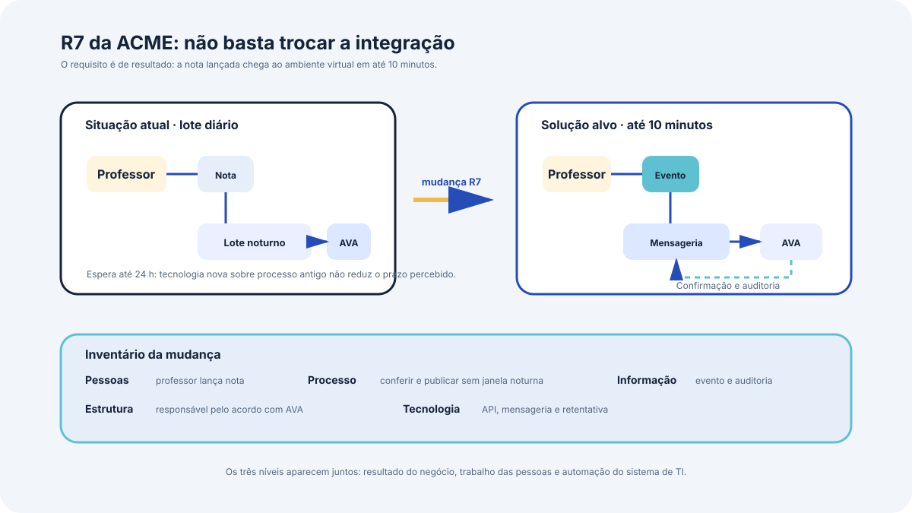

# A solução como sistema e seus componentes

Este bloco trata do objeto sobre o qual o arquiteto de solução trabalha, a solução vista como sistema, com seus cinco tipos de componente, os três níveis em que uma organização é modelada e o alinhamento com a estratégia.

## Antes de começar

- [Componentes da solução](../referencia/glossario.md#componentes-da-solucao)
- [Arquitetura de solução](../referencia/glossario.md#arquitetura-de-solucao)
- [Parte interessada](../referencia/glossario.md#parte-interessada)

## Conceito

Uma solução atende a um problema, um risco ou uma oportunidade da organização. Com o tempo, as soluções implantadas deixam de ser reconhecíveis como tais e passam a fazer parte do tecido da instituição, de modo que uma solução nova quase sempre substitui ou modifica uma solução anterior, mesmo quando ninguém a chamou assim na época.

{ .module-diagram }

A arquitetura de solução trata a solução como um sistema, com partes que interagem para produzir o comportamento exigido. As partes podem ser novas ou já existentes, podem ser compartilhadas com outras soluções, e interagem por interfaces nas quais informação é trocada. Essa leitura tem uma consequência direta: uma solução não é avaliada pela qualidade isolada de cada parte, e sim pelo comportamento que o conjunto produz.

### Os três níveis de uma organização

Uma organização pode ser modelada em três níveis encaixados. O **sistema de negócio** é a organização, ou uma unidade dela, tratada como sistema, com estrutura e comportamento próprios, que oferece serviços a clientes e parceiros por interfaces externas. O **sistema de informação** é um híbrido de processos conduzidos por pessoas e sistemas computacionais que gerencia a informação do negócio, e pode incluir atividades manuais. O **sistema de TI** é a combinação de equipamento e software que trata dados e informação dentro do contexto de um sistema de informação.

Na ACME, universidade privada brasileira fictícia com 38.400 alunos ativos e sistema acadêmico em operação desde 2004, a matrícula ilustra os três níveis. O sistema de negócio é o processo acadêmico de alocar alunos em turmas a cada semestre, com regras de pré-requisito, limite de vagas e prazos definidos pelo calendário. O sistema de informação abrange a orientação prestada pelo coordenador de curso, a conferência manual feita pela Secretaria Acadêmica nos casos de aproveitamento de disciplina e os registros que circulam entre essas pessoas. O sistema de TI é o portal do aluno, o núcleo em COBOL que calcula a situação do aluno e as integrações com o ambiente virtual de aprendizagem e com o ERP financeiro.

A arquitetura de solução ocupa-se de soluções que são sistemas de negócio contendo dentro de si sistemas de informação e sistemas de TI. Algumas soluções têm como foco um sistema de informação ou de TI novo ou modificado, e é raro que não haja envolvimento ou impacto mais amplo do negócio.

### Os cinco tipos de componente

Os componentes de uma solução classificam-se em cinco áreas, usadas como lista de verificação para que nenhuma delas fique de fora do desenho. Mudança, nesse contexto, inclui acrescentar componente novo, alterar um existente ou retirá-lo.

| Tipo | O que abrange | Exemplo na ACME |
| --- | --- | --- |
| Pessoas | Funcionários, clientes, parceiros, papéis, capacidades, habilidades e descrições de cargo | Professores que passam a lançar nota diretamente, com o treinamento correspondente |
| Estruturas organizacionais | Unidades, estruturas de gestão, terceirização, organizações parceiras, metas e acordos de nível de serviço | Fim da intermediação da fábrica de software na correção de dado cadastral, que volta para a Secretaria Acadêmica |
| Processos | Serviços de negócio, cadeia de valor, processos, políticas, regras de negócio e procedimentos | Fechamento de notas deixa de depender da janela noturna de lote |
| Informação | Entrada, saída, gatilho, retorno, auditoria e informação como produto | Trilha de auditoria de leitura de dado pessoal, com retenção de 5 anos |
| Tecnologia | Equipamento, software, comunicação, nuvem e automação | Mensageria entre o núcleo acadêmico e o ambiente virtual de aprendizagem |

O valor da lista está no que ela impede de esquecer. Uma solução que troque o lote diário por propagação em minutos, sem mudar a rotina de quem lança a nota nem o acordo de nível de serviço com o fornecedor do ambiente virtual, entrega tecnologia nova sobre processo antigo, e o resultado percebido pelo aluno tende a não mudar.

Nem todo tipo de componente precisa mudar em toda solução. O desenho declara explicitamente quando um tipo permanece como está, e essa declaração é diferente de esquecimento, porque registra que a análise foi feita e concluiu pela permanência.

### Alinhamento com a estratégia

A solução precisa sustentar, e idealmente reforçar, a estratégia de negócio e a estratégia de TI. A técnica de planejamento estratégico usada como referência organiza cinco níveis encaixados, visão, missão, objetivos, estratégia e táticas. A visão descreve a situação futura ideal, que nem sempre é alcançável, e serve para alinhar o entendimento de todos sobre o destino pretendido. Os objetivos tornam essa direção verificável, a estratégia define o caminho escolhido, e as táticas são as ações concretas que a realizam.

Para o arquiteto, a utilidade prática dessa cadeia é o teste de coerência. Uma solução proposta que não se ligue a nenhum objetivo declarado da organização, ou que contrarie uma estratégia vigente, precisa ser reformulada ou explicitamente negociada com quem responde pela estratégia. Na ACME, a meta de reduzir o custo anual de propriedade de R$ 15,83 milhões para R$ 11,0 milhões até o fim de 2029 é o objetivo ao qual qualquer decisão de plataforma precisa se ligar, e o contrato de capacidade do mainframe vigente até 31/12/2028 é o fato que impede tratar a redução como consequência automática da migração.

## Uso pelo arquiteto

O arquiteto usa os cinco tipos de componente em dois momentos. No levantamento, eles funcionam como roteiro de investigação, e cada tipo gera perguntas que a conversa técnica sozinha não faria, como quem passa a fazer o quê e qual política precisa mudar. No desenho, eles funcionam como conferência de completude, porque uma solução que só lista componentes de tecnologia é uma solução incompleta ou uma solução cuja parte organizacional foi deixada implicitamente para outra pessoa resolver.

Os três níveis servem para situar o alcance do que está sendo desenhado e para evitar um erro comum, o de tratar um problema de sistema de negócio como se fosse problema de sistema de TI. Quando a queixa é de que a nota demora a aparecer para o aluno, o nível de TI mostra o lote noturno, e o nível de negócio mostra que o calendário de fechamento e a rotina de conferência manual também determinam o prazo percebido.

## Exercício 2

A ACME é uma universidade privada brasileira fictícia, com 38.400 alunos ativos, dos quais 10.200 na graduação a distância, 2.150 professores e 4 campi em 3 cidades. O sistema acadêmico está em operação desde 2004 e sustenta matrícula, avaliação, emissão de documentos e integração com o ERP financeiro.

A Coordenação de Educação a Distância declarou o seguinte requisito, registrado como R7 no dossiê do caso: a nota lançada pelo professor chega ao ambiente virtual de aprendizagem em até 10 minutos. Hoje essa propagação ocorre por lote diário noturno, o que gera reclamação de aluno a cada fechamento. O ambiente virtual permanece em operação e não será substituído, por decisão da Reitoria de 12/03/2026, e o plano contratado do fornecedor que oferece interfaces de programação custa 38% a mais que o plano vigente.

Responda às três perguntas abaixo.

1. Monte o inventário de componentes da solução que atende ao R7, com pelo menos um componente em cada um dos cinco tipos, pessoas, estruturas organizacionais, processos, informação e tecnologia.
2. Indique qual dos cinco tipos exige a mudança de maior impacto sobre quem trabalha na instituição, e justifique em duas linhas.
3. Situe o requisito R7 nos três níveis, sistema de negócio, sistema de informação e sistema de TI, indicando o que pertence a cada nível. Em seguida, explique por que uma solução construída apenas no nível de sistema de TI pode não reduzir o prazo percebido pelo aluno.

## Fontes

As referências seguem o formato APA, 7ª edição, e constam da [bibliografia](../referencia/bibliografia.md) do curso. O trecho consultado aparece entre parênteses ao fim de cada entrada.

- Lovatt, M. (2021). *Solution architecture foundations*. BCS, The Chartered Institute for IT. (seções 1.2, 1.3, 1.4 e 1.8)

**Material do curso.** Glossário, entradas [componentes da solução](../referencia/glossario.md#componentes-da-solucao), [arquitetura de solução](../referencia/glossario.md#arquitetura-de-solucao) e [parte interessada](../referencia/glossario.md#parte-interessada). Dossiê da instituição fictícia [ACME](../caso-acme/index.md), porte da instituição, requisitos declarados e interesses em conflito.
