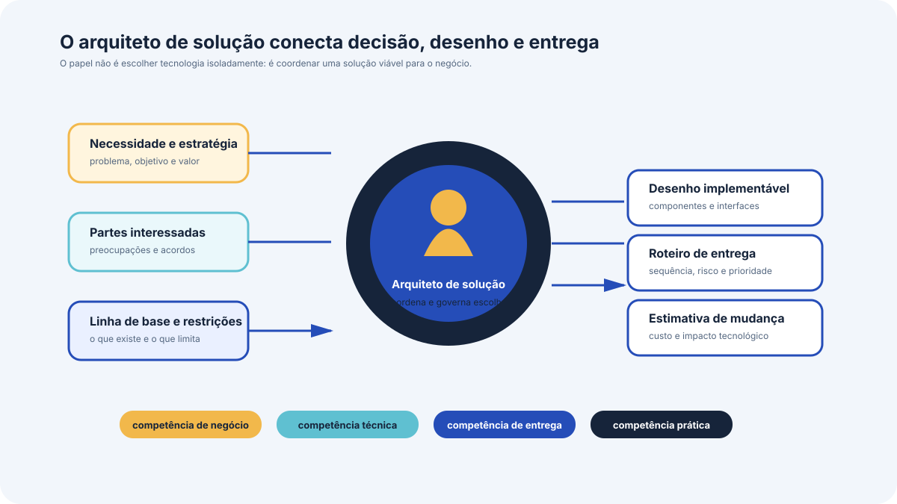

# O papel do arquiteto de solução

Este bloco descreve o que o arquiteto de solução faz, quais competências o papel exige, o que a arquitetura de solução entrega ao fim do trabalho e que benefícios a organização obtém ao adotar essa abordagem.

## Antes de começar

- [Arquiteto de solução](../referencia/glossario.md#arquiteto-de-solucao)
- [Parte interessada](../referencia/glossario.md#parte-interessada)
- [Arquitetura de solução](../referencia/glossario.md#arquitetura-de-solucao)
- [Bloco de construção da solução](../referencia/glossario.md#bloco-de-construcao-da-solucao)

## Conceito

{ .module-diagram }

Cada solução proposta costuma ser responsabilidade de um único arquiteto de solução. Problemas grandes demais são decompostos em áreas de tamanho realista, cada uma conduzida por um arquiteto, com a coordenação do conjunto a cargo de um arquiteto sênior. O risco de aceitar uma área de problema grande demais é ela não poder ser resolvida como unidade.

As atividades do papel começam antes de qualquer desenho. O arquiteto organiza o processo, interage com as partes interessadas, investiga a situação atual, levanta requisitos, propõe alternativas, modela a solução escolhida, valida o desenho com quem tem autoridade para aprová-lo e permanece com responsabilidade de governança durante a implantação. Parte interessada, na definição da norma ISO/IEC/IEEE 42010, é o indivíduo, a equipe, a organização ou a classe desses que tem interesse em um sistema.

### Competências exigidas

As competências do papel distribuem-se em quatro grupos, e nenhum deles é dispensável. No grupo de **negócio** entram a estratégia da organização, o modelo operacional atual e planejado, a política interna, os fatores comerciais e de mercado e a leitura do ambiente externo. No grupo **técnico** entram a estratégia técnica, a arquitetura de infraestrutura e de tecnologia vigente e planejada, e as abordagens metodológicas de desenvolvimento. No grupo de **entrega** entram gestão de projetos, de programas e de portfólio, gestão de mudança e de configuração, e gestão de riscos. No grupo **prático** entram comunicação, gestão de partes interessadas, tratamento de requisitos, resolução de problemas, inovação e liderança.

O papel se situa em dois eixos, com quatro extremidades. Um eixo vai de **negócio**, extremidade ocupada por papéis como o analista de negócio e o arquiteto de negócio, a **tecnologia**, extremidade ocupada por papéis como o engenheiro de sistemas e o arquiteto de infraestrutura. O outro eixo vai de **especificação**, que responde à necessidade de negócio produzindo o plano da solução, a **implementação**, que entrega a mudança equilibrando custo, recurso, risco e prazo. O arquiteto de solução fica mais próximo das extremidades de negócio e de especificação, e o arquiteto técnico fica mais próximo das extremidades de tecnologia e de implementação.

### O que o trabalho entrega

A arquitetura de solução produz três saídas principais, um desenho com detalhe suficiente para ser implementado, um roteiro de entrega da solução ao negócio, e uma estimativa do custo da mudança tecnológica. Os documentos e modelos usados e produzidos ao longo do caminho são chamados de artefatos e dividem-se em três categorias, entradas, entregáveis e produtos de trabalho intermediários.

Três artefatos de entrada aparecem no início de quase todo processo. A declaração de visão da solução registra que a organização identificou a necessidade de agir e como a solução poderia se parecer, em termos abstratos e com o mínimo de detalhe sobre a forma de resolver. O documento de iniciação da arquitetura dá autoridade à equipe para prosseguir, estima prazo e recurso e lista os entregáveis. O catálogo de requisitos de negócio reúne os requisitos de alto nível ligados diretamente ao problema, que serão ampliados na fase de descoberta.

### Benefícios da abordagem

A abordagem arquitetural traz sete benefícios que justificam o custo do processo. O primeiro é a **visão do todo**, porque a solução é tratada como sistema que reúne pessoas, estruturas organizacionais, processos, informação e tecnologia, e são raras as soluções bem-sucedidas que não mudam algo em cada uma dessas áreas. O segundo é o **alinhamento estratégico**, com a identificação do que é estratégico na fase de descoberta e o registro como dívida estratégica daquilo que precisou ser feito contra a estratégia por urgência. O terceiro é o **reúso**, favorecido pelo uso de modelos de componente e interface, que aumentam a chance de um componente existente ser identificado como adequado a mais de um uso.

O quarto é a **decisão baseada em evidência**, porque a modelagem da área do problema permite localizar a causa raiz e testar se a solução proposta de fato a resolve, em lugar de decidir por opinião. O quinto é o **custo e a perturbação mínimos**, obtidos pela comparação de alternativas por análise de lacunas, que procura a menor mudança capaz de produzir o resultado desejado, e por análise de impacto, que limita os efeitos colaterais. O sexto é a **redução de dependência**, obtida pelo encapsulamento de componentes com interfaces definidas, de modo que o interior de um componente mude sem repercussão sobre os demais. O sétimo é a **resolução precoce de conflito e de duplicação**, porque o escopo declarado e as análises de lacuna e de impacto revelam cedo quais outras iniciativas em curso tocam a mesma área.

## Uso pelo arquiteto

O arquiteto usa a lista de competências como diagnóstico da própria atuação e da composição da equipe. Quando o grupo de negócio está fraco, a solução tende a ser tecnicamente correta e desalinhada da estratégia. Quando o grupo de entrega está fraco, o desenho ignora a capacidade real de execução da organização e produz um roteiro que ninguém consegue cumprir.

A separação entre entradas, produtos intermediários e entregáveis organiza a negociação de prazo. O patrocinador costuma cobrar o desenho final desde a primeira semana, e é o arquiteto quem precisa mostrar que a declaração de visão e o documento de iniciação vêm antes, com custo baixo, e que a decisão de seguir ou parar é tomada sobre eles.

## Exercício 3

A ACME é uma universidade privada brasileira fictícia, com 38.400 alunos ativos, 2.150 professores e 4 campi, cujo sistema acadêmico está em operação desde 2004. A instituição aprovou um ciclo de modernização de 12 meses com orçamento de R$ 6,2 milhões, mantendo o ambiente virtual de aprendizagem e o ERP financeiro em operação. O núcleo em COBOL permanece sob contrato de sustentação de uma fábrica de software até 30/09/2027.

A lista abaixo traz dez tarefas do ciclo de modernização.

| Código | Tarefa |
| --- | --- |
| T1 | Entrevistar a Pró-Reitoria de Graduação e a Coordenação de Educação a Distância para levantar o que cada área precisa do sistema |
| T2 | Definir como o serviço extraído mantém consistência de dado com o núcleo em COBOL durante a coexistência |
| T3 | Estimar o custo da mudança tecnológica do primeiro ciclo e verificar se cabe nos R$ 6,2 milhões |
| T4 | Escolher a estrutura de dados que o serviço de matrícula usa para ordenar a lista de turmas disponíveis |
| T5 | Negociar com a fábrica de software a abertura de interfaces no núcleo antes do fim do contrato |
| T6 | Redigir a política institucional que define como qualquer sistema da universidade trata dado pessoal de aluno |
| T7 | Produzir o roteiro de entrega do ciclo, com a ordem em que os módulos são extraídos |
| T8 | Decidir que a Secretaria Acadêmica passa a responder pela correção de dado cadastral de aluno |
| T9 | Configurar o servidor de integração contínua que compila e publica o serviço extraído |
| T10 | Verificar com a Diretoria de TI se já existe na universidade um componente de envio de mensagem que possa ser reaproveitado |

Responda às três perguntas abaixo.

1. Separe as dez tarefas em três grupos, as que cabem ao arquiteto de solução, as que cabem ao arquiteto de software ou à equipe de desenvolvimento, e as que cabem à arquitetura corporativa. Justifique cada tarefa em uma linha.
2. Para as tarefas que você atribuiu ao arquiteto de solução, indique a qual dos quatro grupos de competência cada uma recorre principalmente, entre negócio, técnico, entrega e prático.
3. A tarefa T10 existe por causa de um dos sete benefícios da abordagem arquitetural. Identifique qual, e explique em três linhas o que a instituição perde se essa verificação não for feita antes de especificar componente novo.

## Fontes

As referências seguem o formato APA, 7ª edição, e constam da [bibliografia](../referencia/bibliografia.md) do curso. O trecho consultado aparece entre parênteses ao fim de cada entrada.

- Lovatt, M. (2021). *Solution architecture foundations*. BCS, The Chartered Institute for IT. (seções 1.5 a 1.7 e 1.9)
- International Organization for Standardization/International Electrotechnical Commission/Institute of Electrical and Electronics Engineers. (2022). *Systems and software engineering — Architecture description* (ISO/IEC/IEEE 42010:2022). (definição de parte interessada)
- Ford, N., & Richards, M. (2020). *Fundamentals of software architecture*. O'Reilly. (papel do arquiteto)

**Material do curso.** Glossário, entradas [arquiteto de solução](../referencia/glossario.md#arquiteto-de-solucao), [parte interessada](../referencia/glossario.md#parte-interessada) e [bloco de construção da solução](../referencia/glossario.md#bloco-de-construcao-da-solucao). Dossiê da instituição fictícia [ACME](../caso-acme/index.md), restrições fechadas e mapa de atores.
