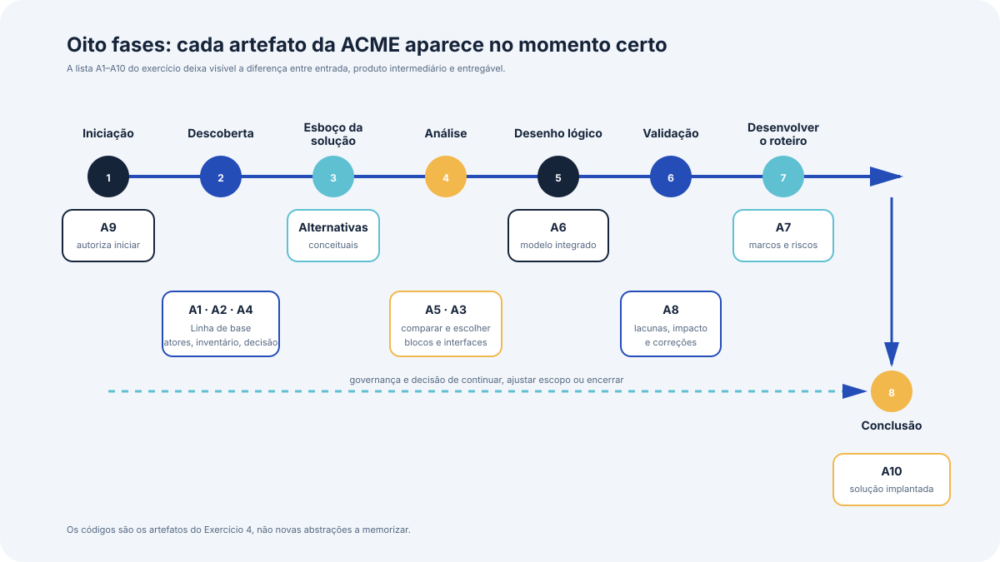

# O processo de definição da arquitetura

Este bloco apresenta o ciclo de vida de oito fases que organiza o trabalho de arquitetura de solução, com a entrada, a atividade central e a saída de cada fase.

## Antes de começar

- [Fase do processo de definição da arquitetura](../referencia/glossario.md#fase-do-processo-de-definicao-da-arquitetura)
- [Artefato de linha de base](../referencia/glossario.md#artefato-de-linha-de-base)
- [Bloco de construção da solução](../referencia/glossario.md#bloco-de-construcao-da-solucao)
- [Arquitetura de linha de base](../referencia/glossario.md#arquitetura-de-linha-de-base)

## Conceito

Produzir um desenho de solução completo e realista a partir apenas de uma ideia inicial exige trabalho organizado. O processo adotado no curso organiza esse trabalho em oito fases sequenciais, cada uma construída sobre as saídas das anteriores. O ponto de partida é o conceito de solução, a ideia de que uma solução é necessária. Alguns dos artefatos usados no percurso já existem e descrevem a situação atual, e são chamados de artefatos de linha de base, guardados no repositório de arquitetura corporativa. O processo modifica parte deles, cria outros, e devolve as versões finais a esse repositório.

{ .module-diagram }

O ciclo não é obrigatoriamente percorrido até o fim. Durante qualquer fase, ou ao término dela, é legítimo abandonar o processo quando nenhuma solução aceitável for encontrada. Mais comum que o abandono é a mudança de escopo, que pode ser reduzido quando apenas parte do problema tem solução viável, ou ampliado para incluir áreas do negócio que estavam fora do recorte inicial.

### As oito fases

| Fase | Entrada principal | Atividade central | Saída |
| --- | --- | --- | --- |
| Iniciação | Conceito de solução com apoio de partes interessadas seniores | Definir e documentar a área do problema em detalhe suficiente para decisão | Decisão de prosseguir ou não para a descoberta, com prazo e recurso definidos |
| Descoberta | Descrição da área do problema | Investigar requisitos de negócio, arquitetura existente e partes interessadas | Base factual completa para o desenho, com causas identificadas |
| Definição do esboço da solução | Insumos da descoberta | Produzir um ou mais desenhos conceituais de alto nível para estimular retorno do negócio | Esboços de solução, também chamados de desenho conceitual |
| Análise | Esboços de solução | Comparar alternativas no caso de negócio, escolher uma e definir o escopo da mudança | Opção única escolhida, com catálogo de blocos de construção e interfaces |
| Desenho lógico | Catálogo de blocos e interfaces | Reunir as saídas da análise em um modelo único de componentes e interações | Desenho lógico da solução, com mudanças organizacionais, de informação, de processo e de tecnologia |
| Validação | Desenho lógico | Verificar o desenho com pontos de vista e visões, análise de impacto e análise de lacunas | Desenho validado, ou lista de correções que exigem retrabalho |
| Desenvolvimento do roteiro | Desenho validado e resultado das análises | Ordenar as mudanças em sequência viável, tratando risco e prioridade das partes interessadas | Roteiro de entrega autorizado pelo patrocinador de negócio |
| Conclusão | Roteiro autorizado | Implementar o desenho com as disciplinas de execução, com a arquitetura em papel de governança | Artefatos da solução implantada nos níveis conceitual, lógico e físico |

A fase de iniciação tem custo deliberadamente baixo, porque seu produto é uma decisão e não um desenho. O que ela exige é tempo e atenção de partes interessadas seniores, e é nela que costuma ser identificado o patrocinador de negócio, o responsável último pela solução, que responde pelo sucesso dela e decide sobre a passagem de cada fase.

O termo problema, nesse processo, cobre três categorias. Problemas imediatos que a organização precisa tratar, problemas antecipados que exigem redução de risco, e oportunidades que a organização deve aproveitar. O espaço do problema delimita o escopo da investigação, e é a área do negócio que precisa ser examinada primeiro para estabelecer a causa raiz.

A fase de validação usa três técnicas que reaparecem ao longo do curso. Um **ponto de vista** é o modelo que se aplica como filtro sobre o modelo de arquitetura, e o resultado é uma **visão**. Aplicar o mesmo ponto de vista às descrições anterior e posterior da arquitetura permite ver o efeito da mudança sob uma perspectiva específica. A **análise de impacto** examina cada bloco de construção e enumera o impacto da mudança, avaliado por alcance, tamanho e direção. A **análise de lacunas** compara duas descrições de arquitetura e lista os componentes acrescentados, removidos ou alterados.

### Adaptação do processo

O ciclo foi desenhado para funcionar em situações variadas, com soluções de tipos e tamanhos diferentes. Ao aplicá-lo a um problema concreto, o arquiteto escolhe as atividades que fazem sentido e as ajusta. Mesmo uma solução aparentemente pequena e simples se beneficia de percorrer as fases de forma consistente, ainda que o trabalho de algumas atividades seja reduzido a poucas horas. A mesma lógica vale para os artefatos, que podem ser adaptados à solução, ao modo de trabalho da organização ou ao setor.

Na ACME, universidade privada brasileira fictícia com 38.400 alunos ativos e sistema acadêmico em operação desde 2004, o percurso já começou antes da primeira aula. O conceito de solução é a modernização do sistema acadêmico. A área do problema foi definida com números, o prazo médio de 34 dias úteis entre pedido aprovado e entrega, a concentração de incidentes na janela de matrícula e a dependência de 6 especialistas em COBOL, dos quais 2 se aposentam em 2027. Duas alternativas foram descartadas na análise preliminar pela Reitoria em 12/03/2026, a substituição por produto de mercado e a reescrita em entrega única.

## Uso pelo arquiteto

O arquiteto usa o ciclo para saber o que pode e o que não pode ser cobrado dele em cada momento. Pedir catálogo de blocos de construção durante a descoberta antecipa uma decisão que ainda não tem base, e pedir criatividade na fase de análise atrapalha o fechamento que aquela fase precisa produzir.

O ciclo também organiza a conversa sobre incerteza. Quando o patrocinador pergunta qual será o custo da solução na segunda semana de trabalho, a resposta honesta é que a estimativa de custo é saída da fase de desenvolvimento do roteiro, e que o que existe naquele momento é ordem de grandeza derivada do esboço. Declarar isso protege o arquiteto e o patrocinador de um compromisso numérico que não se sustenta.

## Exercício 4

A ACME é uma universidade privada brasileira fictícia, com 38.400 alunos ativos, 4.900 turmas por semestre e 230.400 matrículas em disciplina por semestre. O sistema acadêmico está em operação desde 2004 e sustenta matrícula, avaliação, emissão de documentos e integração com o ERP financeiro. A modernização foi autorizada pela Reitoria com orçamento de R$ 6,2 milhões para o primeiro ciclo de 12 meses.

A lista abaixo traz dez artefatos do caso, alguns já existentes e outros ainda por produzir.

| Código | Artefato |
| --- | --- |
| A1 | Mapa de atores com o que cada área quer e o que teme |
| A2 | Inventário dos componentes atuais do sistema acadêmico, com idade, responsável e tipo de integração |
| A3 | Catálogo de blocos de construção da solução escolhida, com as interfaces entre eles |
| A4 | Registro da decisão da Reitoria de 12/03/2026 que descartou a substituição por produto de mercado |
| A5 | Comparação de duas alternativas de modernização apresentadas ao Conselho Universitário |
| A6 | Modelo único de componentes da solução, com as mudanças de processo e de propriedade de dado |
| A7 | Sequência de extração dos módulos ao longo dos 12 meses, com marcos e riscos |
| A8 | Lista de componentes acrescentados, removidos e alterados em relação ao sistema atual |
| A9 | Documento que autoriza a equipe de arquitetura a iniciar a investigação, com prazo e entregáveis |
| A10 | Conjunto de modelos da solução implantada, devolvido ao repositório de arquitetura corporativa |

Responda às três perguntas abaixo.

1. Associe cada um dos dez artefatos à fase do ciclo em que ele é produzido ou usado como entrada, e indique se ele é entrada, produto intermediário ou entregável.
2. Identifique quais artefatos da lista são artefatos de linha de base, isto é, já existiam antes do início do processo.
3. A instituição pediu a data de conclusão do ciclo logo após a autorização registrada em A9. Explique, em até cinco linhas, por que essa resposta ainda não pode ser dada com precisão, e qual fase produz a informação que a sustenta.

## Fontes

As referências seguem o formato APA, 7ª edição, e constam da [bibliografia](../referencia/bibliografia.md) do curso. O trecho consultado aparece entre parênteses ao fim de cada entrada.

- Lovatt, M. (2021). *Solution architecture foundations*. BCS, The Chartered Institute for IT. (seções 3.1 a 3.10)

**Material do curso.** Glossário, entradas [fase do processo de definição da arquitetura](../referencia/glossario.md#fase-do-processo-de-definicao-da-arquitetura), [artefato de linha de base](../referencia/glossario.md#artefato-de-linha-de-base) e [bloco de construção da solução](../referencia/glossario.md#bloco-de-construcao-da-solucao). Dossiê da instituição fictícia [ACME](../caso-acme/index.md), pergunta central, restrições fechadas e [arquitetura de linha de base](../caso-acme/linha-de-base.md).
