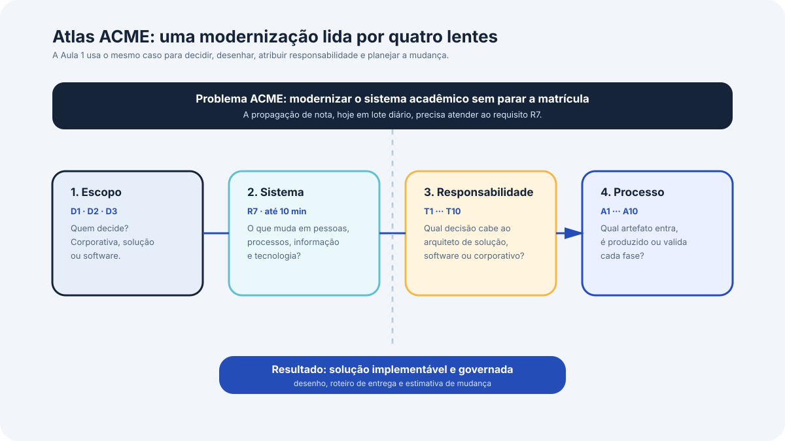

# Aula 1, arquitetura de soluções e seu processo

A aula responde à seguinte questão: o que distingue a arquitetura de soluções da arquitetura de software, sobre que objeto o arquiteto de solução trabalha, o que o papel exige e por qual processo uma solução é definida.

{ .module-diagram }

## Objetivos de aprendizagem

Ao final da aula, o aluno é capaz de

- diferenciar arquitetura corporativa, arquitetura de solução e arquitetura de software pelo alcance da decisão que cada uma toma
- descrever uma solução como sistema, identificando seus componentes nos cinco tipos, pessoas, estruturas organizacionais, processos, informação e tecnologia
- situar uma exigência de negócio nos três níveis de sistema de negócio, sistema de informação e sistema de TI
- descrever o papel do arquiteto de solução, suas competências e o que a disciplina entrega ao fim do trabalho
- descrever as oito fases do processo de definição da arquitetura, com a entrada e a saída de cada uma
- classificar artefatos de um caso real entre entrada, produto intermediário e entregável do processo

## Grade de tempo

A aula ocorre das 19h00 às 22h30, com intervalo das 20h30 às 20h45. O tempo de conteúdo encerra até as 22h10. Os quatro blocos abaixo são o único lugar do site em que os minutos aparecem. As páginas de cada bloco não exibem cronômetro.

| Bloco | Conceito | Conceito (min) | Exercício (min) |
| --- | --- | --- | --- |
| 1 | Arquitetura de soluções e arquitetura de software | 25 | 15 |
| 2 | A solução como sistema e seus componentes | 25 | 15 |
| 3 | O papel do arquiteto de solução | 25 | 15 |
| 4 | O processo de definição da arquitetura | 25 | 15 |

Os quatro blocos somam 160 minutos. Os 15 minutos restantes do tempo útil de 175 minutos cobrem abertura, transições e fechamento.

## Roteiro da aula

O [bloco 1](bloco-1-arquitetura-de-solucoes-e-de-software.md) estabelece a distinção que organiza a disciplina inteira, entre arquitetura corporativa, de solução e de software, com o critério de granularidade que diz a quem pertence cada decisão. O exercício classifica nove decisões do caso da instituição fictícia ACME nos três níveis. O produto é uma leitura estruturada de autoridade sobre decisão, sem artefato formal que alimente o bloco seguinte.

O [bloco 2](bloco-2-a-solucao-como-sistema.md) trata do objeto sobre o qual o arquiteto de solução trabalha, a solução vista como sistema, com os cinco tipos de componente e os três níveis em que uma organização é modelada. O exercício monta o inventário de componentes da solução que atende ao requisito de propagação de nota da ACME. Esse inventário alimenta o bloco 4, porque as fases do processo operam sobre componentes já identificados.

O [bloco 3](bloco-3-papel-do-arquiteto-de-solucao.md) descreve o papel do arquiteto de solução, os quatro grupos de competência exigidos, as três saídas do trabalho e os sete benefícios da abordagem arquitetural. O exercício separa dez tarefas do ciclo de modernização da ACME entre arquiteto de solução, arquiteto de software e arquitetura corporativa.

O [bloco 4](bloco-4-processo-de-definicao-da-arquitetura.md) apresenta o ciclo de oito fases, da iniciação à conclusão, com a entrada, a atividade central e a saída de cada uma. O exercício associa dez artefatos do caso da ACME às fases correspondentes e distingue artefato de linha de base de artefato produzido no processo.

A [síntese](sintese.md) fecha o módulo com o checklist do que precisa permanecer, a autoavaliação e as fontes da aula inteira.

## Preparação para a Aula 2

A Aula 2 trata das entradas do processo, dos requisitos e das partes interessadas, que correspondem à fase de descoberta apresentada no bloco 4 desta aula. A distinção de granularidade do bloco 1 é pré-condição, porque separar requisito de solução de requisito de software depende dela. O inventário de componentes do bloco 2 também é insumo, porque cada tipo de componente gera exigências próprias que aparecem no levantamento.
