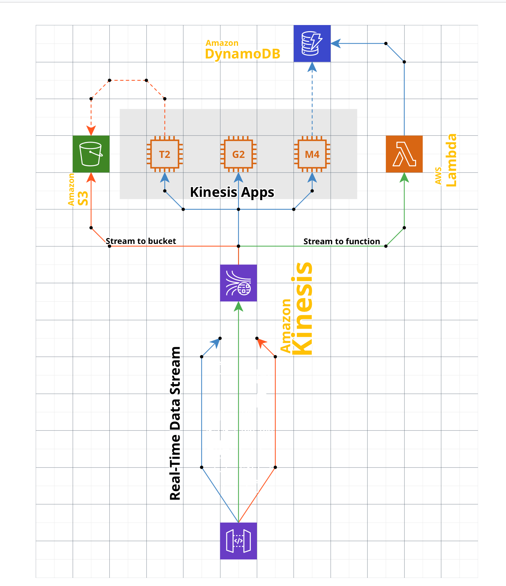

# Plataforma arquitetural

Este bloco dá sequência à aula respondendo a uma pergunta que só faz sentido depois do estilo já decidido, qual conjunto de tecnologias concretiza esse estilo na prática de desenvolvimento e operação.

## Antes de começar

- [Plataforma arquitetural](../referencia/glossario.md#plataforma-arquitetural)
- [Racional arquitetural](../referencia/glossario.md#racional-arquitetural)

## Conceito

Uma **plataforma arquitetural** é um conjunto estruturado e consistente de ferramentas, frameworks, bibliotecas e práticas de desenho, organizadas para implementar um ou mais estilos arquiteturais. Diferentemente de um framework isolado ou de uma biblioteca, a plataforma é um ambiente integrado que cobre todos os aspectos do ciclo de vida do software, incluindo desenvolvimento, integração, implantação e manutenção. Ela atua como a concretização prática de um estilo arquitetural, alinhando o princípio teórico às demandas operacionais de construir e executar o sistema.

A plataforma não escolhe o estilo, ela o executa. Por isso essa decisão vem depois da decisão de estilo, nunca antes ou junto, porque decidir framework, banco de dados ou orquestrador de execução antes de fixar o padrão estrutural inverte a ordem de dependência entre as duas decisões.

### Quatro características de uma plataforma arquitetural

A primeira é a **instanciação de estilos arquiteturais**. Toda plataforma está baseada em um ou mais estilos. O Java EE implementa arquitetura em camadas e web. O Spring Boot com Spring Cloud concretiza microsserviços. O Event Store e o Apache Kafka dão suporte à arquitetura baseada em eventos.

A segunda é a **composição multidimensional**. Uma plataforma não é monolítica, ela reúne quatro tipos de peça. Frameworks base definem o núcleo funcional e estrutural, como o Spring Framework ou o ASP.NET Core. Ferramentas de integração cuidam da comunicação e da orquestração, como o RabbitMQ ou o gRPC. Ferramentas de monitoramento e manutenção acompanham a execução, como o Prometheus e o Grafana. Bibliotecas complementares resolvem necessidades pontuais, como o Axios para acesso HTTP e o Zod para validação de dados.

A terceira é o **alinhamento com práticas de engenharia**. A plataforma promove testabilidade, com ferramentas como o Jest e o JUnit, automação, com integração contínua e esteiras de implantação, e escalabilidade e manutenção, com orquestração de execução em Kubernetes ou Service Fabric.

A quarta é a **adaptação ao contexto**. Plataformas não são universais. Elas são selecionadas e configuradas a partir de um racional arquitetural, apresentado no Conceito do [bloco 1](bloco-1-registro-de-decisao-arquitetural.md) desta aula, que leva em conta sete fatores.

1. atendimento aos requisitos funcionais
2. atendimento aos requisitos não funcionais, como escalabilidade e tolerância a falhas
3. atendimento integral aos requisitos arquiteturais
4. conhecimento técnico do time
5. custos de aquisição e de renovação de ferramentas
6. facilidade de uso
7. confiabilidade dos fornecedores

Esses sete fatores são os critérios de comparação entre plataformas candidatas. Uma plataforma tecnicamente superior que ninguém no time sabe operar tem custo real maior do que o preço de licença sugere, e é o quarto fator que captura isso.

### Exemplos de plataforma por estilo

Os exemplos abaixo são ilustrações de composição, não recomendações de uso. Cada um mostra como um estilo se materializa em uma pilha concreta de ferramentas nomeadas.

#### Pipelines de processamento de dados, ETL e ELT

Orquestração de fluxos com Apache NiFi. Transformação com Apache Beam, em Python ou Java, em lote ou em fluxo contínuo. Conectores de ingestão com Kafka, Amazon S3, FTP e SFTP e APIs REST, e de persistência com PostgreSQL, Elasticsearch e MongoDB. Controle de qualidade de dados com Great Expectations. Monitoramento com Prometheus e Grafana. Gestão de dependências com Poetry. Testes com Pytest. Versionamento de pipelines com Git e NiFi Registry.

#### Arquitetura de serviços escaláveis em nuvem

Processamento de dados com Dataflow, com suporte nativo ao Apache Beam. Armazenamento estruturado com BigQuery e não estruturado com Google Cloud Storage. Mensageria com Cloud Pub/Sub. Gerenciamento de contêineres com Google Kubernetes Engine, com escalabilidade automática e suporte nativo a Istio. Monitoramento com o Cloud Operations Suite. Automação de infraestrutura com Terraform. Testes com Testcontainers. Segurança com Identity-Aware Proxy.

#### Serverless orientado a eventos

Execução sob demanda com AWS Lambda. Mensageria com Amazon SQS. Orquestração de fluxos com AWS Step Functions. Armazenamento estruturado com Amazon RDS e não estruturado com Amazon S3, com eventos de criação e modificação. Transformação de dados com AWS Glue sobre Spark. Gerenciamento de API com Amazon API Gateway. Monitoramento com CloudWatch Logs e AWS X-Ray. Segurança com AWS IAM e AWS WAF. Testes com LocalStack.

#### Desenvolvimento móvel com React Native

Gerenciamento de estado com Zustand. Navegação com React Navigation. Estilo e componentes com Tailwind CSS e NativeWind. Formulários e validação com React Hook Form e Zod. Requisições HTTP com Axios. Gestão de dados remotos com TanStack Query. Internacionalização com i18next. Armazenamento local com MMKV. Notificações com Expo Notification. Testes com Jest e React Native Testing Library. Lint e formatação com ESLint e Prettier. A organização interna dessa pilha segue o *Model-View-ViewModel*, e aqui cabe uma ressalva de vocabulário. Boa parte da literatura, e o próprio material base desta disciplina, lista MVC e MVVM entre os estilos arquiteturais. Esta disciplina os trata como padrão de organização da camada de interface, e não como estilo, porque a definição adotada no [bloco 4 da Aula 1](../modulo-1-fundamentos/bloco-4-estilos-arquiteturais.md) exige que o estilo descreva a forma estrutural do sistema inteiro, não a organização interna de uma camada. É escolha de recorte desta disciplina, não erro da literatura, e vale conhecer as duas leituras porque você vai encontrar ambas em texto profissional.

#### Aplicação web de página única com Vue.js

Framework base Vue.js. Gerenciamento de estado com Pinia. Navegação com Vue Router. Componentes com Vuetify. Requisições HTTP com Axios. Internacionalização com Vue I18n. Testes unitários com Vitest e ponta a ponta com Cypress. Lint e formatação com ESLint e Prettier. Empacotamento com Vite.

#### Microsserviços em Java

Framework base Spring Boot. Gestão de configurações com Spring Cloud Config. Descoberta de serviços e roteamento com Eureka e Spring Cloud Gateway. Mensageria com Apache Kafka para eventos e RabbitMQ para filas. Autenticação e autorização com Keycloak ou Spring Security com OAuth2. Monitoramento com Prometheus e Grafana. Gerenciamento de logs com Elastic Stack. Testes com JUnit e Mockito, e WireMock para simular APIs externas. Empacotamento com Docker e orquestração com Kubernetes.

#### Aplicação web em camadas com ASP.NET Core

Camada de apresentação com Razor Pages e Blazor. Camada de negócios com MediatR para CQRS. Camada de persistência com Entity Framework Core e migrações *Code First*. Autenticação e autorização com Identity Server, OAuth2 e OpenID Connect. Injeção de dependências com Autofac. Documentação de API com Swashbuckle e OpenAPI. Testes com xUnit e FluentAssertions. Hospedagem em Azure App Services e esteira em Azure DevOps.

#### Arquitetura baseada em eventos

Orquestração de mensagens com Apache Kafka. Processamento de fluxos com Kafka Streams. Armazenamento de eventos com Event Store. Coordenação e mediação com Apache Camel. Gestão de APIs com Kong API Gateway. Autenticação com OAuth2 e Okta. Monitoramento de eventos com Confluent Control Center. Testes com Testcontainers.

### Representação visual da plataforma

Alguns arquitetos preferem representar a plataforma em desenho, mostrando como a pilha tecnológica se organiza para implementar o estilo. As quatro figuras a seguir desenham plataformas inteiras, com as três dimensões que o Conceito já apresentou visíveis no mesmo quadro, as peças que compõem a plataforma, as fronteiras com quem a consome e com os sistemas externos, e os serviços transversais que atravessam tudo.

![Plataforma Java EE e Jakarta EE. À esquerda, navegador e cliente móvel acessam por HTTPS e REST. No centro, um servidor de aplicação Java reúne três contêineres, o web com JSF, Servlet e JAX-RS, o de negócio com CDI, EJB e Bean Validation, e o de integração com JMS, conector JCA e agendador. Abaixo, JPA e Hibernate persistem em PostgreSQL e Oracle. À direita, mensageria Kafka ou ActiveMQ e sistemas externos de ERP, CRM e legado. Na base, serviços transversais de segurança, transações, observabilidade e configuração.](../assets/images/plataforma-java-ee.png)

*Plataforma Java EE e Jakarta EE, materializando o estilo em camadas. Os três contêineres do servidor de aplicação são a divisão estrutural que o estilo impõe, e a faixa de serviços transversais na base é o que nenhum framework isolado entrega. Fonte: material base do professor.*

![Plataforma de microsserviços. À esquerda, clientes web, móvel e usuários entram por HTTP e HTTPS num gateway de API com NGINX Ingress. No centro, um agrupamento Kubernetes com camada de serviço e três pods em contêineres Docker, um serviço de catálogo em Java, um de pedidos em .NET e um de pagamentos em Node.js, apoiados por Redis, PostgreSQL e um barramento Kafka. À direita, observabilidade com Prometheus para métricas, Grafana para painéis e OpenTelemetry para rastros. Na base, a esteira de integração e entrega, do código ao GitHub Actions, ao registro de contêineres e à implantação no Kubernetes.](../assets/images/plataforma-microsservicos.png)

*Plataforma de microsserviços, materializando o estilo de mesmo nome. Note que os três serviços usam linguagens diferentes, o que o estilo permite e a plataforma precisa sustentar, e que a esteira de entrega faz parte da plataforma, não é acessório dela. Fonte: material base do professor.*

![Plataforma de data lake. À esquerda, fontes de dados de ERP, CRM, IoT, SaaS, arquivos e fluxos de eventos. Em seguida, ingestão por Kafka ou Kinesis, por API e em lote. No centro, armazenamento de objetos dividido em três zonas, bruta, curada e analítica. Acima, governança com catálogo de dados, qualidade de dados e controle de acesso. Abaixo, processamento com Spark, ETL e ELT e dbt. À direita, consumidores, análise SQL com Athena ou Trino, painéis em Power BI, aprendizado de máquina com SageMaker e aplicações.](../assets/images/plataforma-data-lake.png)

*Plataforma de data lake, materializando o estilo de pipelines de processamento de dados. As três zonas de armazenamento, bruta, curada e analítica, são a restrição estrutural do estilo, e a faixa de governança no topo é o que distingue um data lake de um depósito de arquivos. Fonte: material base do professor.*

![Plataforma .NET. À esquerda, navegador, aplicativo móvel e API de parceiro entram por Azure Front Door e gestão de API. No centro, a plataforma de aplicação .NET com ASP.NET Core, serviço de trabalho, serviço gRPC e Blazor sobre uma camada de domínio e Entity Framework Core. À direita, repositórios de dados com SQL Server, Cosmos DB e Redis, e mensageria com Azure Service Bus ou RabbitMQ. Abaixo, empacotamento em Docker e orquestração em AKS Kubernetes. Na base, serviços transversais de plataforma, Microsoft Entra ID, OpenTelemetry, Application Insights e a esteira de integração e entrega.](../assets/images/plataforma-dotnet.png)

*Plataforma .NET, materializando um estilo em camadas com a camada de domínio isolada no centro. É a mesma forma estrutural da plataforma Java EE acima, com outro conjunto de ferramentas, o que mostra que um estilo admite mais de uma plataforma. Fonte: material base do professor.*

As três figuras seguintes vêm de outra convenção de desenho, mais próxima do diagrama de infraestrutura do fornecedor, e nelas o nome da ferramenta aparece em amarelo.

*Arquitetura web com soluções AWS, materializando um estilo em camadas distribuído entre duas zonas de disponibilidade. Fonte: material base do professor.*

*Arquitetura de streaming com soluções AWS, materializando o estilo orientado a eventos. Fonte: material base do professor.*

*Plataforma IoT para automação residencial, com o protocolo MQTT sobre SSL ligando os dispositivos ao serviço de nuvem. Fonte: material base do professor.*

## Uso pelo arquiteto

Assim como o estilo arquitetural é a maior decisão que um arquiteto toma em um projeto, a plataforma arquitetural é a maior decisão tecnológica do projeto. Por consequência, ela precisa ser justificada e registrada em um ADR próprio, escrito no [bloco 3](bloco-3-adr-de-plataforma.md) desta aula.

O arquiteto documenta a comparação antes de decidir, em um **quadro comparativo** que lista as plataformas candidatas nas linhas e os sete fatores de adaptação ao contexto nas colunas, com uma nota curta em cada célula. Esse quadro entra no ADR de plataforma como evidência de que a escolha considerou alternativas reais, não apenas a plataforma mais familiar ao time, o que faz a decisão resistir a questionamento meses depois.

## Exercício 6

A ACME é a universidade privada brasileira em modernização incremental do sistema acadêmico, cujo núcleo transacional em COBOL sobre o monitor CICS segue em operação durante toda a transição, com uma camada web em JSF e EJB e integrações com o ERP financeiro e o ambiente virtual de aprendizagem resolvidas por arquivo, em lote noturno.

Considerando o estilo arquitetural que você escolheu no exercício do [bloco 4 da Aula 1](../modulo-1-fundamentos/bloco-4-estilos-arquiteturais.md), levante duas plataformas candidatas capazes de concretizar esse estilo, considerando que o núcleo COBOL sobre CICS permanece em operação durante a transição.

1. Nomeie as duas plataformas candidatas, com as ferramentas concretas de cada uma, no nível de detalhe dos exemplos de plataforma por estilo apresentados no Conceito.
2. Monte o quadro comparativo das duas, usando pelo menos quatro dos sete fatores de adaptação ao contexto listados no Conceito.
3. Escolha uma das duas e justifique a escolha considerando a restrição de convivência com o legado.

## Fontes

Glossário do curso, entradas [plataforma arquitetural](../referencia/glossario.md#plataforma-arquitetural) e [racional arquitetural](../referencia/glossario.md#racional-arquitetural).

Material base do professor, guia [Plataforma Arquitetural](https://github.com/aulas-marco/projeto-arquitetura-software/blob/main/2.2%20Plataforma%20Arquitetural.md), de onde vêm a definição, as quatro características, os sete fatores de adaptação ao contexto, os oito exemplos de plataforma por estilo e as três representações visuais reproduzidos nesta página.

Ford e Richards (2020), listado na [bibliografia](../referencia/bibliografia.md), referência já usada na comparação de estilos por atributo de qualidade e igualmente pertinente à comparação de plataformas. Dossiê da instituição fictícia [ACME](../caso-acme/index.md) e [arquitetura de linha de base](../caso-acme/linha-de-base.md).
