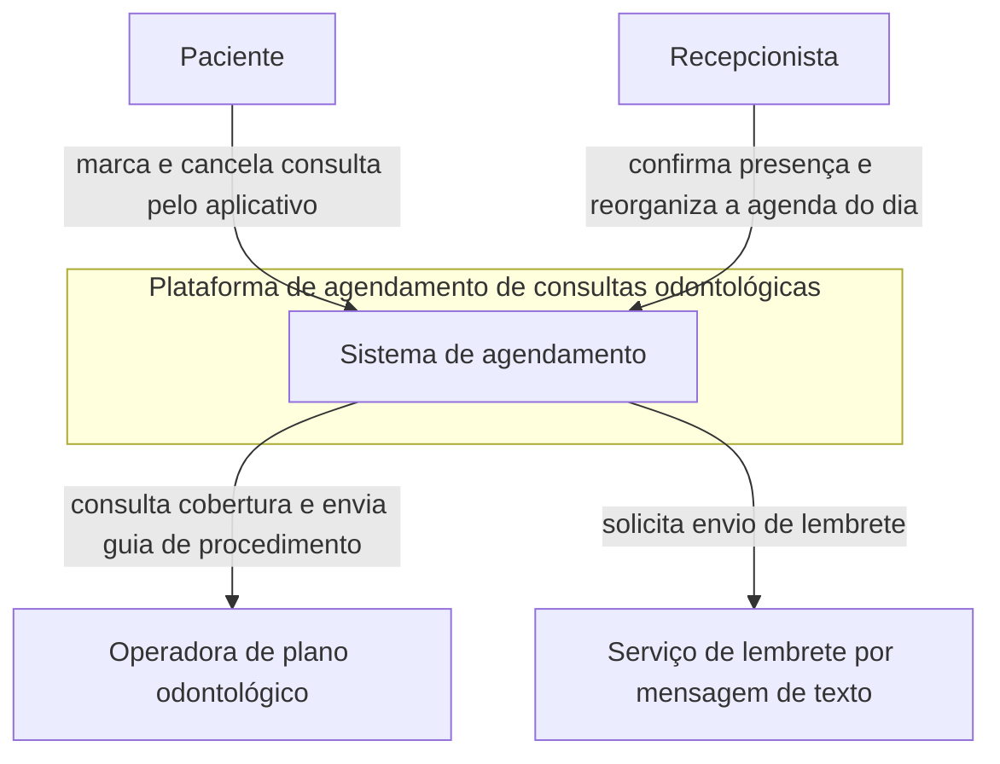
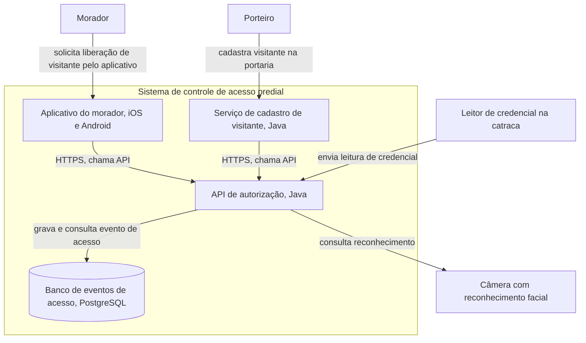

# Representação de modelos e C4

Este bloco fecha a aula tratando de uma pergunta anterior às duas ADRs já escritas, como representar o sistema de forma que estilo e plataforma decididos nos blocos anteriores fiquem visíveis num modelo, não apenas descritos em texto.

## Antes de começar

- [Modelo C4](../referencia/glossario.md#modelo-c4)

## Conceito

Um modelo de arquitetura é uma representação simplificada do sistema, feita para responder a uma pergunta específica de uma audiência específica. Um diagrama solto, desenhado sem convenção declarada, mistura níveis de detalhe diferentes na mesma figura, obriga quem lê a adivinhar o que uma caixa representa, um processo, uma máquina ou uma equipe, e não sobrevive à saída de quem o desenhou. Um bom modelo declara o que cada elemento significa, mantém um nível de abstração consistente dentro da mesma figura e é redesenhável por outra pessoa a partir da mesma convenção, sem depender de explicação oral de quem o produziu.

O **modelo C4**, criado por Brown, resolve esse problema com quatro níveis de abstração progressiva, Contexto, Contêineres, Componentes e Código. Cada nível aprofunda o anterior sem repetir o nome do modelo inteiro como se fosse o nome do nível, o modelo se chama C4 porque tem quatro níveis, cada nível tem nome próprio. O nível de contexto mostra o sistema como uma caixa única, sem revelar sua composição interna. O nível de contêineres abre essa caixa e mostra as partes que a compõem. Os níveis de componentes e de código aprofundam ainda mais, mas não são cobertos nesta aula, que trata apenas dos dois primeiros.

O **diagrama de contexto**, nível 1, é o ponto de partida. Ele mostra o sistema em foco como uma única caixa, os atores humanos que interagem com ele e os sistemas externos com os quais ele troca informação, sem detalhar nada do que acontece dentro da caixa. A pergunta que esse diagrama responde é o que o sistema faz e com quem ele se relaciona, pergunta suficiente para um stakeholder de negócio que não precisa saber como o sistema é construído por dentro.

O **diagrama de contêineres**, nível 2, abre a caixa única do nível de contexto e mostra como o sistema se decompõe em aplicações, bancos de dados e serviços, cada um com a tecnologia que o implementa. A pergunta que esse diagrama responde é como o sistema funciona por dentro, em termos de suas partes principais, sem descer ao nível de classe ou de função que o nível de componentes trataria. Continua sem repetir a comunicação já registrada no diagrama de contexto com o mesmo nível de detalhe, cada contêiner aparece com sua responsabilidade e sua tecnologia.

Os dois exemplos acima cobrem domínios distintos entre si e distintos do domínio principal do [bloco 3](bloco-3-adr-de-plataforma.md) desta aula, a seguradora de mensageria entre serviços de apólice, risco e sinistro. Os níveis de componentes e de código existem no modelo C4 completo, mas ficam fora do escopo desta aula, que se detém nos dois primeiros níveis.

## Uso pelo arquiteto

O arquiteto escolhe o nível de detalhe do diagrama conforme a audiência que vai lê-lo. Um stakeholder de negócio, que decide sobre orçamento ou prioridade, só precisa do diagrama de contexto, porque a pergunta dele é sobre escopo e relação externa, não sobre tecnologia interna. A própria equipe técnica, que vai implementar ou manter o sistema, precisa do diagrama de contêineres, porque a pergunta dela é sobre como as partes internas se comunicam e com qual tecnologia cada uma foi construída. Entregar o diagrama de contêineres a um stakeholder de negócio sobrecarrega a conversa com detalhe irrelevante para a decisão que ele precisa tomar, e entregar apenas o diagrama de contexto a um desenvolvedor que vai implementar uma integração nova deixa de fora a informação de que contêiner ele está alterando.

## Exercício 8

A ACME é a universidade privada brasileira em modernização incremental do sistema acadêmico, cujo núcleo transacional em COBOL sobre o monitor CICS segue em operação durante toda a transição, com uma camada web em JSF e EJB servindo quatro portais de acesso, aluno, professor, secretaria e gestor, e integrações por arquivo, em lote noturno, com o ERP financeiro e o ambiente virtual de aprendizagem, conforme descrito na [arquitetura de linha de base](../caso-acme/linha-de-base.md) do caso.

1. Desenhe o diagrama de contexto, nível 1, do sistema acadêmico da ACME, identificando o sistema como uma única caixa, os atores humanos, aluno e secretaria, e os sistemas externos, o ERP financeiro e o ambiente virtual de aprendizagem, no formato de pessoa, sistema e relação apresentado no [Conceito](#conceito) acima.
2. Desenhe o diagrama de contêineres, nível 2, decompondo o sistema acadêmico nos contêineres que a [arquitetura de linha de base](../caso-acme/linha-de-base.md) da ACME já descreve, o núcleo COBOL sobre CICS, a camada web e as integrações com os sistemas externos, no formato apresentado no [Conceito](#conceito) acima.
3. Justifique em uma frase por que um stakeholder de negócio da ACME só precisaria ver o diagrama de contexto do item 1, não o diagrama de contêineres do item 2.

Entregue os dois diagramas em Mermaid ou em desenho livre, à sua escolha.

## Fontes

Glossário do curso, entrada [modelo C4](../referencia/glossario.md#modelo-c4). Brown (sem data), listado na [bibliografia](../referencia/bibliografia.md). Dossiê da instituição fictícia [ACME](../caso-acme/index.md) e [arquitetura de linha de base](../caso-acme/linha-de-base.md).
