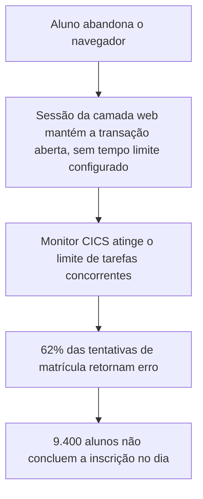

# Cenários de qualidade, linha de base e restrições

Este bloco trata de como tornar um requisito de atributo de qualidade concreto o bastante para orientar decisão, como julgar se um requisito deve pesar sobre a arquitetura, e quais insumos já existentes entram no processo antes de qualquer desenho, os artefatos de linha de base e as restrições.

## Antes de começar

- [Cenário de atributo de qualidade](../referencia/glossario.md#cenario-de-atributo-de-qualidade)
- [Requisito arquiteturalmente significativo](../referencia/glossario.md#requisito-arquiteturalmente-significativo)
- [Direcionador arquitetural](../referencia/glossario.md#direcionador-arquitetural)
- [Artefato de linha de base](../referencia/glossario.md#artefato-de-linha-de-base)
- [Arquitetura de linha de base](../referencia/glossario.md#arquitetura-de-linha-de-base)

## Conceito

Um [requisito de atributo de qualidade](bloco-2-qualidade-e-tipos-de-requisito.md#conceito), definido no bloco 2 desta aula, mesmo bem formulado, ainda deixa dúvida sobre em que situação exata ele vale e sobre como equipes diferentes devem interpretá-lo. O Software Engineering Institute usa cenários para reduzir essa ambiguidade. O relatório CMU/SEI-2003-TR-016 descreve o Quality Attribute Workshop, QAW, como método conduzido com os interessados para descobrir atributos de qualidade importantes e esclarecer requisitos antes mesmo de existir uma arquitetura detalhada. No QAW, os interessados geram, consolidam, priorizam e refinam cenários que representam os requisitos de qualidade do sistema. Esse trabalho também revela suposições e conflitos que permaneceriam ocultos em expressões genéricas como rápido, seguro ou flexível.

Um **cenário de atributo de qualidade** organiza essa expectativa em seis elementos.

| Elemento | Pergunta respondida |
| --- | --- |
| Fonte do estímulo | Quem ou o que provoca o evento |
| Estímulo | O que acontece |
| Ambiente | Sob quais condições |
| Artefato | Que parte do sistema é afetada |
| Resposta | O que o sistema deve fazer |
| Medida da resposta | Como se verificará o atendimento |

<figure markdown="span">
{ .module-diagram }
</figure>

*Figura 1 — Relação entre a estrutura do cenário de qualidade, a linha de base, as restrições e a decisão arquitetural. Fonte: material do curso.*

Um exemplo aplicado torna a estrutura concreta antes das três variações detalhadas a seguir.

{ .module-diagram }

*Figura 2 — Exemplo aplicado da estrutura de seis elementos a um requisito de desempenho de um serviço de catálogo. Fonte: material do curso.*

O exemplo abaixo aplica a mesma estrutura a um requisito de desempenho em outro domínio, na mesma progressão de contexto e medida vista no exemplo de desempenho da plataforma de vídeo da Produtora ACME, apresentado na seção Conceito do [bloco 2](bloco-2-qualidade-e-tipos-de-requisito.md).

| Elemento | Especificação |
| --- | --- |
| Fonte | Usuários autenticados do aplicativo de rastreamento de encomendas da Transportadora ACME |
| Estímulo | Submissão de consulta de status de uma encomenda |
| Ambiente | Pico mensal de 2.000 requisições por segundo |
| Artefato | API de rastreamento e dependências necessárias |
| Resposta | Validar a identidade, recuperar o status da encomenda e devolver a resposta |
| Medida | p95 até 500 ms, p99 até 1 s, erros abaixo de 0,1% |

O exemplo seguinte aplica a mesma estrutura a um requisito de modificabilidade, no sistema de pagamentos da Varejista ACME, que trabalha com múltiplos adquirentes.

| Elemento | Especificação |
| --- | --- |
| Fonte | Equipe de produto |
| Estímulo | Solicitação de inclusão de novo adquirente |
| Ambiente | Sistema em evolução normal |
| Artefato | Componente de roteamento de pagamentos |
| Resposta | Implementar e ativar a nova integração sem alterar as integrações existentes |
| Medida | Até dez dias úteis, alterações limitadas ao adaptador, configuração e testes contratuais |

O terceiro exemplo aplica a mesma estrutura a um requisito de segurança, em um domínio ainda não usado nesta aula, o portal de sinistros da Seguradora ACME.

| Elemento | Especificação |
| --- | --- |
| Fonte | Agente que tenta acesso não autorizado a uma conta de segurado |
| Estímulo | Cinco tentativas de autenticação inválida para a mesma conta em dez minutos |
| Ambiente | Operação normal do portal de sinistros |
| Artefato | Serviço de identidade do portal de sinistros |
| Resposta | Bloquear novas tentativas, registrar o evento e notificar o segurado |
| Medida | Bloqueio por quinze minutos, registro em log de auditoria, notificação em até um minuto |

Um cenário bem escrito não é, por si, um requisito arquiteturalmente significativo. Depois de formulado, ele ainda precisa ser priorizado e avaliado quanto ao impacto sobre a arquitetura.

Nem todo requisito produz o mesmo efeito sobre a solução. Incluir um campo opcional em uma tela já existente costuma ser mudança local, contida em poucos componentes. Já a exigência de que um sistema de pagamentos permaneça disponível mesmo após a perda completa de uma região de nuvem pode alterar implantação, replicação de dados, comunicação entre serviços, tratamento de falha, monitoramento e custo operacional. A arquitetura passa a importar quando uma necessidade produz efeito amplo, envolve risco elevado ou exige escolha difícil de reverter.

Um **requisito arquiteturalmente significativo**, ASR, é um requisito cuja satisfação exerce influência importante sobre a arquitetura, podendo determinar estrutura, responsabilidade, interface, tecnologia, mecanismo, padrão de interação ou forma de implantação. Arquiteturalmente significativo não nomeia uma categoria temática nova de requisito. É um juízo sobre o impacto que aquele requisito produz sobre a arquitetura. Um requisito tende a ser um ASR quando sua satisfação apresenta ao menos uma das oito condições abaixo.

- força escolhas estruturais importantes
- afeta vários componentes ou equipes
- exige mecanismos arquiteturais específicos
- produz riscos técnicos relevantes
- envolve compromissos entre atributos de qualidade
- restringe tecnologias ou estilos arquiteturais
- tem alto custo de alteração tardia
- demanda experimentação, prototipação ou análise antecipada

Um **direcionador arquitetural** é um fator prioritário que orienta a formação ou a avaliação da arquitetura. Dependendo do método e do autor, o termo pode incluir ASRs, objetivos de negócio, restrições e preocupações críticas. No processo QAW, o SEI inclui entre os direcionadores requisitos de alto nível, preocupações de negócio ou de missão, objetivos e atributos de qualidade, e cabe aos interessados e facilitadores estabelecer consenso sobre quais são decisivos para aquele sistema. Requisito arquiteturalmente significativo e direcionador arquitetural, portanto, também não são intercambiáveis. Um objetivo de negócio como entrar em cinco países em doze meses não é, por si, um requisito de sistema já formulado, mas funciona como direcionador de requisitos de configurabilidade, localização, conformidade e escalabilidade que ainda precisam ser decompostos.

A relação entre atributo de qualidade e ASR não é de equivalência. Um atributo de qualidade é uma propriedade, como desempenho ou disponibilidade. Um requisito de atributo de qualidade estabelece o comportamento esperado em relação a essa propriedade. Um ASR é um requisito que influencia materialmente a arquitetura, e essa influência não decorre do rótulo do requisito, decorre do efeito que ele produz sobre decisões estruturais. Um requisito de atributo de qualidade pode ser arquiteturalmente significativo, mas não necessariamente será, como acontece com uma consulta administrativa de baixo volume que continua sendo requisito de desempenho válido sem provocar qualquer decisão arquitetural nova. Um ASR, por sua vez, não precisa ser um requisito de atributo de qualidade. No sistema de pagamentos da Varejista ACME, o requisito de escolher dinamicamente entre cinco adquirentes, considerando custo, disponibilidade, risco e regra contratual, sem duplicar cobrança durante tentativa de contingência, tem núcleo funcional. Ainda assim ele pode exigir estratégia intercambiável entre adquirentes, normalização de contrato, idempotência, gerenciamento de estado, tratamento de falha parcial, auditoria e observabilidade distribuída, o que o torna um ASR funcional. Na expansão internacional, o objetivo de disponibilizar o produto em cinco países em doze meses ainda não especifica comportamento de software, mas pode gerar ASRs de localização, configurabilidade, extensibilidade e conformidade regulatória, sem que nenhum desses ASRs seja, sozinho, um requisito de qualidade nomeado como tal. Os dois conjuntos, requisito de atributo de qualidade e ASR, se cruzam sem coincidir. Existem requisitos de qualidade que são ASR e requisitos de qualidade que não são. Existem ASR funcionais e existem ASR que são restrição. Existe também requisito funcional comum sem nenhuma significância arquitetural relevante.

Diante de um requisito qualquer, um roteiro prático ajuda a decidir se ele deve pesar sobre a arquitetura.

1. Quais decisões mudariam? O requisito influencia decomposição, interfaces, comunicação, persistência, implantação ou tecnologias?
2. Qual é o alcance? Afeta um único componente ou atravessa vários elementos, serviços e equipes?
3. Qual é o risco? Há incerteza técnica, escala incomum, dependências frágeis ou consequências graves de falha?
4. Qual é o custo de adiamento? Uma decisão tardia provocaria reconstrução substancial?
5. Há compromisso entre qualidades? Melhorar segurança, consistência ou disponibilidade prejudica desempenho, usabilidade, custo ou modificabilidade?
6. É necessário validar hipóteses cedo? O requisito demanda protótipo, teste de carga, experimento ou prova de conceito?
7. Qual é a prioridade para os interessados? A exigência está ligada a objetivos de negócio ou de missão realmente prioritários?

Uma heurística resume o roteiro. Se uma alteração relevante no requisito obrigaria a reconsiderar decisões fundamentais, caras ou transversais da solução, há boa evidência de significância arquitetural. Essa heurística não substitui julgamento, porque significância depende de escala, riscos, arquitetura existente, competências disponíveis e custo de mudança, e pode variar entre sistemas e entre estágios do ciclo de vida do mesmo sistema.

Dois erros conceituais recorrentes merecem atenção neste ponto. O primeiro é tratar todo requisito não funcional como ASR. Nem todo requisito de qualidade altera a arquitetura, e alguns são satisfeitos por configuração local, implementação convencional ou capacidade já existente, como no exemplo da consulta administrativa, citado no parágrafo sobre a relação entre atributo de qualidade e ASR, nesta mesma seção Conceito. O segundo é tratar todo ASR como requisito não funcional. Funcionalidade, restrição regulatória, padrão corporativo e integração mandatória também podem condicionar a arquitetura, como mostra o exemplo do roteamento entre adquirentes de pagamento, apresentado no mesmo parágrafo sobre a relação entre atributo de qualidade e ASR, que é, no núcleo, um requisito funcional.

### Artefatos de linha de base

Cenário e julgamento de significância não são os únicos insumos da [fase de descoberta](../modulo-1-fundamentos/bloco-4-processo-de-definicao-da-arquitetura.md#as-oito-fases), segunda fase do processo apresentado na Aula 1. Parte do que o arquiteto precisa já existe na organização, descrita como situação atual, e recebe o nome de [artefato de linha de base](../referencia/glossario.md#artefato-de-linha-de-base). Usá-los evita refazer levantamento e, mais importante, evita que a solução seja desenhada sobre uma leitura inventada do sistema existente.

Os artefatos de linha de base mais frequentes são a descrição da arquitetura atual, com componentes e integrações, o catálogo de aplicações, os modelos de processo de negócio, os modelos de dados, os contratos vigentes com fornecedores e os registros de incidente e de capacidade. Cada um deles tem data, dono e grau de confiabilidade, e parte do trabalho de descoberta é justamente estabelecer quanto de cada artefato ainda descreve a realidade.

Na ACME, universidade privada brasileira fictícia com sistema acadêmico em operação desde 2004, os artefatos de linha de base disponíveis incluem o inventário de componentes com idade e responsável, o registro dos três incidentes graves dos últimos 18 meses, a medição de 34 dias úteis entre pedido aprovado e entrega em produção, o custo anual de propriedade de R$ 15,83 milhões e os contratos de sustentação e de capacidade, com prazos em 30/09/2027 e 31/12/2028.

### Restrições ao desenho

Restrição é decisão tomada fora do processo de projeto, que limita as alternativas do arquiteto sem ser negociável por ele. Ela difere do requisito em dois pontos. O requisito descreve o que a solução precisa entregar e admite discussão sobre a forma de atendê-lo, enquanto a restrição fecha alternativas antes da análise. Tratar restrição como requisito leva a comparar opções que a organização já descartou, e tratar requisito como restrição leva a aceitar como fechado o que ainda podia ser negociado.

As restrições chegam de origens distintas, e a origem determina quem pode revê-las. Restrição regulatória vem de fora e só muda com mudança normativa. Restrição contratual vem de acordo assinado e muda por negociação com o fornecedor, dentro dos prazos previstos. Restrição de política interna vem de decisão de governança e muda com nova decisão do mesmo nível. Restrição técnica vem do parque instalado e muda com investimento.

Sete restrições chegam fechadas ao caso da ACME, entre elas a impossibilidade de parar o sistema em período letivo, imposta pela Pró-Reitoria de Graduação, a permanência do ambiente virtual de aprendizagem e do ERP financeiro, decidida pela Reitoria em 12/03/2026, o uso de apenas dois provedores de nuvem pré-aprovados pelo Conselho Universitário, e o processamento de dado pessoal de aluno em território nacional, conforme parecer jurídico de 28/04/2026.

## Uso pelo arquiteto

O arquiteto usa o cenário e o roteiro de sete perguntas para decidir onde investir esforço de design, dentro de um conjunto de requisitos que nunca recebe atenção equivalente. Cenários bem formados tornam comparável o que antes era apenas uma lista de rótulos de atributo, e o roteiro filtra, entre os cenários escritos, quais realmente pesam sobre decisão estrutural, risco ou custo de mudança tardia. O resultado orienta a prioridade de análise antes de qualquer proposta de solução, evitando que o esforço de arquitetura se disperse sobre requisito que a implementação convencional já resolve.

## Exercício 7

A ACME é uma universidade privada brasileira fictícia cujo sistema acadêmico está em modernização. O exercício usa os dados de sazonalidade e de incidentes dos [dados operacionais](../caso-acme/dados-operacionais.md) do caso e pode partir, como orientação de continuidade e sem obrigatoriedade, da reescrita mensurável de R2 sobre disponibilidade na janela de matrícula, produzida no [exercício 6](bloco-2-qualidade-e-tipos-de-requisito.md#exercicio-6) desta mesma aula.

### Item 1: Cenário do pico de matrícula

O portal da ACME registra 815 sessões simultâneas em média anual ponderada, com pico de 5.800 sessões na abertura da matrícula, uma razão de 7,1 entre pico e média, e taxa de erro de 6,3% das requisições nesse intervalo de pico, contra 0,2% em dia letivo comum. O quadro abaixo traz um [cenário de atributo de qualidade](../referencia/glossario.md#cenario-de-atributo-de-qualidade) para esse pico, com os quatro primeiros elementos preenchidos.

| Elemento | Especificação |
| --- | --- |
| Fonte do estímulo | Alunos veteranos e ingressantes na abertura da matrícula |
| Estímulo | 5.800 sessões simultâneas solicitando inscrição em turmas |
| Ambiente | Abertura da matrícula, com razão de 7,1 entre pico e média |
| Artefato | Portal do aluno e serviço de matrícula |
| Resposta | A completar |
| Medida da resposta | A completar |

1. Complete a resposta e a medida da resposta do cenário, de modo que a medida possa ser verificada em teste de carga.

### Item 2: Cenário do incidente de 04/02/2026

O diagrama abaixo descreve a sequência do incidente ocorrido na abertura da matrícula de 04/02/2026, quando o limite de tarefas concorrentes do monitor CICS foi atingido. O incidente durou 4h20, e a janela de matrícula foi prorrogada em 2 dias úteis.

| Elemento | Especificação |
| --- | --- |
| Fonte do estímulo | Navegadores de alunos abandonados durante a sessão de matrícula |
| Estímulo | Acúmulo de transações abertas no núcleo sem encerramento da sessão web |
| Ambiente | Abertura da matrícula, no pico de 5.800 sessões simultâneas |
| Artefato | A completar |
| Resposta | A completar |
| Medida da resposta | A completar |

1. Complete o artefato, a resposta e a medida da resposta do cenário, de modo que a repetição do incidente possa ser verificada.

### Item 3: Significância arquitetural dos dois cenários

O quadro abaixo reproduz o roteiro de sete perguntas apresentado na seção [Conceito](#conceito) para julgar se um requisito é [arquiteturalmente significativo](../referencia/glossario.md#requisito-arquiteturalmente-significativo), com uma coluna para cada cenário.

| Pergunta do roteiro | Cenário do pico | Cenário do incidente |
| --- | --- | --- |
| Quais decisões mudariam, entre decomposição, interfaces, comunicação, persistência, implantação ou tecnologias? | | |
| O alcance atravessa vários elementos, serviços e equipes? | | |
| Há incerteza técnica, escala incomum, dependência frágil ou consequência grave de falha? | | |
| Uma decisão tardia provocaria reconstrução substancial? | | |
| Melhorar uma qualidade prejudica outra, como desempenho, custo ou modificabilidade? | | |
| O requisito demanda protótipo, teste de carga, experimento ou prova de conceito? | | |
| A exigência está ligada a objetivo de negócio prioritário para os interessados? | | |

1. Marque sim ou não para cada pergunta, em cada cenário, com uma justificativa curta por célula.
2. Defenda, em até três linhas por cenário, se cada um constitui um requisito arquiteturalmente significativo.

### Item 4: Artefatos de linha de base que sustentam os cenários

O quadro abaixo lista os [artefatos de linha de base](../referencia/glossario.md#artefato-de-linha-de-base) disponíveis no caso da ACME, descritos na seção [Artefatos de linha de base](#artefatos-de-linha-de-base) deste bloco.

| Código | Artefato de linha de base |
| --- | --- |
| L1 | Inventário de componentes do sistema acadêmico, com idade e responsável |
| L2 | Registro dos três incidentes graves dos últimos 18 meses |
| L3 | Medição de 34 dias úteis entre pedido aprovado e entrega em produção |
| L4 | Custo anual de propriedade de R$ 15,83 milhões |
| L5 | Contratos de sustentação e de capacidade, com prazos em 30/09/2027 e 31/12/2028 |
| L6 | Série de medição de sessões simultâneas e de taxa de erro do portal, com média anual e pico |

1. Escolha quatro artefatos do quadro que sustentam os dois cenários e indique, para cada um, o dado específico que ele fornece.
2. Indique, para cada um dos quatro artefatos escolhidos, o que aconteceria com o cenário se esse dado estivesse desatualizado.

### Item 5: Origem das restrições fechadas

O quadro abaixo reproduz as sete restrições que chegam fechadas ao caso da ACME, com o registro de quem as estabeleceu.

| Restrição | Registro no caso |
| --- | --- |
| O sistema acadêmico não pode parar em período letivo | Pró-Reitoria de Graduação |
| O ambiente virtual de aprendizagem e o ERP financeiro permanecem | Reitoria, 12/03/2026 |
| Uso de apenas dois provedores de nuvem pré-aprovados | Conselho Universitário, 12/03/2026 |
| Identidade e autorização por padrões abertos | Comitê de Segurança da Informação |
| Dado pessoal de aluno processado em território nacional | Jurídico, parecer de 28/04/2026 |
| Manutenção do núcleo COBOL sob contrato até 30/09/2027 | Contrato de sustentação |
| Orçamento de R$ 6,2 milhões para o primeiro ciclo de 12 meses | Reitoria |

1. Classifique cada restrição pela origem, entre regulatória, contratual, de política interna e técnica, e indique quem teria autoridade para revê-la.

## Fontes

As referências seguem o formato APA, 7ª edição, e constam da [bibliografia](../referencia/bibliografia.md) do curso. O trecho consultado aparece entre parênteses ao fim de cada entrada.

- Barbacci, M., Ellison, R., Lattanze, A., Stafford, J., Weinstock, C., & Wood, W. (2003). *Quality attribute workshops (QAWs), third edition* (CMU/SEI-2003-TR-016). Software Engineering Institute, Carnegie Mellon University. (formato de cenário de atributo de qualidade)
- International Organization for Standardization. (2023). *Systems and software engineering — Systems and software quality requirements and evaluation (SQuaRE) — Product quality model* (ISO/IEC 25010:2023). (modelo de qualidade de produto)
- International Organization for Standardization/International Electrotechnical Commission/Institute of Electrical and Electronics Engineers. (2022). *Systems and software engineering — Architecture description* (ISO/IEC/IEEE 42010:2022). (descrição de arquitetura)
- Lovatt, M. (2021). *Solution architecture foundations*. BCS, The Chartered Institute for IT. (seções 4.7 e 4.8, artefatos de linha de base e restrições)

**Material do curso.** Glossário, entradas [cenário de atributo de qualidade](../referencia/glossario.md#cenario-de-atributo-de-qualidade), [requisito arquiteturalmente significativo](../referencia/glossario.md#requisito-arquiteturalmente-significativo), [direcionador arquitetural](../referencia/glossario.md#direcionador-arquitetural), [artefato de linha de base](../referencia/glossario.md#artefato-de-linha-de-base) e [arquitetura de linha de base](../referencia/glossario.md#arquitetura-de-linha-de-base). Dossiê da instituição fictícia [ACME](../caso-acme/index.md), dados de sazonalidade e incidentes, restrições fechadas e [arquitetura de linha de base](../caso-acme/linha-de-base.md).
