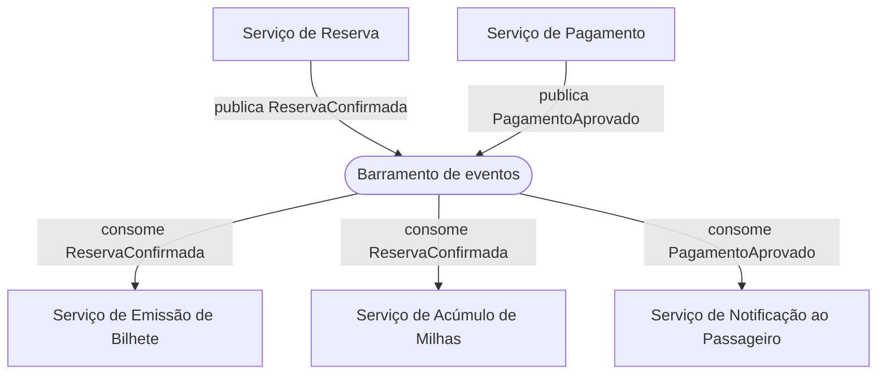

# Estilos arquiteturais e sua relação com atributo de qualidade

Este bloco fecha a aula respondendo a uma pergunta que depende de tudo o que veio antes, qual padrão de organização estrutural sustenta melhor os atributos de qualidade que um cenário já revelou como significativos.

## Antes de começar

- [Estilo arquitetural](../referencia/glossario.md#estilo-arquitetural)

## Conceito

Um estilo arquitetural é um padrão de organização estrutural de um sistema, que define tipos de componentes, formas de conexão entre eles e restrições sobre essa organização. A definição tem três partes que merecem exame separado. Tipos de componentes significa que o estilo nomeia categorias recorrentes de elemento, como camada, serviço ou produtor de evento, não instâncias específicas de um sistema. Formas de conexão significa que o estilo fixa como esses elementos se comunicam, de forma síncrona ou assíncrona, direta ou mediada por um intermediário. Restrições sobre essa organização significa que o estilo proíbe certas relações, como uma camada inferior chamar uma camada superior, ou um serviço acessar diretamente o banco de outro serviço. Um estilo arquitetural descreve, portanto, a forma macro de um sistema inteiro, e não a organização interna de uma única camada ou de um único componente.

A arquitetura civil ajuda a fixar a ideia. Por que faria sentido projetar uma casa de madeira com telhado pontudo? Porque a função segue a forma. O telhado inclinado impede o acúmulo de neve, e a madeira opera como isolamento térmico. Nenhuma das duas escolhas é estética, cada uma responde a uma condição do ambiente em que a casa vai operar. A mesma lógica vale em software, o estilo não é preferência de desenho, é resposta às condições em que o sistema vai executar.

*Três estilos construtivos, cada um respondendo a condições diferentes de clima, terreno e uso. Fonte: ShutterStock, reproduzida do material base do professor.*

A escolha de estilo está entre as decisões de maior impacto sobre a arquitetura porque ela define, de antemão, quais atributos de qualidade o sistema consegue sustentar com naturalidade e quais exigirão esforço extra ou mecanismo compensatório. Um estilo que concentra processamento em um único processo favorece consistência transacional e simplicidade operacional, mas tende a limitar a escalabilidade independente de partes do sistema com carga desigual. Um estilo que distribui processamento em unidades independentes favorece escalabilidade seletiva e implantação isolada, mas introduz consistência eventual, latência de rede e superfície maior de falha parcial. Ford e Richards descrevem essa comparação de estilos por atributo de qualidade como o instrumento central da decisão, porque nenhum estilo maximiza todos os atributos ao mesmo tempo, e a escolha declara, de forma implícita, quais atributos o arquiteto está disposto a sacrificar em favor de outros.

O quadro abaixo apresenta sete estilos, os tipos de componente que cada um define, a forma de comunicação entre eles e os atributos de qualidade que cada um tende a favorecer ou a prejudicar.

| Estilo | Componentes | Comunicação | Favorece | Prejudica |
| --- | --- | --- | --- | --- |
| Arquitetura em camadas | Camadas horizontais com responsabilidade fixa, como apresentação, negócio e persistência | Síncrona, sempre da camada superior para a imediatamente inferior | Simplicidade de raciocínio, manutenibilidade dentro de cada camada, curva de aprendizado baixa para equipe nova | Escalabilidade independente de partes do sistema, porque a unidade de implantação costuma ser o sistema inteiro |
| Arquitetura de microsserviços | Serviços autônomos, cada um dono de seu próprio dado e implantado de forma independente | Síncrona por chamada de rede ou assíncrona por mensageria, sempre entre processos distintos | Escalabilidade seletiva, implantação independente, isolamento de falha entre serviços | Consistência transacional entre serviços, complexidade operacional, latência de comunicação entre processos |
| Arquitetura orientada a eventos | Produtores e consumidores de evento, conectados por um intermediário que distribui a mensagem | Assíncrona, mediada por um barramento ou tópico, sem acoplamento direto entre quem publica e quem consome | Desacoplamento temporal entre componentes, absorção de pico de carga por enfileiramento, extensibilidade por novo consumidor sem alterar o produtor | Rastreabilidade do fluxo completo de processamento, consistência imediata, previsibilidade de ordem de entrega |
| Arquitetura microkernel | Um núcleo mínimo com as regras essenciais e plugins que estendem funcionalidade sem alterar o núcleo | O núcleo expõe pontos de extensão fixos, e cada plugin se conecta a esses pontos sem se comunicar diretamente com outro plugin | Extensibilidade controlada, isolamento de funcionalidade opcional, ciclo de liberação independente para cada plugin | Desempenho quando o volume de plugins ativos cresce, coordenação de comportamento que atravessa vários plugins ao mesmo tempo |
| Arquitetura hexagonal | Um núcleo com a lógica de negócio e adaptadores que o ligam ao mundo externo, através de portas declaradas pelo próprio núcleo | O núcleo nunca chama o adaptador diretamente, ele declara a porta e o adaptador se conecta a ela, o que inverte a direção da dependência | Testabilidade do núcleo em isolamento, substituição de banco, interface ou integração externa sem tocar na regra de negócio | Esforço inicial de desenho, porque cada porta precisa ser declarada antes de haver ganho visível, e custo de indireção em sistema pequeno |
| Pipes and filters | Filtros que transformam o dado recebido e pipes que transportam o dado entre eles | Unidirecional e em sequência, sem estado compartilhado entre filtros, cada um recebendo apenas o que o anterior produziu | Substituição e reordenação de etapa sem afetar o restante, reúso do mesmo filtro em outro fluxo, escalabilidade por etapa | Latência acumulada e sobrecarga de comunicação em fluxo longo, e dificuldade de operação que precise de visão do dado inteiro |
| Arquitetura orientada a APIs | Serviços que expõem capacidade por contrato formal, e um gateway que centraliza o acesso a eles | Síncrona e sempre através da API publicada, com contrato declarado e versionado, nunca por acesso direto ao dado alheio | Interoperabilidade, reúso da mesma capacidade em contextos diferentes, desacoplamento entre consumidor e provedor, integração rápida de parceiro novo | Gestão do ciclo de vida da API, porque versionamento mal conduzido recria dependência rígida entre consumidor e provedor |

A arquitetura em camadas é o estilo mais direto de descrever e o mais frequente em sistema corporativo de escopo estável. Em um sistema de gestão de estoque industrial, a camada de apresentação exibe posição de inventário e ordem de reposição, a camada de negócio aplica regra de ponto de pedido e rateio entre depósitos, e a camada de persistência grava o saldo por item e por local. A dependência entre camadas segue sempre a mesma direção, o que simplifica o raciocínio sobre o sistema, mas concentra a implantação em uma unidade só, de modo que um pico de consulta de estoque em um único depósito força escalar o sistema inteiro, mesmo que os demais depósitos operem em carga normal.

| Força típica da arquitetura em camadas | Anti-padrão típico |
| --- | --- |
| Simplicidade de raciocínio e testabilidade de cada camada em isolamento | O **sumidouro**, quando uma camada apenas repassa a chamada adiante sem decidir, validar ou transformar nada |

A heurística prática para reconhecer o sumidouro vem de Ford e Richards, autores já citados no início desta seção Conceito. Se mais de 80% das chamadas de um sistema em camadas apenas repassam a requisição adiante, sem tomar decisão, validar dado ou transformar resultado, o estilo em camadas provavelmente deixou de ser o certo para esse sistema, porque a estrutura passa a cobrar latência de travessia sem devolver benefício algum. No exemplo do sistema de gestão de estoque industrial descrito acima, esse sinal apareceria se a camada de negócio apenas repassasse a consulta de saldo à persistência, sem aplicar a regra de ponto de pedido que justifica sua existência.

A prevalência do estilo em camadas em sistema corporativo tem, além da explicação técnica, uma explicação organizacional. A **Lei de Conway** descreve que organizações produzem arquiteturas que espelham sua própria estrutura de comunicação. Uma equipe dividida em front-end, back-end e banco de dados tende a produzir, mesmo sem decisão deliberada de um arquiteto, um sistema também dividido nessas três camadas.

A arquitetura de microsserviços resolve exatamente essa limitação ao custo de outra. Em uma plataforma de streaming de música, o catálogo de faixas, o motor de recomendação e o processamento de pagamento de assinatura podem ser serviços separados, cada um escalado de acordo com sua própria demanda, o motor de recomendação crescendo em época de lançamento de grandes artistas sem exigir que o serviço de pagamento cresça junto. O preço dessa independência é a ausência de uma transação única que atravesse os três serviços, o que obriga a tratar inconsistência temporária entre catálogo e recomendação como situação normal, não como falha.

| Força típica da arquitetura de microsserviços | Anti-padrão típico |
| --- | --- |
| Escalabilidade seletiva e implantação independente por serviço | O **monólito distribuído**, quando serviços são separados fisicamente mas seguem acoplados por uma cadeia longa de chamadas síncronas necessárias para concluir uma única operação de negócio |

A heurística prática aqui olha para o comprimento dessa cadeia. Se concluir uma operação do usuário depende de uma sequência síncrona que atravessa mais de dois ou três serviços, a falha de qualquer um deles interrompe a operação inteira, e a independência de implantação que justificou dividir o sistema em serviços deixa de existir na prática, porque nenhum serviço consegue evoluir sem considerar o comportamento dos demais na mesma cadeia.

A Lei de Conway, já apresentada no estilo em camadas acima, também explica a origem de muitas fronteiras de microsserviços. Uma organização dividida em equipes autônomas responsáveis por uma capacidade de negócio inteira tende a produzir serviços com a mesma fronteira dessas equipes, o que é a razão organizacional por trás da divisão em catálogo, recomendação e pagamento no exemplo da plataforma de streaming de música descrito acima.

A arquitetura orientada a eventos favorece situação de pico e de integração entre partes que não precisam saber umas das outras. Em um sistema de reservas de companhia aérea, o serviço de reserva publica um evento de confirmação de assento, e os serviços de emissão de bilhete, de acúmulo de milhas e de notificação ao passageiro consomem esse evento de forma independente, sem que o serviço de reserva conheça a existência deles. O diagrama abaixo mostra essa estrutura.

O barramento absorve variação de carga entre produtor e consumidor, porque o evento fica retido até que cada consumidor tenha capacidade de processá-lo, o que favorece um pico de reservas na abertura de uma nova rota sem que o serviço de reserva espere a conclusão da emissão de bilhete. O custo aparece quando é preciso reconstruir, depois do fato, a sequência exata de eventos que levou a um estado incorreto, porque a ordem de entrega entre tópicos diferentes não é garantida e o fluxo completo está disperso entre vários consumidores.

| Força típica da arquitetura orientada a eventos | Anti-padrão típico |
| --- | --- |
| Desacoplamento temporal e absorção de pico de carga entre produtor e consumidor | A ausência de um identificador de correlação entre eventos relacionados, que impede reconstruir depois do fato a sequência que levou a um estado incorreto |

A heurística prática aqui é sobre ordem, não sobre volume. Se a lógica de negócio depende de uma ordem garantida entre eventos publicados em tópicos diferentes, a arquitetura orientada a eventos provavelmente não é o estilo certo para essa parte do fluxo, porque o barramento por si só garante ordem dentro de um tópico, não entre tópicos diferentes. No exemplo do sistema de reservas de companhia aérea descrito acima, isso significa que a confirmação de assento e a aprovação de pagamento precisam carregar um identificador comum de reserva, para que os serviços de emissão de bilhete, de acúmulo de milhas e de notificação consigam correlacionar os dois eventos à mesma operação, mesmo sem garantia de que um chegue antes do outro.

A arquitetura microkernel serve bem quando a maior parte do sistema é estável e uma parte pequena precisa variar por cliente ou por mercado. Um sistema de gestão de estoque industrial que atende clientes com regras fiscais diferentes por estado pode manter o núcleo de controle de saldo fixo e tratar cada regra fiscal como um plugin acionado no momento da baixa de estoque. O ganho é liberar um plugin novo sem tocar no núcleo nem nos demais plugins. A limitação aparece quando duas regras fiscais de plugins diferentes precisam ser aplicadas na mesma operação em uma ordem específica, porque o núcleo não foi desenhado para coordenar plugins entre si.

| Força típica da arquitetura microkernel | Anti-padrão típico |
| --- | --- |
| Extensibilidade controlada e ciclo de liberação independente para cada plugin | O **core creep**, quando o núcleo absorve regra específica de um plugin e deixa de ser mínimo |

A heurística prática é direta. Quando o núcleo precisa ser alterado a cada novo plugin adicionado, ele já não cumpre o papel de núcleo estável, e o estilo microkernel só se sustenta enquanto as regras essenciais permanecem fixas no núcleo e toda variação fica isolada nos plugins. No exemplo do sistema de gestão de estoque industrial com regras fiscais por estado, descrito acima, o core creep apareceria se o núcleo de controle de saldo passasse a conter uma condicional específica para a regra fiscal de um estado, em vez de delegar essa regra ao plugin correspondente.

Uma organização pequena e estável responsável pelo núcleo, com equipes variáveis e temporárias contratadas para construir plugins específicos por cliente ou mercado, tende a produzir naturalmente essa divisão entre núcleo e extensão, outra aplicação da Lei de Conway já apresentada no estilo em camadas acima.

A arquitetura hexagonal, também chamada de portas e adaptadores, ataca um problema diferente dos anteriores. Ela não trata de como distribuir o sistema, trata de proteger a regra de negócio do que a cerca. Em um sistema de concessão de crédito, a política de risco e de limite fica no núcleo, e tudo o que é externo entra por adaptador, o serviço de consulta a bureau de crédito, o núcleo bancário que efetiva o desembolso e os canais pelos quais o cliente pede o empréstimo. O núcleo não conhece nenhum desses três, ele declara o que precisa, por exemplo obter a pontuação de crédito de um solicitante, e cada adaptador atende a essa declaração. Trocar de bureau passa a ser trocar um adaptador, sem tocar na política de risco, e testar a política deixa de exigir bureau, banco ou tela.

| Força típica da arquitetura hexagonal | Anti-padrão típico |
| --- | --- |
| Testabilidade do núcleo em isolamento e substituição de dependência externa sem alterar a regra de negócio | O vazamento do adaptador para dentro do núcleo, quando a regra de negócio passa a conhecer detalhe de tecnologia, como o formato de retorno do bureau ou a exceção específica do driver de banco |

A heurística prática é de compilação, não de desenho. Se o núcleo não compila sem a biblioteca do fornecedor externo, a porta não existe de fato, ela é apenas um nome dado a uma chamada direta. No exemplo do sistema de concessão de crédito descrito acima, isso apareceria se a política de risco recebesse como parâmetro o objeto de resposta do bureau, em vez de uma pontuação simples, porque a partir daí trocar de bureau volta a exigir mexer na política.

O estilo pipes and filters organiza o sistema como uma sequência de etapas de transformação. Os filtros encapsulam uma função específica, como validar, estimar ou calcular, e os pipes transportam o dado de um para o outro na forma de fluxo. Como nenhum filtro compartilha estado com outro, cada um pode ser substituído ou reaproveitado em outro fluxo sem afetar o restante. Em um sistema de processamento de medições de consumo de energia, a leitura bruta do medidor passa por um filtro de validação, depois por um filtro que estima a leitura quando ela veio ausente ou implausível, depois pelo filtro que aplica a tarifa vigente e por fim pelo que gera a fatura. Mudar a regra de estimativa é trocar um filtro, e a tarifação nem fica sabendo. Ferramentas modernas de fluxo de dados derivam desse estilo, e é por isso que ele é a base de sistemas de extração, transformação e carga.

| Força típica do estilo pipes and filters | Anti-padrão típico |
| --- | --- |
| Substituição e reúso de etapa isolada, sem afetar o restante do fluxo | O filtro que guarda estado entre execuções ou que depende de saber qual filtro veio antes dele, o que destrói a substituição e o reúso que justificam o estilo |

A heurística prática testa o isolamento. Se um filtro precisa saber qual etapa o antecedeu para produzir o resultado correto, ele carrega estado implícito e deixou de ser substituível, porque não dá mais para reaproveitá-lo em outro fluxo nem testá-lo sozinho. No exemplo do processamento de medições descrito acima, esse sinal apareceria se o filtro de tarifação precisasse saber se a leitura foi medida ou estimada, em vez de receber essa informação como parte do dado que chega.

A arquitetura orientada a APIs organiza o sistema em torno de contratos formais publicados. Cada capacidade é exposta por uma interface declarada e versionada, e nenhum consumidor alcança o dado de outro por caminho que não seja essa interface. As APIs costumam ser classificadas em três tipos por alcance, as internas, que ligam sistemas da própria organização, as externas, expostas a parceiros identificados, e as públicas, abertas a qualquer desenvolvedor. Em uma operadora de telecomunicações, a consulta de saldo e a recarga de crédito podem ser a mesma capacidade oferecida nos três alcances, consumida internamente pelo aplicativo próprio, externamente pela rede de varejo que vende recarga no caixa, e publicamente por quem queira construir algo sobre ela. Um gateway centraliza o que seria repetido em cada serviço, a autenticação, a autorização, a limitação de taxa e a observabilidade.

| Força típica da arquitetura orientada a APIs | Anti-padrão típico |
| --- | --- |
| Reúso da mesma capacidade em contextos diferentes e desacoplamento entre quem consome e quem provê | A mudança incompatível publicada sem nova versão, que quebra o consumidor sem aviso e recria a dependência rígida que o contrato deveria eliminar |

A heurística prática olha para a liberação. Se publicar uma alteração exige combinar a data com cada consumidor, o contrato não está desacoplando nada, ele apenas mudou de lugar o acoplamento. No exemplo da operadora de telecomunicações descrito acima, isso apareceria se acrescentar um campo à resposta de consulta de saldo obrigasse a rede de varejo a atualizar o sistema de caixa no mesmo dia. Vale notar que este estilo raramente aparece sozinho, ele costuma organizar a fronteira de um sistema que por dentro segue microsserviços ou camadas.

## Uso pelo arquiteto

O arquiteto usa essa comparação de estilo por atributo de qualidade para defender uma escolha diante de partes interessadas com prioridades diferentes, traduzindo uma preferência técnica em uma tabela de trocas explícitas. Em vez de afirmar que um estilo é melhor em abstrato, o arquiteto mostra qual atributo o estilo escolhido favorece, qual ele sacrifica, e associa cada um desses atributos ao cenário de qualidade que a organização já reconheceu como prioritário, o que torna a decisão auditável e reduz a chance de reabri-la sem novo dado.

## Exercício 10

A ACME é uma universidade privada brasileira cujo sistema acadêmico legado sustenta um núcleo transacional em COBOL sobre o monitor CICS, uma camada web em JSF e EJB e integrações por arquivo em lote com o ERP financeiro e o ambiente virtual de aprendizagem, em processo de modernização incremental.

Os dois cenários abaixo já foram formulados no formato de seis elementos. Se o aluno já escreveu seus próprios cenários no [bloco 3 da Aula 2](../modulo-2-requisitos-e-partes-interessadas/bloco-3-cenarios-linha-de-base-e-restricoes.md), pode usá-los no lugar destes, que servem de versão de referência para quem ainda não os tem.

Cenário 1, pico de sazonalidade

| Elemento | Especificação |
| --- | --- |
| Fonte | Alunos veteranos e ingressantes da ACME |
| Estímulo | Acesso simultâneo ao Portal do Aluno para confirmar matrícula |
| Ambiente | Abertura da janela de matrícula, pico de 5.800 sessões simultâneas nos 30 minutos iniciais, razão de 7,1 sobre a média anual ponderada de 815 sessões |
| Artefato | Portal do Aluno e núcleo transacional |
| Resposta | Processar as tentativas de confirmação sem degradar acima de um limite aceitável de erro |
| Medida | Taxa de erro abaixo de 1%, contra os 6,3% observados atualmente no mesmo intervalo |

Cenário 2, incidente de 04/02/2026

| Elemento | Especificação |
| --- | --- |
| Fonte | Sessões web abandonadas pelo aluno sem encerramento explícito |
| Estímulo | Transação do monitor CICS permanece aberta após o abandono do navegador, sem tempo limite de sessão configurado |
| Ambiente | Abertura da matrícula de 04/02/2026, sob o mesmo pico de 5.800 sessões simultâneas |
| Artefato | Monitor CICS e núcleo transacional |
| Resposta | Encerrar a transação por tempo limite de sessão antes de esgotar o limite de tarefas concorrentes do CICS |
| Medida | Indisponibilidade contida dentro dos 43 minutos tolerados por mês pelo acordo de nível de serviço, contra os 260 minutos consumidos no incidente registrado, com 62% de erro nas tentativas de matrícula e 9.400 alunos sem inscrição concluída no dia |

1. Escolha três dos estilos apresentados no Conceito e compare cada um contra os dois cenários acima. Para cada estilo, avalie se ele sustentaria a resposta e a medida descritas, considerando o núcleo COBOL sobre CICS como parte que permanece em operação durante a transição.
2. Defenda qual dos três estilos se ajusta melhor a um contexto de modernização incremental de um sistema legado crítico, justificando a escolha por atributo de qualidade favorecido e por atributo de qualidade prejudicado.

## Fontes

As referências seguem o formato APA, 7ª edição, e constam da [bibliografia](../referencia/bibliografia.md) do curso. O trecho consultado aparece entre parênteses ao fim de cada entrada.

- Ford, N., & Richards, M. (2020). *Fundamentals of software architecture*. O'Reilly. (comparação de estilos por atributo de qualidade)
- Bass, L., Clements, P., & Kazman, R. (2021). *Software architecture in practice* (4th ed.). Addison-Wesley. (relação entre estilo e atributo de qualidade)
- Mendes, M. (2026b). *Guias de projeto de arquitetura de software* [Material de curso, versão arquivada]. https://github.com/aulas-marco/projeto-arquitetura-software/tree/30f15cd (guia 1.3, fonte da analogia da casa e da caracterização dos estilos hexagonal, pipes and filters e orientada a APIs)
- Mendes, M. (2026a). *Arquitetura de software* [Material de curso]. https://marco-mendes.github.io/arquitetura-software/ (material publicado do professor)
- Vernon, V. (2013). *Implementing domain-driven design*. Addison-Wesley. (arquitetura hexagonal, leitura indicada por Mendes (2026b))
- Hohpe, G., & Woolf, B. (2003). *Enterprise integration patterns: Designing, building, and deploying messaging solutions*. Addison-Wesley. (pipes and filters, leitura indicada por Mendes (2026b))

**Material do curso.** Glossário, entrada [estilo arquitetural](../referencia/glossario.md#estilo-arquitetural). Dossiê da instituição fictícia [ACME](../caso-acme/index.md), [arquitetura de linha de base](../caso-acme/linha-de-base.md) e [dados operacionais](../caso-acme/dados-operacionais.md).
