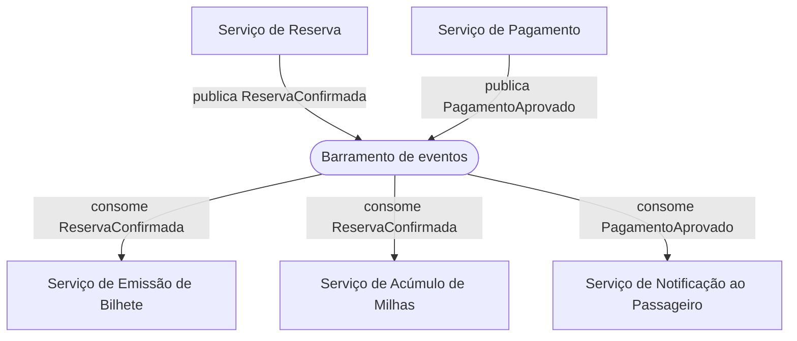
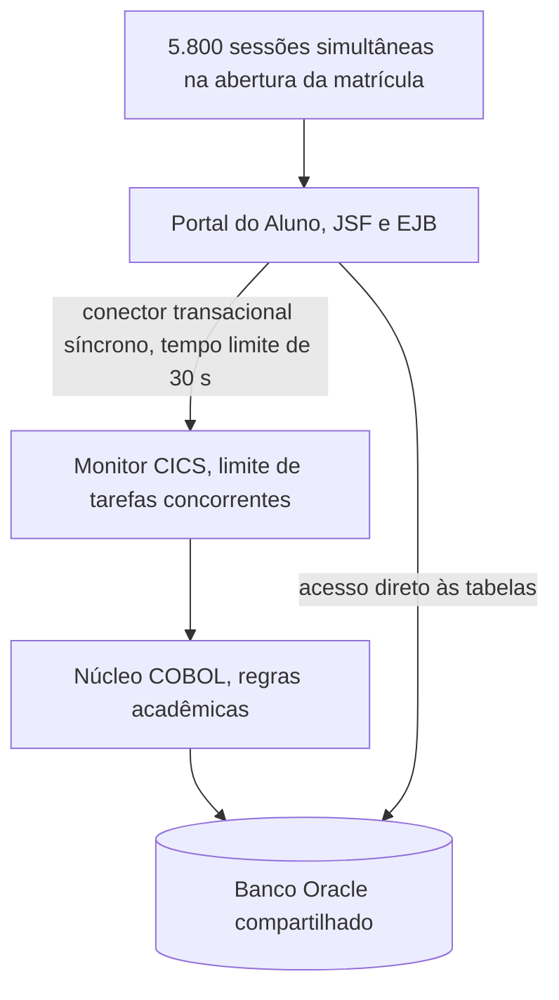

# Estilos arquiteturais e sua relação com atributo de qualidade

Este bloco recebe os princípios priorizados no [bloco 1](bloco-1-principios-de-design.md#repertorio-de-principios) e os cenários de qualidade do [bloco 3 da Aula 2](../modulo-2-requisitos-e-partes-interessadas/bloco-3-cenarios-linha-de-base-e-restricoes.md) e responde qual padrão de organização estrutural sustenta melhor essas exigências, reconhecendo o compromisso que cada estilo impõe.

## Antes de começar

- [Estilo arquitetural](../referencia/glossario.md#estilo-arquitetural)
- [Princípio de design](../referencia/glossario.md#principio-de-design)
- [Cenário de atributo de qualidade](../referencia/glossario.md#cenario-de-atributo-de-qualidade)

## Conceito

Um estilo arquitetural é um padrão de organização estrutural de um sistema, que define tipos de componentes, formas de conexão entre eles e restrições sobre essa organização. A definição tem três partes que merecem exame separado. Tipos de componentes significa que o estilo nomeia categorias recorrentes de elemento, como camada, serviço ou produtor de evento, não instâncias específicas de um sistema. Formas de conexão significa que o estilo fixa como esses elementos se comunicam, de forma síncrona ou assíncrona, direta ou mediada por um intermediário. Restrições sobre essa organização significa que o estilo proíbe certas relações, como uma camada inferior chamar uma camada superior, ou um serviço acessar diretamente o banco de outro serviço. Um estilo arquitetural descreve, portanto, a forma macro de um sistema inteiro, e a organização interna de uma camada ou de um componente fica para os padrões tratados no bloco 3.

A arquitetura civil ajuda a fixar a ideia. Por que faria sentido projetar uma casa de madeira com telhado pontudo? Porque a forma segue a função. O telhado inclinado impede o acúmulo de neve, e a madeira opera como isolamento térmico. Cada uma das duas escolhas responde a uma condição do ambiente em que a casa vai operar, e a mesma lógica vale em software, onde o estilo responde às condições de carga, de mudança e de falha em que o sistema vai executar.

*Figura 1 — Três estilos construtivos, cada um respondendo a condições diferentes de clima, terreno e uso. Fonte: ShutterStock, reproduzida do material base do professor.*

A escolha de estilo está entre as decisões de maior impacto sobre a arquitetura porque ela define, de antemão, quais [atributos de qualidade](../referencia/glossario.md#atributo-de-qualidade) o sistema consegue sustentar com naturalidade e quais exigirão esforço extra ou mecanismo compensatório. Um estilo que concentra processamento em um único processo favorece consistência transacional e simplicidade operacional, mas tende a limitar a escalabilidade independente de partes do sistema com carga desigual. Um estilo que distribui processamento em unidades independentes favorece escalabilidade seletiva e implantação isolada, mas introduz consistência eventual, latência de rede e superfície maior de falha parcial. Ford e Richards (2020) descrevem essa comparação de estilos por atributo de qualidade como o instrumento central da decisão, porque nenhum estilo maximiza todos os atributos ao mesmo tempo, e a escolha declara, de forma implícita, quais atributos o arquiteto está disposto a sacrificar em favor de outros.

O quadro abaixo apresenta sete estilos, os tipos de componente que cada um define, a forma de comunicação entre eles, os atributos de qualidade que cada um tende a favorecer ou a prejudicar e os princípios do repertório apresentado no [bloco 1](bloco-1-principios-de-design.md) que a estrutura do estilo tende a sustentar sem mecanismo adicional.

| Estilo | Componentes | Comunicação | Favorece | Prejudica | Princípios que tende a sustentar |
| --- | --- | --- | --- | --- | --- |
| Arquitetura em camadas | Camadas horizontais com responsabilidade fixa, como apresentação, negócio e persistência | Síncrona, sempre da camada superior para a imediatamente inferior | Simplicidade de raciocínio, manutenibilidade dentro de cada camada, curva de aprendizado baixa para equipe nova | Escalabilidade independente de partes do sistema, porque a unidade de implantação costuma ser o sistema inteiro | Simplicidade, separação de responsabilidades |
| Arquitetura de microsserviços | Serviços autônomos, cada um dono de seu próprio dado e implantado de forma independente | Síncrona por chamada de rede ou assíncrona por mensageria, sempre entre processos distintos | Escalabilidade seletiva, implantação independente, isolamento de falha entre serviços | Consistência transacional entre serviços, complexidade operacional, latência de comunicação entre processos | Baixo acoplamento, alta coesão, evolução incremental |
| Arquitetura orientada a eventos | Produtores e consumidores de evento, conectados por um intermediário que distribui a mensagem | Assíncrona, mediada por um barramento ou tópico, sem acoplamento direto entre quem publica e quem consome | Desacoplamento temporal entre componentes, absorção de pico de carga por enfileiramento, extensibilidade por novo consumidor sem alterar o produtor | Rastreabilidade do fluxo completo de processamento, consistência imediata, previsibilidade de ordem de entrega | Baixo acoplamento, desenho para falha |
| Arquitetura microkernel | Um núcleo mínimo com as regras essenciais e plugins que estendem funcionalidade sem alterar o núcleo | O núcleo expõe pontos de extensão fixos, e cada plugin se conecta a esses pontos sem se comunicar diretamente com outro plugin | Extensibilidade controlada, isolamento de funcionalidade opcional, ciclo de liberação independente para cada plugin | Desempenho quando o volume de plugins ativos cresce, coordenação de comportamento que atravessa vários plugins ao mesmo tempo | Encapsulamento, evolução incremental |
| Arquitetura hexagonal | Um núcleo com a lógica de negócio e adaptadores que o ligam ao mundo externo, através de portas declaradas pelo próprio núcleo | O núcleo nunca chama o adaptador diretamente, ele declara a porta e o adaptador se conecta a ela, o que inverte a direção da dependência | Testabilidade do núcleo em isolamento, substituição de banco, interface ou integração externa sem tocar na regra de negócio | Esforço inicial de desenho, porque cada porta precisa ser declarada antes de haver ganho visível, e custo de indireção em sistema pequeno | Encapsulamento, separação de responsabilidades |
| Pipes and filters | Filtros que transformam o dado recebido e pipes que transportam o dado entre eles | Unidirecional e em sequência, sem estado compartilhado entre filtros, cada um recebendo apenas o que o anterior produziu | Substituição e reordenação de etapa sem afetar o restante, reúso do mesmo filtro em outro fluxo, escalabilidade por etapa | Latência acumulada e sobrecarga de comunicação em fluxo longo, e dificuldade de operação que precise de visão do dado inteiro | Alta coesão, simplicidade |
| Arquitetura orientada a APIs | Serviços que expõem capacidade por contrato formal, e um gateway que centraliza o acesso a eles | Síncrona e sempre através da API publicada, com contrato declarado e versionado, nunca por acesso direto ao dado alheio | Interoperabilidade, reúso da mesma capacidade em contextos diferentes, desacoplamento entre consumidor e provedor, integração rápida de parceiro novo | Gestão do ciclo de vida da API, porque versionamento mal conduzido recria dependência rígida entre consumidor e provedor | Encapsulamento, baixo acoplamento |

A última coluna indica tendência e não garantia. Um estilo que tende a sustentar baixo acoplamento pode ser implantado com acoplamento alto, como mostra o anti-padrão do monólito distribuído descrito na seção de microsserviços abaixo, e um princípio que o estilo não sustenta por estrutura pode ser atendido por mecanismo acrescentado, com custo. A comparação útil cruza, para cada estilo candidato, os princípios priorizados com o que o estilo oferece por estrutura e com o que exigiria de mecanismo compensatório.

<figure markdown="span">
{ .module-diagram }
</figure>

*Figura 2 — Tendência de cada estilo diante de quatro forças genéricas de desenho. Fonte: material do curso, com base em Ford e Richards (2020).*

As sete seções seguintes descrevem cada estilo na mesma ordem de aspectos, forma estrutural, componentes e comunicação, atributos favorecidos, atributos prejudicados, quando usar, quando evitar e o anti-padrão com a heurística que o denuncia.

### Arquitetura em camadas

A arquitetura em camadas é o estilo mais direto de descrever e o mais frequente em sistema corporativo de escopo estável. Em um sistema de gestão de estoque industrial, a camada de apresentação exibe posição de inventário e ordem de reposição, a camada de negócio aplica regra de ponto de pedido e rateio entre depósitos, e a camada de persistência grava o saldo por item e por local. A dependência entre camadas segue sempre a mesma direção, o que simplifica o raciocínio sobre o sistema, mas concentra a implantação em uma unidade só, de modo que um pico de consulta de estoque em um único depósito força escalar o sistema inteiro, mesmo que os demais depósitos operem em carga normal.

| Aspecto | Descrição |
| --- | --- |
| Forma estrutural | Camadas horizontais empilhadas, cada uma com responsabilidade fixa |
| Componentes e comunicação | Apresentação, negócio e persistência, com chamada síncrona sempre da camada superior para a inferior |
| Favorece | Simplicidade de raciocínio e testabilidade de cada camada em isolamento |
| Prejudica | Escalabilidade independente, porque a unidade de implantação costuma ser o sistema inteiro |
| Quando usar | Escopo estável, carga homogênea entre funcionalidades e equipe que precisa de estrutura de aprendizado rápido |
| Quando evitar | Partes do sistema com carga muito desigual ou com ritmos de mudança muito diferentes |
| Anti-padrão e heurística de alerta | O **sumidouro**, quando uma camada apenas repassa a chamada adiante. Se mais de 80% das chamadas atravessam as camadas sem decisão, validação ou transformação, o estilo provavelmente deixou de ser adequado |

A heurística do sumidouro vem de Ford e Richards (2020). A estrutura em camadas passa a cobrar latência de travessia sem devolver benefício quando a maior parte das chamadas apenas atravessa as camadas. No exemplo do sistema de gestão de estoque industrial, esse sinal apareceria se a camada de negócio apenas repassasse a consulta de saldo à persistência, sem aplicar a regra de ponto de pedido que justifica sua existência.

### Arquitetura de microsserviços

A arquitetura de microsserviços resolve a limitação de escalabilidade do estilo em camadas ao custo de outra. Na Plataforma de Streaming ACME, que oferece música por assinatura, o catálogo de faixas, o motor de recomendação e o processamento de pagamento de assinatura podem ser serviços separados, cada um escalado de acordo com sua própria demanda, o motor de recomendação crescendo em época de lançamento de grandes artistas sem exigir que o serviço de pagamento cresça junto. O preço dessa independência é a ausência de uma transação única que atravesse os três serviços, o que obriga a tratar inconsistência temporária entre catálogo e recomendação como situação prevista no desenho, com prazo máximo de convergência declarado.

| Aspecto | Descrição |
| --- | --- |
| Forma estrutural | Serviços autônomos, cada um dono do seu dado e implantado de forma independente |
| Componentes e comunicação | Serviços ligados por chamada de rede síncrona ou por mensageria assíncrona, sempre entre processos distintos |
| Favorece | Escalabilidade seletiva, implantação independente e isolamento de falha entre serviços |
| Prejudica | Consistência transacional entre serviços, simplicidade operacional e latência entre processos |
| Quando usar | Capacidades com carga e ritmo de mudança diferentes, sob responsabilidade de equipes autônomas |
| Quando evitar | Equipe pequena sem automação de implantação e de observabilidade, ou domínio cuja regra exige transação única entre as partes |
| Anti-padrão e heurística de alerta | O **monólito distribuído**, com serviços separados fisicamente mas acoplados por cadeia síncrona longa. Se uma operação do usuário depende de mais de dois ou três serviços em sequência síncrona, a independência de implantação deixou de existir na prática |

A heurística olha para o comprimento da cadeia síncrona. Quando concluir uma operação exige a resposta de vários serviços em sequência, a falha de qualquer um deles interrompe a operação inteira, e nenhum serviço consegue evoluir sem considerar o comportamento dos demais na mesma cadeia.

A fronteira dos serviços tem também uma explicação organizacional. A Lei de Conway descreve que organizações produzem arquiteturas que espelham sua própria estrutura de comunicação, e uma organização dividida em equipes autônomas responsáveis por uma capacidade de negócio inteira tende a produzir serviços com a mesma fronteira dessas equipes. No exemplo da Plataforma de Streaming ACME, a divisão em catálogo, recomendação e pagamento só se sustenta se houver equipes com essas mesmas responsabilidades, e uma divisão de serviços que contrarie a divisão de equipes tende a reintroduzir o acoplamento por coordenação entre pessoas.

### Arquitetura orientada a eventos

A arquitetura orientada a eventos favorece situação de pico e de integração entre partes que não precisam saber umas das outras. No sistema de reservas da Companhia Aérea ACME, o serviço de reserva publica um evento de confirmação de assento, e os serviços de emissão de bilhete, de acúmulo de milhas e de notificação ao passageiro consomem esse evento de forma independente, sem que o serviço de reserva conheça a existência deles, e o diagrama abaixo mostra os dois produtores, o barramento e os três consumidores.

```mermaid
graph TD
    RES["Serviço de Reserva"]
    PAG["Serviço de Pagamento"]
    BUS(["Barramento de eventos"])
    EMI["Serviço de Emissão de Bilhete"]
    MIL["Serviço de Acúmulo de Milhas"]
    NOT["Serviço de Notificação ao Passageiro"]

    RES -->|"publica ReservaConfirmada"| BUS
    PAG -->|"publica PagamentoAprovado"| BUS
    BUS -->|"consome ReservaConfirmada"| EMI
    BUS -->|"consome ReservaConfirmada"| MIL
    BUS -->|"consome PagamentoAprovado"| NOT
```

O barramento absorve variação de carga entre produtor e consumidor, porque o evento fica retido até que cada consumidor tenha capacidade de processá-lo, o que favorece um pico de reservas na abertura de uma nova rota sem que o serviço de reserva espere a conclusão da emissão de bilhete. O custo aparece quando é preciso reconstruir, depois do fato, a sequência exata de eventos que levou a um estado incorreto, porque a ordem de entrega entre tópicos diferentes não é garantida e o fluxo completo está disperso entre vários consumidores.

| Aspecto | Descrição |
| --- | --- |
| Forma estrutural | Produtores e consumidores de evento sem conhecimento mútuo, ligados por um intermediário |
| Componentes e comunicação | Publicação e consumo assíncronos por barramento ou tópico |
| Favorece | Desacoplamento temporal, absorção de pico por enfileiramento e extensão por novo consumidor sem alterar o produtor |
| Prejudica | Rastreabilidade do fluxo completo, consistência imediata e previsibilidade de ordem de entrega |
| Quando usar | Integração entre partes que reagem ao mesmo fato em ritmos diferentes, ou carga com picos que o consumidor não acompanha em tempo real |
| Quando evitar | Fluxo que exige resposta imediata ao usuário com o resultado de todos os consumidores, ou regra que depende de ordem garantida entre tópicos diferentes |
| Anti-padrão e heurística de alerta | A ausência de identificador de correlação entre eventos relacionados. Se a lógica de negócio depende de ordem garantida entre eventos de tópicos diferentes, o estilo provavelmente não é adequado para essa parte do fluxo |

O barramento garante ordem apenas dentro de cada tópico. No exemplo do sistema de reservas da Companhia Aérea ACME, a confirmação de assento e a aprovação de pagamento precisam carregar um identificador comum de reserva, para que os serviços de emissão de bilhete, de acúmulo de milhas e de notificação consigam correlacionar os dois eventos à mesma operação, mesmo sem garantia de que um chegue antes do outro.

### Arquitetura microkernel

A arquitetura microkernel serve bem quando a maior parte do sistema é estável e uma parte pequena precisa variar por cliente ou por mercado. Um sistema de gestão de estoque industrial que atende clientes com regras fiscais diferentes por estado pode manter o núcleo de controle de saldo fixo e tratar cada regra fiscal como um plugin acionado no momento da baixa de estoque. O ganho é liberar um plugin novo sem tocar no núcleo nem nos demais plugins. A limitação aparece quando duas regras fiscais de plugins diferentes precisam ser aplicadas na mesma operação em uma ordem específica, porque o núcleo não foi desenhado para coordenar plugins entre si.

| Aspecto | Descrição |
| --- | --- |
| Forma estrutural | Um núcleo mínimo com as regras essenciais e plugins conectados a pontos de extensão fixos |
| Componentes e comunicação | O núcleo aciona cada plugin pelo ponto de extensão, e os plugins não se comunicam entre si |
| Favorece | Extensibilidade controlada e ciclo de liberação independente para cada plugin |
| Prejudica | Desempenho com muitos plugins ativos e coordenação de comportamento que atravessa vários plugins |
| Quando usar | Produto com núcleo estável e variação delimitada por cliente, mercado ou regulação |
| Quando evitar | Variação que exige interação entre extensões ou que altera as regras essenciais com frequência |
| Anti-padrão e heurística de alerta | O **core creep**, quando o núcleo absorve regra específica de um plugin. Se o núcleo precisa ser alterado a cada plugin novo, ele deixou de ser estável |

No exemplo do sistema de gestão de estoque industrial com regras fiscais por estado, o core creep apareceria se o núcleo de controle de saldo passasse a conter uma condicional específica para a regra fiscal de um estado, regra que pertence ao plugin correspondente.

### Arquitetura hexagonal

A arquitetura hexagonal, também chamada de portas e adaptadores, ataca um problema diferente dos anteriores. Ela não trata de como distribuir o sistema, trata de proteger a regra de negócio do que a cerca. Em um sistema de concessão de crédito, a política de risco e de limite fica no núcleo, e tudo o que é externo entra por adaptador, o serviço de consulta a bureau de crédito, o núcleo bancário que efetiva o desembolso e os canais pelos quais o cliente pede o empréstimo. O núcleo não conhece nenhum desses três, ele declara o que precisa, por exemplo obter a pontuação de crédito de um solicitante, e cada adaptador atende a essa declaração. Trocar de bureau passa a ser trocar um adaptador, sem tocar na política de risco, e testar a política deixa de exigir bureau, banco ou tela.

| Aspecto | Descrição |
| --- | --- |
| Forma estrutural | Um núcleo de regra de negócio cercado por portas declaradas e adaptadores que as implementam |
| Componentes e comunicação | O núcleo declara a porta, e o adaptador se conecta a ela, o que inverte a direção da dependência |
| Favorece | Testabilidade do núcleo em isolamento e substituição de dependência externa sem alterar a regra |
| Prejudica | Esforço inicial de desenho e custo de indireção em sistema pequeno |
| Quando usar | Regra de negócio valiosa e duradoura, cercada por integrações que tendem a mudar |
| Quando evitar | Sistema pequeno, de regra trivial, em que as portas não teriam mais de uma implementação |
| Anti-padrão e heurística de alerta | O vazamento do adaptador para dentro do núcleo. Se o núcleo não compila sem a biblioteca do fornecedor externo, a porta não existe de fato |

No exemplo do sistema de concessão de crédito, o vazamento apareceria se a política de risco recebesse como parâmetro o objeto de resposta do bureau, com a estrutura definida pelo fornecedor, porque a partir daí trocar de bureau volta a exigir mexer na política.

### Pipes and filters

O estilo pipes and filters organiza o sistema como uma sequência de etapas de transformação. Os filtros encapsulam uma função específica, como validar, estimar ou calcular, e os pipes transportam o dado de um para o outro na forma de fluxo. No sistema de processamento de medições de consumo da Distribuidora de Energia ACME, a leitura bruta do medidor passa por um filtro de validação, depois por um filtro que estima a leitura quando ela veio ausente ou implausível, depois pelo filtro que aplica a tarifa vigente e por fim pelo que gera a fatura. Mudar a regra de estimativa é trocar um filtro, e a tarifação nem fica sabendo. Ferramentas modernas de fluxo de dados derivam desse estilo, e é por isso que ele é a base de sistemas de extração, transformação e carga.

| Aspecto | Descrição |
| --- | --- |
| Forma estrutural | Sequência de filtros independentes ligados por pipes unidirecionais |
| Componentes e comunicação | Cada filtro recebe apenas o que o anterior produziu, sem estado compartilhado entre filtros |
| Favorece | Substituição, reordenação e reúso de etapa sem afetar o restante, e escalabilidade por etapa |
| Prejudica | Latência acumulada em fluxo longo e operação que precise de visão do dado inteiro |
| Quando usar | Processamento em etapas bem definidas sobre fluxo de dado, como integração, conversão e cálculo em lote |
| Quando evitar | Interação com o usuário que exige resposta imediata ou regra que depende de várias etapas ao mesmo tempo |
| Anti-padrão e heurística de alerta | O filtro que guarda estado entre execuções ou depende de saber qual filtro veio antes. Se um filtro precisa conhecer a etapa anterior para produzir o resultado correto, ele deixou de ser substituível |

No exemplo do processamento de medições, esse sinal apareceria se o filtro de tarifação precisasse consultar o filtro de estimativa para saber se a leitura foi medida ou estimada, informação que deveria chegar como parte do próprio dado.

### Arquitetura orientada a APIs

A arquitetura orientada a APIs organiza o sistema em torno de contratos formais publicados. Cada capacidade é exposta por uma interface declarada e versionada, e nenhum consumidor alcança o dado de outro por caminho que não seja essa interface. As APIs costumam ser classificadas em três tipos por alcance, as internas, que ligam sistemas da própria organização, as externas, expostas a parceiros identificados, e as públicas, abertas a qualquer desenvolvedor. Na Operadora de Telecomunicações ACME, a consulta de saldo e a recarga de crédito podem ser a mesma capacidade oferecida nos três alcances, consumida internamente pelo aplicativo próprio, externamente pela rede de varejo que vende recarga no caixa, e publicamente por quem queira construir algo sobre ela. Um gateway centraliza o que seria repetido em cada serviço, a autenticação, a autorização, a limitação de taxa e a observabilidade.

| Aspecto | Descrição |
| --- | --- |
| Forma estrutural | Capacidades expostas por contratos formais, com acesso centralizado por um gateway |
| Componentes e comunicação | Chamada síncrona sempre pela API publicada, com contrato declarado e versionado |
| Favorece | Interoperabilidade, reúso da mesma capacidade em contextos diferentes e integração rápida de parceiro novo |
| Prejudica | Gestão do ciclo de vida da API, porque versionamento mal conduzido recria dependência rígida |
| Quando usar | Capacidade consumida por vários canais ou parceiros, com necessidade de governança do acesso |
| Quando evitar | Integração interna única e estável, em que o custo de contrato formal e de gateway não tem retorno |
| Anti-padrão e heurística de alerta | A mudança incompatível publicada sem nova versão. Se publicar uma alteração exige combinar a data com cada consumidor, o contrato não está desacoplando nada |

No exemplo da Operadora de Telecomunicações ACME, esse sinal apareceria se acrescentar um campo à resposta de consulta de saldo obrigasse a rede de varejo a atualizar o sistema de caixa no mesmo dia. Este estilo raramente aparece sozinho, porque costuma organizar a fronteira de um sistema que por dentro segue microsserviços ou camadas.

## Uso pelo arquiteto

O arquiteto usa essa comparação de estilo por atributo de qualidade para defender uma escolha diante de partes interessadas com prioridades diferentes, traduzindo uma preferência técnica em uma tabela de trocas explícitas. O arquiteto mostra qual atributo o estilo escolhido favorece, qual ele sacrifica, e associa cada um desses atributos ao cenário de qualidade que a organização já reconheceu como prioritário. Quando dois estilos empatam diante dos cenários, os princípios priorizados no [bloco 1](bloco-1-principios-de-design.md#anatomia-de-um-principio) funcionam como critério de desempate, o que torna a decisão auditável e reduz a chance de reabri-la sem novo dado.

## Exercício 10

A ACME é uma universidade privada brasileira cujo sistema acadêmico legado sustenta um núcleo transacional em COBOL sobre o monitor CICS, uma camada web em JSF e EJB e integrações por arquivo em lote com o ERP financeiro e o ambiente virtual de aprendizagem, em processo de modernização incremental. A comparação deste exercício usa os princípios priorizados no [exercício 9](bloco-1-principios-de-design.md#exercicio-9), e o estilo recomendado aqui é a entrada da seleção de padrões do exercício 11, no [bloco 3](bloco-3-padroes-arquiteturais-e-de-design.md).

### Item 1: Adequação aos cenários de qualidade

Os dois cenários abaixo já foram formulados no formato de seis elementos apresentado no [bloco 3 da Aula 2](../modulo-2-requisitos-e-partes-interessadas/bloco-3-cenarios-linha-de-base-e-restricoes.md). Quem já escreveu os próprios cenários naquele bloco pode usá-los no lugar destes, que servem de versão de referência.

Cenário 1, pico de sazonalidade

| Elemento | Especificação |
| --- | --- |
| Fonte | Alunos veteranos e ingressantes da ACME |
| Estímulo | Acesso simultâneo ao Portal do Aluno para confirmar matrícula |
| Ambiente | Abertura da janela de matrícula, pico de 5.800 sessões simultâneas nos 30 minutos iniciais, razão de 7,1 sobre a média anual ponderada de 815 sessões |
| Artefato | Portal do Aluno e núcleo transacional |
| Resposta | Processar as tentativas de confirmação sem degradar acima de um limite aceitável de erro |
| Medida | Taxa de erro abaixo de 1%, contra os 6,3% observados atualmente no mesmo intervalo |

Cenário 2, incidente de 04/02/2026

| Elemento | Especificação |
| --- | --- |
| Fonte | Sessões web abandonadas pelo aluno sem encerramento explícito |
| Estímulo | Transação do monitor CICS permanece aberta após o abandono do navegador, sem tempo limite de sessão configurado |
| Ambiente | Abertura da matrícula de 04/02/2026, sob o mesmo pico de 5.800 sessões simultâneas |
| Artefato | Monitor CICS e núcleo transacional |
| Resposta | Encerrar a transação por tempo limite de sessão antes de esgotar o limite de tarefas concorrentes do CICS |
| Medida | Indisponibilidade contida dentro dos 43 minutos tolerados por mês pelo acordo de nível de serviço, contra os 260 minutos consumidos no incidente registrado, com 62% de erro nas tentativas de matrícula e 9.400 alunos sem inscrição concluída no dia |

O diagrama abaixo mostra o caminho que as duas situações percorrem no sistema atual, do Portal do Aluno ao núcleo que permanece em operação durante a transição.

```mermaid
flowchart TB
    ALU["5.800 sessões simultâneas na abertura da matrícula"] --> PA["Portal do Aluno, JSF e EJB"]
    PA -->|"conector transacional síncrono, tempo limite de 30 s"| CICS["Monitor CICS, limite de tarefas concorrentes"]
    CICS --> NUC["Núcleo COBOL, regras acadêmicas"]
    NUC --> ORA[("Banco Oracle compartilhado")]
    PA -->|"acesso direto às tabelas"| ORA
```

1. Escolha três dos [sete estilos](#conceito) apresentados neste bloco, considerando o núcleo COBOL sobre CICS como parte que permanece em operação durante a transição.
2. Para cada um dos três estilos, registre a adequação ao cenário 1 e ao cenário 2, classificando cada par de estilo e cenário como favorável, neutro ou desfavorável e indicando em uma linha o motivo.

### Item 2: Princípios, risco e recomendação

Quem ainda não tem os princípios do exercício 9 pode partir dos três enunciados de referência abaixo, formulados sem motivação nem implicação, que o aluno completa ao usá-los, conforme a [anatomia de um princípio](bloco-1-principios-de-design.md#anatomia-de-um-principio).

| Princípio de referência | Entrada que o origina |
| --- | --- |
| A operação acadêmica continua disponível durante toda a transição. | Continuidade operacional |
| Dado pessoal de aluno é tratado apenas em território nacional. | Residência de dados |
| Responsabilidades do núcleo legado são assumidas por elementos novos uma a uma, sem substituição simultânea. | Dependência do legado |

1. Para cada um dos três estilos escolhidos no Item 1, registre a adequação aos princípios priorizados, o risco introduzido pelo estilo no contexto da ACME e o mecanismo compensatório necessário para neutralizar esse risco.
2. Recomende um dos três estilos para um contexto de modernização incremental de um sistema legado crítico, justificando a escolha pelo atributo de qualidade favorecido, pelo atributo de qualidade prejudicado e pelo princípio que desempata a comparação.

## Fontes

As referências seguem o formato APA, 7ª edição, e constam da [bibliografia](../referencia/bibliografia.md) do curso. O trecho consultado aparece entre parênteses ao fim de cada entrada.

- Ford, N., & Richards, M. (2020). *Fundamentals of software architecture*. O'Reilly. (comparação de estilos por atributo de qualidade)
- Bass, L., Clements, P., & Kazman, R. (2021). *Software architecture in practice* (4th ed.). Addison-Wesley. (relação entre estilo e atributo de qualidade)
- Mendes, M. (2026b). *Guias de projeto de arquitetura de software* [Material de curso, versão arquivada]. https://github.com/aulas-marco/projeto-arquitetura-software/tree/30f15cd (guia 1.3, fonte da analogia da casa e da caracterização dos estilos hexagonal, pipes and filters e orientada a APIs)
- Mendes, M. (2026a). *Arquitetura de software* [Material de curso]. https://marco-mendes.github.io/arquitetura-software/ (material publicado do professor)
- Vernon, V. (2013). *Implementing domain-driven design*. Addison-Wesley. (arquitetura hexagonal, leitura indicada por Mendes (2026b))
- Hohpe, G., & Woolf, B. (2003). *Enterprise integration patterns: Designing, building, and deploying messaging solutions*. Addison-Wesley. (pipes and filters, leitura indicada por Mendes (2026b))

**Material do curso.** O bloco usa a entrada [estilo arquitetural](../referencia/glossario.md#estilo-arquitetural) do glossário, os princípios do [bloco 1](bloco-1-principios-de-design.md) e o dossiê da instituição fictícia [ACME](../caso-acme/index.md), com a sua [arquitetura de linha de base](../caso-acme/linha-de-base.md) e os seus [dados operacionais](../caso-acme/dados-operacionais.md).
