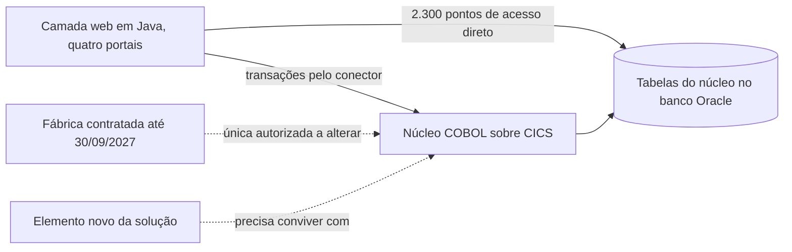
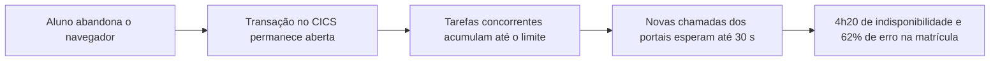

# Padrões arquiteturais e padrões de design

Este bloco trabalha dentro do estilo recomendado no [bloco 2](bloco-2-estilos-arquiteturais.md) e responde que soluções recorrentes tratam problemas específicos da solução, em que nível de decisão cada uma atua e que custo cada uma impõe.

## Antes de começar

- [Estilo arquitetural](../referencia/glossario.md#estilo-arquitetural)
- [Padrão arquitetural](../referencia/glossario.md#padrao-arquitetural)
- [Padrão de design](../referencia/glossario.md#padrao-de-design)

## Três níveis de decisão

Christopher Alexander definiu o padrão como a descrição de um problema que ocorre repetidamente em um ambiente e do núcleo da solução para esse problema, definição adotada também por Gamma et al. (1994) para o software. A definição tem duas consequências práticas. A primeira é que o padrão só se aplica quando o problema que ele descreve está presente, com as forças que o caracterizam. A segunda é que o padrão registra uma solução já testada por outros, com consequências conhecidas, o que permite ao arquiteto antecipar o custo antes de adotá-la.

Estilo e padrão respondem a perguntas de alcance diferente, e confundir os dois leva a discutir a organização do sistema inteiro quando o problema é local, ou a tratar como decisão local uma escolha que afeta toda a solução. Este bloco adota três níveis, cada um associado a uma pergunta.

| Nível | Pergunta | Exemplos |
| --- | --- | --- |
| Estilo arquitetural | Como o sistema inteiro se organiza? | Camadas, eventos, microsserviços |
| Padrão arquitetural | Como uma preocupação transversal ou de integração é resolvida? | API Gateway, Strangler Fig, Anti-Corruption Layer, Saga |
| Padrão de design | Como responsabilidades colaboram dentro de uma parte do sistema? | Adapter, Strategy, Observer |

Um **padrão arquitetural** é uma solução recorrente para uma preocupação transversal ou de integração entre partes do sistema, com escopo menor que o do estilo e maior que o de uma colaboração local. Um **padrão de design** é uma solução recorrente para a colaboração entre responsabilidades dentro de uma parte do sistema, descrita em termos de papéis, interfaces e relações, e o catálogo de Gamma et al. (1994) é a referência de origem desse nível. A fronteira entre os dois níveis é o alcance do efeito, porque um padrão arquitetural altera a forma como partes distintas se relacionam, enquanto um padrão de design altera a organização interna de uma dessas partes.

Dois termos frequentes nesta discussão precisam de enquadramento. Strangler Fig é um padrão de modernização, que organiza a substituição gradual de um sistema existente, e convive com qualquer estilo escolhido para a solução nova. Domain-driven design, proposto por Evans (2003), é uma abordagem de modelagem e de delimitação de contextos, e o Anti-Corruption Layer descrito abaixo é um dos padrões que essa abordagem formulou para proteger o modelo de um contexto contra o modelo de outro.

<figure markdown="span">
![Diagrama de três faixas empilhadas que representam os níveis de decisão. A faixa externa é o estilo arquitetural, com a pergunta de como o sistema inteiro se organiza e os exemplos camadas e eventos. A faixa intermediária é o padrão arquitetural, com a pergunta de como uma preocupação transversal ou de integração é resolvida e os exemplos API Gateway e Saga. A faixa interna é o padrão de design, com a pergunta de como responsabilidades colaboram dentro de uma parte e os exemplos Adapter e Strategy.](../assets/images/modulo-3-niveis-de-padrao.svg){ .module-diagram }
</figure>

*Figura 1 — Os três níveis de decisão usados nesta aula, do sistema inteiro à colaboração dentro de uma parte, em material do curso elaborado com base em Gamma et al. (1994) e em Ford e Richards (2020).*

A seleção parte sempre do problema declarado. Um padrão acrescenta elementos, interfaces e comportamento ao desenho, e cada acréscimo que não responde a uma exigência nomeada produz **complexidade acidental**, que é a complexidade introduzida pela solução e ausente do problema. O critério de adoção é a existência de evidência de necessidade, como um cenário de qualidade não atendido, um incidente registrado ou uma restrição que fecha as demais alternativas, e a popularidade do padrão ou a familiaridade da equipe com ele não constituem evidência. O repertório abaixo reúne dez padrões agrupados pelo tipo de problema que resolvem, e cada um é descrito pelos mesmos seis aspectos, problema, contexto e forças, estrutura mínima, consequência favorável, custo e sinal de uso inadequado.

### Modernização e integração

O exemplo desta seção é a Varejista ACME, que opera há doze anos uma plataforma de comércio eletrônico construída como sistema único, com catálogo, carrinho, checkout e gestão de pedidos no mesmo processo, e que decidiu substituir essa plataforma sem interromper as vendas.

#### Strangler Fig

O Strangler Fig organiza a substituição gradual de um sistema existente por um sistema novo, com as duas implementações em operação simultânea e com o tráfego desviado para a nova à medida que cada funcionalidade é concluída (Fowler, 2024). Na Varejista ACME, o catálogo é a primeira funcionalidade migrada, e um ponto de interceptação encaminha as consultas de produto ao catálogo novo enquanto carrinho e checkout continuam atendidos pela plataforma antiga.

| Aspecto | Descrição |
| --- | --- |
| Problema | Substituir um sistema em operação sem uma virada única de alto risco |
| Contexto e forças | O serviço não pode parar, o sistema antigo concentra regras pouco documentadas e o prazo total da substituição é longo |
| Estrutura mínima | Um ponto de interceptação na entrada, a implementação antiga, a implementação nova e uma regra de roteamento por funcionalidade |
| Consequência favorável | Cada funcionalidade entra em produção de forma isolada e pode voltar para a implementação antiga se falhar |
| Custo | Duas implementações mantidas ao mesmo tempo, sincronização de dado entre elas e disciplina para concluir a retirada do sistema antigo |
| Sinal de uso inadequado | O ponto de interceptação existe há muito tempo e nenhuma funcionalidade deixou o sistema antigo, ou a implementação nova passa a depender de chamadas à antiga para concluir cada operação |

#### Anti-Corruption Layer

O Anti-Corruption Layer é uma camada de tradução entre dois contextos com modelos diferentes, que impede que os conceitos, os formatos e as regras de um contexto entrem no modelo do outro (Evans, 2003). Na Varejista ACME, a plataforma antiga representa um produto com trinta e dois campos de texto livre e códigos de categoria herdados, e o catálogo novo recebe esses dados por uma camada que os converte em atributos tipados e em uma árvore de categorias própria.

| Aspecto | Descrição |
| --- | --- |
| Problema | Integrar-se a um sistema cujo modelo contraria o modelo do sistema novo |
| Contexto e forças | O sistema externo não pode ser alterado, seu modelo é confuso ou instável e o sistema novo precisa preservar um modelo coerente |
| Estrutura mínima | Uma fachada voltada ao sistema novo, tradutores de conceito e adaptadores voltados ao sistema externo |
| Consequência favorável | O modelo do sistema novo permanece independente do modelo externo, e a mudança externa fica contida na camada |
| Custo | Código de tradução a manter, latência adicional e necessidade de conhecer bem os dois modelos |
| Sinal de uso inadequado | A camada apenas repassa estruturas sem traduzir conceito algum, ou tipos do sistema externo aparecem no modelo do sistema novo |

#### Adapter

O Adapter converte a interface de um elemento na interface que o cliente espera, permitindo que elementos com interfaces incompatíveis colaborem sem alteração em nenhum dos dois (Gamma et al., 1994). Ele é o único padrão de design do repertório deste bloco, porque atua dentro de uma parte do sistema, e costuma ser a peça de implementação de um Anti-Corruption Layer ou de uma porta da [arquitetura hexagonal](bloco-2-estilos-arquiteturais.md#arquitetura-hexagonal). Na Varejista ACME, o serviço de cálculo de frete espera uma operação que recebe CEP e peso, e um adapter converte essa chamada no formato de requisição exigido por cada transportadora contratada.

| Aspecto | Descrição |
| --- | --- |
| Problema | Usar um elemento existente cuja interface não corresponde à interface esperada pelo cliente |
| Contexto e forças | O elemento adaptado não pode ou não deve ser alterado, e o cliente precisa de uma interface estável |
| Estrutura mínima | A interface esperada pelo cliente, o elemento adaptado e o adapter que implementa a primeira usando o segundo |
| Consequência favorável | O cliente fica isolado da interface concreta, e trocar o elemento adaptado exige apenas um adapter novo |
| Custo | Uma indireção a mais por chamada e uma classe ou módulo a manter por elemento adaptado |
| Sinal de uso inadequado | O adapter passa a conter regra de negócio, ou existe apenas uma implementação possível e nenhuma perspectiva de troca |

#### API Gateway

O API Gateway é um ponto único de entrada para os clientes externos de um conjunto de serviços, que roteia cada requisição e concentra preocupações transversais como autenticação, limitação de taxa e registro de acesso (Richardson, 2018). Na Varejista ACME, o aplicativo móvel e o site consultam um gateway que encaminha as chamadas de catálogo ao serviço novo e as de checkout à plataforma antiga, e o mesmo gateway pode servir de ponto de interceptação do Strangler Fig.

| Aspecto | Descrição |
| --- | --- |
| Problema | Expor vários serviços a clientes externos sem que cada cliente conheça a localização e as políticas de cada serviço |
| Contexto e forças | Há mais de um serviço e mais de um tipo de cliente, e as políticas de acesso precisam ser uniformes |
| Estrutura mínima | O gateway, as rotas por operação e as políticas transversais aplicadas antes do encaminhamento |
| Consequência favorável | Clientes estáveis diante de mudanças internas e políticas de acesso aplicadas em um único lugar |
| Custo | Um salto de rede a mais, um componente crítico para a disponibilidade e risco de concentrar lógica que pertence aos serviços |
| Sinal de uso inadequado | O gateway passa a compor respostas com regra de negócio, ou toda mudança em serviço exige mudança no gateway |

### Resiliência na integração

O exemplo desta seção é a Transportadora ACME, empresa de cargas que atende 1.400 clientes corporativos e cujo portal de cotação consulta, a cada pedido, o serviço de tarifa de três parceiros de transporte e o serviço de rastreamento de um operador logístico externo. Nygard (2018) reúne sob o nome de padrões de estabilidade as soluções que impedem que a falha de uma dependência se propague ao sistema que a chama, e três dos quatro padrões abaixo, Timeout, Circuit Breaker e Bulkhead, pertencem a esse grupo. O Retry com limite completa o conjunto como prática de tratamento de falha transitória, segura apenas quando combinada com Timeout e aplicada a operações idempotentes.

#### Timeout

O Timeout limita o tempo que um elemento espera pela resposta de uma dependência, devolvendo o controle ao chamador quando o limite é atingido (Nygard, 2018). No portal da Transportadora ACME, a consulta de tarifa a cada parceiro tem limite de 2 segundos, e a cotação é exibida com as tarifas que responderam dentro desse prazo.

| Aspecto | Descrição |
| --- | --- |
| Problema | Uma dependência lenta mantém recursos do chamador ocupados até esgotá-los |
| Contexto e forças | A dependência está fora do controle do chamador e o chamador tem recursos limitados, como conexões e processos |
| Estrutura mínima | Um limite de espera por chamada e um comportamento definido para quando o limite é atingido |
| Consequência favorável | A lentidão da dependência deixa de consumir indefinidamente os recursos do chamador |
| Custo | Escolha do valor exige medição, e respostas que chegariam depois do limite são perdidas |
| Sinal de uso inadequado | O limite é maior que o tempo que o usuário aceita esperar, ou nenhum comportamento é definido para o caso de limite atingido |

#### Retry com limite

O Retry com limite repete uma chamada que falhou por causa transitória, com número máximo de tentativas e intervalo crescente entre elas, e só se aplica a operações que podem ser repetidas sem efeito duplicado. No portal da Transportadora ACME, a consulta de rastreamento é repetida até duas vezes, com intervalos de 200 e 800 milissegundos, porque consultar o mesmo rastreamento duas vezes não altera nenhum estado.

| Aspecto | Descrição |
| --- | --- |
| Problema | Falhas transitórias de rede ou de disponibilidade interrompem operações que teriam sucesso em nova tentativa |
| Contexto e forças | A falha é breve e ocasional, e a operação é idempotente ou pode ser tornada idempotente |
| Estrutura mínima | Um número máximo de tentativas, um intervalo crescente entre elas e a lista de erros que justificam repetição |
| Consequência favorável | Falhas breves deixam de chegar ao usuário |
| Custo | Latência maior no pior caso e carga adicional sobre a dependência que já está com dificuldade |
| Sinal de uso inadequado | A operação repetida cria efeito duplicado, como cobrança ou pedido em dobro, ou todos os clientes repetem ao mesmo tempo e ampliam a sobrecarga |

#### Circuit Breaker

O Circuit Breaker interrompe as chamadas a uma dependência depois que a taxa de falha ultrapassa um limite, responde imediatamente com um comportamento alternativo durante um período e depois libera chamadas de teste para verificar se a dependência se recuperou (Nygard, 2018). No portal da Transportadora ACME, quando mais da metade das consultas a um parceiro falha em um minuto, o portal deixa de consultá-lo por 30 segundos e exibe a cotação sem aquela tarifa.

| Aspecto | Descrição |
| --- | --- |
| Problema | Chamadas repetidas a uma dependência que já falhou consomem recursos e atrasam a recuperação dela |
| Contexto e forças | A falha da dependência dura mais que uma chamada isolada e existe um comportamento alternativo aceitável |
| Estrutura mínima | Um contador de falhas, os estados fechado, aberto e semiaberto e um comportamento alternativo para o estado aberto |
| Consequência favorável | A falha da dependência é contida, e o chamador responde rápido com funcionalidade reduzida |
| Custo | Parâmetros de limite e de período que exigem ajuste, e comportamento alternativo que precisa ser desenhado e testado |
| Sinal de uso inadequado | Não existe comportamento alternativo e o estado aberto apenas troca um erro lento por um erro rápido, ou o circuito abre por falhas que são do próprio chamador |

#### Bulkhead

O Bulkhead separa os recursos do sistema em compartimentos, de modo que o esgotamento de um compartimento por uma dependência ou por um tipo de carga não afete os demais (Nygard, 2018). No portal da Transportadora ACME, cada parceiro de tarifa tem seu próprio conjunto de conexões, e um parceiro lento esgota apenas as conexões que lhe foram reservadas.

| Aspecto | Descrição |
| --- | --- |
| Problema | Uma dependência ou um tipo de carga consome todos os recursos compartilhados e derruba funcionalidades que não dependem dela |
| Contexto e forças | Várias dependências ou tipos de carga disputam o mesmo conjunto de conexões, processos ou instâncias |
| Estrutura mínima | Conjuntos de recursos separados por dependência ou por tipo de carga, com limite próprio |
| Consequência favorável | A falha fica restrita ao compartimento afetado e as demais funcionalidades continuam atendidas |
| Custo | Recursos reservados ficam ociosos em parte do tempo, e o dimensionamento de cada compartimento exige medição |
| Sinal de uso inadequado | Os compartimentos são tantos e tão pequenos que nenhum absorve variação normal de carga |

### Consistência entre partes distribuídas

O exemplo desta seção volta à Varejista ACME, depois que pedido, estoque e pagamento passaram a ser serviços separados, cada um com seu próprio banco de dados, o que elimina a transação única que antes cobria os três.

#### Transactional Outbox

O Transactional Outbox grava a mudança de estado e a mensagem que a comunica na mesma transação local, em uma tabela de saída, e um processo separado publica as mensagens dessa tabela no intermediário de mensagens (Richardson, 2018). Na Varejista ACME, o serviço de pedidos grava o pedido e o evento de pedido criado na mesma transação, e o publicador entrega o evento ao estoque mesmo que o intermediário esteja indisponível no momento da gravação.

| Aspecto | Descrição |
| --- | --- |
| Problema | Atualizar o banco de dados e publicar a mensagem correspondente sem risco de uma operação ocorrer e a outra não |
| Contexto e forças | Transação distribuída entre banco e intermediário não é suportada ou não é desejável, e a perda da mensagem deixa outros serviços inconsistentes |
| Estrutura mínima | A tabela de saída no mesmo banco do serviço, a gravação conjunta na transação local e um publicador que lê a tabela e marca o que foi entregue |
| Consequência favorável | Toda mudança confirmada gera sua mensagem, e nenhuma mensagem é publicada para mudança desfeita |
| Custo | Entrega ao menos uma vez, que exige consumidor idempotente, atraso entre a gravação e a publicação e um processo a mais para operar |
| Sinal de uso inadequado | O consumidor não trata mensagem repetida, ou a tabela de saída cresce sem limpeza e sem monitoramento do atraso |

#### Saga

A Saga executa uma operação de negócio que atravessa vários serviços como uma sequência de transações locais, cada uma com uma ação de compensação que desfaz seu efeito se uma etapa posterior falhar (Richardson, 2018). Na Varejista ACME, a saga do pedido reserva o estoque, autoriza o pagamento e confirma o pedido, e uma recusa do pagamento aciona a compensação que libera a reserva de estoque.

| Aspecto | Descrição |
| --- | --- |
| Problema | Manter a consistência de uma operação de negócio que altera dados de vários serviços sem transação distribuída |
| Contexto e forças | Cada serviço é dono do seu dado, a operação tem etapas que podem falhar e estados intermediários visíveis são aceitáveis por algum tempo |
| Estrutura mínima | A sequência de transações locais, a ação de compensação de cada etapa e a coordenação por orquestrador ou por coreografia de eventos |
| Consequência favorável | A operação atinge um estado final consistente, concluída ou compensada, sem bloqueio entre serviços |
| Custo | Estados intermediários visíveis, compensações a desenhar e testar e depuração mais difícil do fluxo completo |
| Sinal de uso inadequado | A operação cabe em um único serviço e a saga só divide artificialmente uma transação local, ou alguma etapa não tem compensação possível e ninguém registrou esse limite |

### Combinações

Padrões se combinam quando cada um resolve um problema distinto. No portal da Transportadora ACME, o Timeout e o Circuit Breaker aplicados à mesma consulta de tarifa formam uma combinação legítima, porque o primeiro limita a espera de uma chamada isolada e o segundo evita que chamadas sucessivas insistam em uma dependência que já falhou. Na Varejista ACME, a Saga que coordena pedido, estoque e pagamento depende do Transactional Outbox em cada etapa, porque a saga precisa que cada transação local publique seu evento com garantia. Uma combinação redundante seria acrescentar um API Gateway diante de um único serviço consumido por um único cliente interno, porque o gateway resolveria um problema de múltiplos clientes e múltiplos serviços que esse contexto não tem, e o custo de um salto de rede e de um componente crítico adicional ficaria sem contrapartida.

## Uso pelo arquiteto

O arquiteto seleciona um padrão pelo problema declarado e registra, junto com a escolha, o custo aceito e o sinal que indicaria que o padrão deixou de ser adequado. Esse registro permite que outra pessoa avalie depois se o problema ainda existe e se o custo continua justificado, e evita que um padrão permaneça no desenho apenas porque já está lá. O nível do padrão indica também quem precisa participar da decisão, porque um padrão arquitetural afeta várias equipes e entra no [ADR](bloco-4-registro-de-decisao-arquitetural.md) da solução, enquanto um padrão de design costuma ser decidido pela equipe responsável pela parte afetada.

## Exercício 11

A ACME é a universidade privada brasileira em modernização incremental do sistema acadêmico, usada como caso desta disciplina. No [exercício 10](bloco-2-estilos-arquiteturais.md#exercicio-10), o aluno recomendou um estilo arquitetural para a modernização, e este exercício seleciona padrões dentro desse estilo para três problemas da ACME, a coexistência entre legado e solução nova, a proteção contra falha de integração e a publicação confiável de mudança acadêmica, com dados reproduzidos da [arquitetura de linha de base](../caso-acme/linha-de-base.md) e dos [dados operacionais](../caso-acme/dados-operacionais.md). O mapa de problema, padrão e consequência produzido aqui é a entrada do ADR do exercício 12, no [bloco 4](bloco-4-registro-de-decisao-arquitetural.md).

### Item 1: Coexistência entre legado e solução nova

O núcleo COBOL sobre CICS permanece em operação durante toda a transição, a camada Java tem 2.300 pontos de acesso direto às tabelas do núcleo, e a alteração dos programas do núcleo depende da fábrica contratada até 30/09/2027. O diagrama abaixo mostra essa situação.

1. Escolha um padrão do repertório deste bloco para o problema, ou mais de um quando resolverem aspectos distintos do mesmo problema, e indique o nível de cada padrão na taxonomia de três níveis.
2. Registre o elemento afetado do esboço lógico produzido no [exercício 9](bloco-1-principios-de-design.md#exercicio-9), a consequência favorável esperada e o custo aceito. Quem não tem o esboço lógico pode indicar como elemento afetado o componente correspondente do diagrama acima.

### Item 2: Proteção contra falha de integração

Os portais chamam o CICS por conector transacional síncrono com tempo limite de 30 s, e no incidente de 04/02/2026 sessões abandonadas mantiveram transações abertas até esgotar o limite de tarefas concorrentes, com 4h20 de indisponibilidade e 62% de erro nas tentativas de matrícula. O diagrama abaixo mostra a sequência do incidente.

1. Escolha um padrão do repertório deste bloco para o problema, ou mais de um quando resolverem aspectos distintos do mesmo problema, e indique o nível de cada padrão na taxonomia de três níveis.
2. Registre o elemento afetado do esboço lógico produzido no [exercício 9](bloco-1-principios-de-design.md#exercicio-9), a consequência favorável esperada e o custo aceito. Quem não tem o esboço lógico pode indicar como elemento afetado o componente correspondente do diagrama acima.

### Item 3: Publicação confiável de mudança acadêmica

O requisito R7 exige que a nota lançada chegue ao ambiente virtual de aprendizagem em até 10 minutos, a exportação atual ocorre em lote diário iniciado às 05h10, a janela de fechamento chega a 360.000 lançamentos, e a integração por interface de programação exige o plano do ambiente virtual com acréscimo de 38% sobre o valor anual do contrato vigente. O diagrama abaixo mostra o caminho atual da nota.

1. Escolha um padrão do repertório deste bloco para o problema, ou mais de um quando resolverem aspectos distintos do mesmo problema, e indique o nível de cada padrão na taxonomia de três níveis.
2. Registre o elemento afetado do esboço lógico produzido no [exercício 9](bloco-1-principios-de-design.md#exercicio-9), a consequência favorável esperada e o custo aceito. Quem não tem o esboço lógico pode indicar como elemento afetado o componente correspondente do diagrama acima.
3. Indique um padrão que você considerou e descartou para um dos três problemas deste exercício, com o motivo do descarte ligado ao contexto da ACME.

## Fontes

As referências seguem o formato APA, 7ª edição, e constam da [bibliografia](../referencia/bibliografia.md) do curso. O trecho consultado aparece entre parênteses ao fim de cada entrada.

- Gamma, E., Helm, R., Johnson, R., & Vlissides, J. (1994). *Design patterns: Elements of reusable object-oriented software*. Addison-Wesley. (definição de padrão e padrão Adapter)
- Lovatt, M. (2021). *Solution architecture foundations*. BCS, The Chartered Institute for IT. (seção 3.7, quadro sobre padrões de design e a definição de Alexander)
- Evans, E. (2003). *Domain-driven design: Tackling complexity in the heart of software*. Addison-Wesley. (Anti-Corruption Layer e delimitação de contextos)
- Fowler, M. (2024, 22 de agosto). *Strangler fig*. martinfowler.com. https://martinfowler.com/bliki/StranglerFigApplication.html (padrão Strangler Fig)
- Richardson, C. (2018). *Microservices patterns*. Manning. (API Gateway, Saga e Transactional Outbox)
- Nygard, M. (2018). *Release it! Design and deploy production-ready software* (2nd ed.). The Pragmatic Programmers. (padrões de estabilidade Timeout, Circuit Breaker e Bulkhead)
- Ford, N., & Richards, M. (2020). *Fundamentals of software architecture*. O'Reilly. (distinção entre estilo e padrão)
- Mendes, M. (2026a). *Arquitetura de software* [Material de curso]. https://marco-mendes.github.io/arquitetura-software/ ([catálogo de padrões](https://marco-mendes.github.io/arquitetura-software/referencia/catalogo-de-padroes/) do material base do professor)

**Material do curso.** O bloco usa as entradas [padrão arquitetural](../referencia/glossario.md#padrao-arquitetural) e [padrão de design](../referencia/glossario.md#padrao-de-design) do glossário, o estilo recomendado no [bloco 2](bloco-2-estilos-arquiteturais.md) e o dossiê da instituição fictícia [ACME](../caso-acme/index.md).
