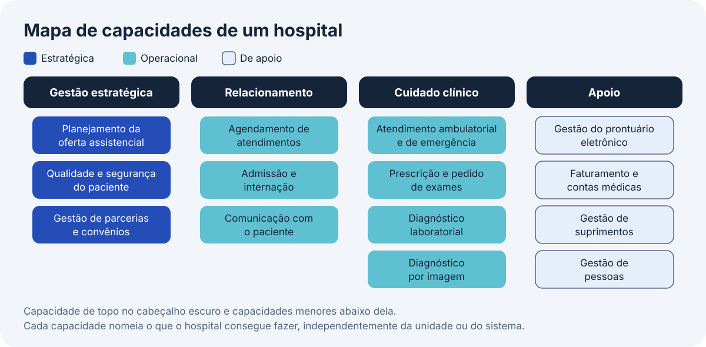
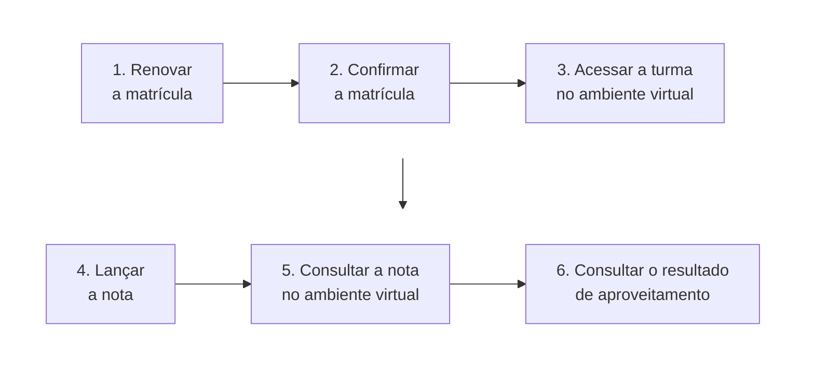
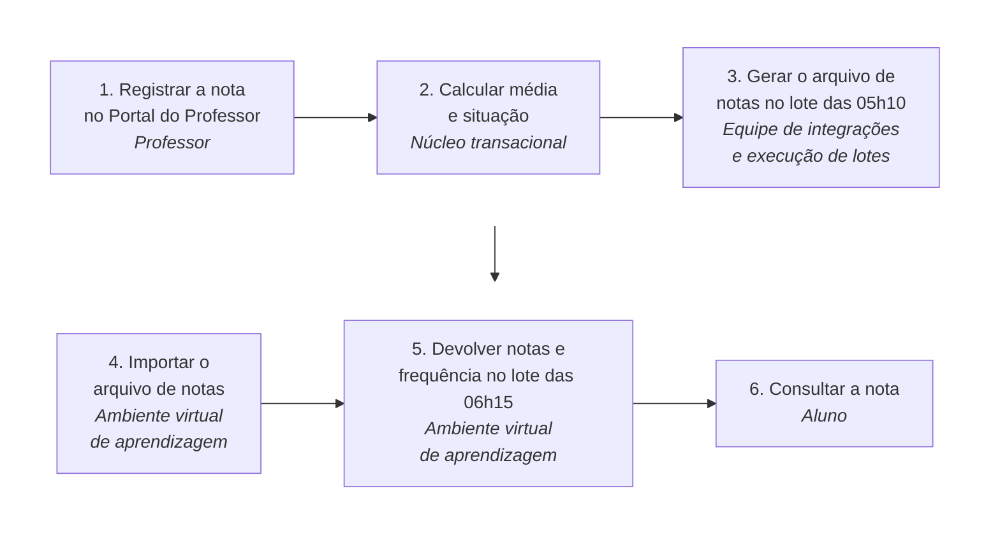

# Arquitetura de negócio da solução

Este bloco inicia o detalhamento da solução por domínios e responde a uma pergunta que precede dados, aplicações e infraestrutura, o que a solução muda no negócio e quais modelos permitem localizar essa mudança.

## Antes de começar

- [Arquitetura de negócio](../referencia/glossario.md#arquitetura-de-negocio)
- [Capacidade](../referencia/glossario.md#capacidade)
- [Fluxo de valor](../referencia/glossario.md#fluxo-de-valor)
- [Componentes da solução](../referencia/glossario.md#componentes-da-solucao)
- [Arquitetura de solução](../referencia/glossario.md#arquitetura-de-solucao)

## Modelos de arquitetura de negócio

A Aula 3 terminou com uma decisão estrutural registrada em [ADR](../modulo-3-design-e-padroes/bloco-4-registro-de-decisao-arquitetural.md), com o estilo e os padrões que organizam a solução. Essa decisão diz como a solução se organiza, mas não diz o que ela altera na organização que a recebe. A Aula 4 detalha a solução em quatro domínios, na ordem negócio, dados, aplicações e infraestrutura, e cada domínio consome o que o anterior estabeleceu, de modo que a mudança localizada neste bloco orienta a escolha dos dados no bloco 2.

A **arquitetura de negócio** é definida pelo Business Architecture Guild como uma representação da organização que oferece entendimento comum sobre ela e serve para alinhar objetivos estratégicos e demandas táticas. O TOGAF descreve a mesma arquitetura como um conjunto de visões do negócio sobre capacidades, entrega de valor de ponta a ponta, informação e estrutura organizacional, com as relações entre essas visões e as estratégias, os produtos, as políticas e as partes interessadas. As duas definições atribuem ao domínio dois papéis na arquitetura de solução, o de origem da necessidade de mudança, já tratada como [direcionador de mudança](../modulo-2-requisitos-e-partes-interessadas/bloco-1-direcionadores-de-mudanca.md) na Aula 2, e o de alvo da mudança que a solução entrega.

### Quando a arquitetura de solução se aplica

A arquitetura de solução trabalha reduzindo um sistema a suas partes por meio de um modelo, e por isso nem todo problema de negócio admite esse tratamento. Quatro perguntas decidem a aplicação do método:

1. A área do problema é um sistema?
2. O sistema pode ser modelado?
3. O modelo exibe o problema?
4. O modelo pode ser alterado para tratar o problema?

Uma resposta negativa a qualquer das quatro indica que outro método é mais adequado. Quando o problema é grande demais para ser modelado de uma vez, a alternativa recomendada é reduzir o escopo, por exemplo a uma linha de produtos, a uma região ou a um grupo delimitado de unidades organizacionais. Para o problema complexo que não se reduz a um modelo, uma alternativa comum é a mudança feita a partir da experiência dos envolvidos, avaliada depois de um período de observação do efeito. Quando o problema é simples demais para ser chamado de sistema, o ciclo completo de arquitetura acrescenta complexidade sem revelar causa, e só algumas técnicas isoladas continuam úteis.

A Figura 1 organiza as quatro perguntas como árvore de decisão com três saídas possíveis. Toda resposta negativa conduz a uma quinta pergunta, sobre o tamanho do problema, que separa a redução de escopo, seguida de nova aplicação das quatro perguntas, do uso de outro método.

<figure markdown="span">
{ .module-diagram }
</figure>

*Figura 1 — As quatro perguntas de aplicabilidade da arquitetura de solução e as três saídas possíveis. Fonte: material do curso, com base em Lovatt (2021).*

### Quatro modelos

A arquitetura de negócio mantém modelos que o arquiteto de solução consulta para localizar a mudança. A tabela abaixo resume os quatro mais usados, a pergunta que cada um responde e o que ele oferece ao arquiteto.

| Modelo | Pergunta que responde | O que oferece ao arquiteto |
| --- | --- | --- |
| Mapa de capacidades | O que a organização precisa conseguir fazer? | As capacidades afetadas pela solução e os recursos que as habilitam |
| Fluxo de valor | Por quais etapas o valor chega ao cliente? | As etapas em que a solução altera o valor percebido |
| Decomposição funcional | Que unidade realiza cada função? | As unidades organizacionais afetadas |
| Modelo de processo de negócio | Que atividades compõem o trabalho e quem as executa? | As atividades que mudam, desaparecem ou passam a ser automatizadas |

A Figura 2 reúne os quatro modelos com a pergunta de cada um e os situa sobre o ciclo de mudança de negócio, apresentado ao fim desta seção, com os estágios de definir e projetar destacados.

<figure markdown="span">
{ .module-diagram }
</figure>

*Figura 2 — Os quatro modelos de arquitetura de negócio e a pergunta de cada um, sobre o ciclo de mudança de negócio. Fonte: material do curso, com base em Lovatt (2021).*

### Mapa de capacidades

O **mapa de capacidades** decompõe as capacidades de topo em capacidades menores. Uma **capacidade** é aquilo que a organização precisa conseguir fazer para entregar seus serviços e executar sua estratégia, e pode ainda não existir, constando apenas do plano. O nome da capacidade descreve uma habilidade da organização e omite quem a exerce e com qual sistema, o que mantém o mapa estável quando a estrutura organizacional ou as aplicações mudam. Cada capacidade tem dois atributos adicionais, o volume, que é quanto se entrega em paralelo, e a competência, que é o nível de habilidade exigido, e é habilitada por recursos como pessoas, unidades organizacionais, tecnologia e conhecimento especializado. O mapa classifica as capacidades em estratégicas, operacionais e de apoio, e outras classificações, como maturidade ou núcleo e periferia, também são usadas.

A Figura 3 mostra um mapa de capacidades genérico de um hospital, em dois níveis. As capacidades estratégicas orientam a oferta e a qualidade do serviço, as operacionais entregam o atendimento e o cuidado ao paciente, e as de apoio sustentam as demais, como o prontuário eletrônico, o faturamento e os suprimentos.

<figure markdown="span">
{ .module-diagram }
</figure>

*Figura 3 — Mapa de capacidades genérico de um hospital, com a classificação de cada capacidade em estratégica, operacional ou de apoio. Fonte: material do curso.*

### Uma mudança no Hospital ACME

O Hospital ACME, hospital geral fictício usado como exemplo nesta aula, tem as capacidades da Figura 3 e já opera com prontuário eletrônico, agendamento por aplicativo e aviso ao paciente por mensagem no telefone celular. Os exames que o laboratório interno não realiza seguem para dois laboratórios de apoio externos. Hoje a central de exames do hospital redigita cada pedido no portal web do laboratório e, quando o resultado é liberado, baixa o laudo em PDF e o anexa ao prontuário do paciente, o que acrescenta horas ao prazo do resultado e abre espaço para erro de transcrição.

A mudança proposta moderniza a comunicação com os laboratórios de apoio. O pedido de exame passa a sair do prontuário como mensagem estruturada, o resultado volta como dado estruturado associado ao pedido e ao paciente, e o valor crítico, que é o resultado fora da faixa de segurança e exige ação imediata, gera alerta automático ao médico responsável. A troca usa o HL7 FHIR (*Fast Healthcare Interoperability Resources*), padrão de interoperabilidade em saúde mantido pela HL7 International, que define o recurso *ServiceRequest* para o pedido e o recurso *DiagnosticReport* para o laudo (HL7 International, 2023).

A Figura 4 repete o mapa da Figura 3 e destaca as quatro capacidades afetadas pela mudança. A prescrição e pedido de exames muda porque o pedido sai do prontuário já estruturado, o diagnóstico laboratorial é a capacidade central da mudança, a gestão do prontuário eletrônico passa a receber o resultado como dado e não mais como anexo, e a comunicação com o paciente passa a avisar o resultado assim que ele chega. O faturamento de exames externos entraria na lista se o hospital decidisse conciliar pela mesma integração as cobranças dos laboratórios, decisão que pertence à declaração de escopo da iniciativa.

<figure markdown="span">
{ .module-diagram }
</figure>

*Figura 4 — Capacidades do Hospital ACME afetadas pela modernização da comunicação com laboratórios, com os atributos de volume e competência da capacidade central. Fonte: material do curso.*

A anotação da figura usa os dois atributos da capacidade para descrever a mudança. O volume aumenta porque todos os pedidos externos passam a trafegar por integração, sem redigitação, e a competência muda porque o hospital precisa trocar pedido e resultado estruturados, rastrear a amostra e alertar o valor crítico.

### Capacidade e fluxo de valor em ArchiMate

Em repositórios de arquitetura corporativa, o mapa de capacidades e o fluxo de valor podem ser registrados em ArchiMate, linguagem de modelagem de arquitetura corporativa mantida pela The Open Group. A versão vigente da linguagem é a ArchiMate 4, publicada em abril de 2026 com compatibilidade declarada em relação às versões anteriores (The Open Group, 2026). As definições a seguir são as da versão 3.2, que define, na camada de estratégia, o elemento capacidade (*capability*), descrito como uma habilidade que um elemento de estrutura ativa, como uma organização, uma pessoa ou um sistema, possui, e o elemento fluxo de valor (*value stream*), descrito como uma sequência de atividades que cria um resultado global para um cliente, uma parte interessada ou um usuário final (The Open Group, 2022). A ferramenta de código aberto Archi é um exemplo de editor que cria e mantém modelos nessa linguagem.

### Fluxo de valor

O **fluxo de valor** é o conjunto de etapas de ponta a ponta que entrega valor a um cliente, do primeiro contato com a organização até a realização desse valor. Cada etapa é nomeada por um verbo no infinitivo seguido do objeto, como solicitar exame ou coletar amostra, porque a etapa descreve o que acontece para que o valor avance. A técnica tem origem na produção enxuta, que procura eliminar as etapas que não acrescentam valor suficiente, e combina bem com a arquitetura de solução porque as duas analisam o problema em termos de estrutura e de comportamento.

A Figura 5 mostra o fluxo de valor do diagnóstico laboratorial do Hospital ACME, da solicitação do exame à comunicação do resultado, em seis etapas. As etapas 3, enviar o pedido, e 5, integrar o resultado, dependem hoje de trabalho manual da central de exames, e o tempo de redigitação do pedido e de anexação do laudo se soma ao prazo entre a coleta e o resultado disponível para o médico.

<figure markdown="span">
{ .module-diagram }
</figure>

*Figura 5 — Fluxo de valor do diagnóstico laboratorial do Hospital ACME, com as etapas que dependem de trabalho manual destacadas em âmbar. Fonte: material do curso.*

O fluxo de valor e o mapa de capacidades se ligam etapa a etapa. A etapa de solicitar exame depende da capacidade de prescrição e pedido de exames, as etapas de enviar o pedido, analisar a amostra e integrar o resultado dependem do diagnóstico laboratorial e da gestão do prontuário eletrônico, e a etapa de comunicar o resultado depende da comunicação com o paciente, o que explica por que as quatro capacidades da Figura 4 foram marcadas.

### Decomposição funcional e modelo de processo

A decomposição funcional e o modelo de processo de negócio completam o conjunto. Nesta disciplina, os dois são tratados como artefatos que o arquiteto de solução lê e consulta, mantidos pela área de negócio ou pela análise de processos, e não como técnica que o arquiteto pratica. O modelo de motivação de negócio, que liga direcionadores de mudança a fins e meios, também pertence à arquitetura de negócio e foi tratado, pelo lado dos direcionadores, no [bloco 1 da Aula 2](../modulo-2-requisitos-e-partes-interessadas/bloco-1-direcionadores-de-mudanca.md).

O modelo de processo de negócio é desenhado com frequência em BPMN (*Business Process Model and Notation*), notação padronizada pelo Object Management Group (OMG), cuja versão 2.0.2 foi publicada em janeiro de 2014 e que a própria OMG descreve como padrão de fato para diagramas de processo de negócio (Object Management Group, 2014). A notação distribui o processo em raias, uma por participante ou unidade responsável, e usa um conjunto básico de símbolos, o evento de início, a tarefa, o gateway de decisão e o evento de fim, ligados por fluxos de sequência. A Figura 6 reproduz em notação simplificada o processo atual de recebimento de resultado de exame do Hospital ACME, que detalha a etapa 5 do fluxo de valor da Figura 5.

<figure markdown="span">
{ .module-diagram }
</figure>

*Figura 6 — Processo atual de recebimento de resultado de exame do Hospital ACME em notação BPMN simplificada, com raias para laboratório, central de exames e prontuário eletrônico. Fonte: material do curso.*

O arquiteto de solução lê um modelo de processo como esse em quatro passos:

1. Identificar as raias, que indicam os papéis e as unidades envolvidos, e confrontá-las com a decomposição funcional da organização.
2. Localizar as tarefas que dependem de troca de informação com o laboratório, aqui publicar, baixar e anexar o laudo, que são as candidatas a mudança.
3. Examinar cada gateway e a regra de negócio que o governa, como o critério de valor crítico, porque essa regra entra na solução como requisito.
4. Marcar as tarefas da raia do sistema, que indicam as interfaces com o prontuário eletrônico tratadas no bloco 3.

Com a integração, as tarefas de baixar o laudo do portal e de anexá-lo ao prontuário deixam de existir, porque o resultado entra no prontuário pela interface com o laboratório. A regra de valor crítico passa a ser avaliada pelo sistema, que dispara o alerta ao médico, e o telefonema da central de exames permanece como confirmação de recebimento, o que reduz o trabalho manual da central sem retirar dela a responsabilidade pelo valor crítico.

Nesta disciplina, o arquiteto de solução obtém esses modelos do repositório de arquitetura corporativa da organização ou da área de análise de processos, sem desenhá-los. Ferramentas como o Camunda Modeler e o Bizagi Modeler editam diagramas BPMN e permitem exportá-los no formato XML de intercâmbio definido pela especificação, o que permite abrir o mesmo modelo em ferramentas diferentes, e o Archi cumpre papel equivalente para os modelos ArchiMate. A escolha de ferramenta ou de produto para a ACME não é objeto deste bloco e pertence à Aula 5.

### O que os modelos revelam no Hospital ACME

Os quatro modelos delimitam a mudança do Hospital ACME sem que o arquiteto precise criá-los. O mapa de capacidades indica as quatro capacidades afetadas da Figura 4. O fluxo de valor indica as etapas de enviar o pedido e de integrar o resultado como aquelas em que o paciente e o médico percebem a mudança. O modelo de processo indica as atividades afetadas, que são a solicitação de exame externo, o envio do pedido ao laboratório, o recebimento e a conferência do resultado, a comunicação do valor crítico e o acompanhamento de pedidos pendentes. A decomposição funcional indica as unidades afetadas, entre elas a central de exames, que deixa de redigitar pedidos e de anexar laudos, o corpo clínico, que passa a receber alerta automático, e a equipe de tecnologia, que assume a operação das interfaces com os laboratórios.

### Componentes de negócio da solução

Pessoas, unidades organizacionais e processos de negócio são componentes da solução e foram apresentados no [bloco 2 da Aula 1](../modulo-1-fundamentos/bloco-2-a-solucao-como-sistema.md). Todos os componentes da solução, inclusive os processos, sustentam em última instância um ou mais serviços de negócio. Essa relação organiza os blocos seguintes desta aula, porque dados, aplicações e infraestrutura só se justificam pelo serviço de negócio que sustentam, e o [bloco 3](bloco-3-arquitetura-de-aplicacoes-e-integracao.md) retoma essa relação na hierarquia que vai do serviço de negócio ao serviço de tecnologia.

### O ciclo de mudança de negócio

A arquitetura de solução se situa num ciclo de mudança de negócio em cinco estágios, usado por analistas de negócio e arquitetos:

1. Alinhar, que examina os ambientes externo e interno em busca de oportunidades e é fonte de conceitos de solução.
2. Definir, que identifica requisitos e restrições, articula benefícios e constrói o caso de negócio.
3. Projetar, que é o foco principal da arquitetura de solução.
4. Implementar, em que a arquitetura de solução fornece o roteiro de entrega e mantém papel de governança.
5. Realizar, em que a solução é entregue ao negócio e a arquitetura acompanha a entrega.

A arquitetura de solução concentra seu trabalho nos estágios de definir e projetar, e os modelos de arquitetura de negócio são a principal entrada de ambos, ao lado dos [requisitos e restrições](../modulo-2-requisitos-e-partes-interessadas/bloco-3-cenarios-linha-de-base-e-restricoes.md) levantados na Aula 2.

## Uso pelo arquiteto

O arquiteto de solução consulta os modelos que a arquitetura de negócio já mantém para delimitar o que a solução muda, sem redesenhar a organização a cada iniciativa. O mapa de capacidades indica onde a mudança incide, o fluxo de valor indica onde o cliente percebe a mudança, e o modelo de processo indica que atividades precisam ser revistas com as áreas responsáveis. Quando um desses modelos não existe, o arquiteto registra a ausência como risco e solicita o artefato à área de negócio, sem assumir a modelagem como tarefa própria.

## Exercício 13

O exercício aplica os modelos deste bloco à ACME, universidade privada brasileira com 38.400 alunos ativos, cujo sistema acadêmico, em operação desde 2004, passa por modernização incremental. Ele parte da declaração de escopo do primeiro ciclo, produzida no [exercício 8](../modulo-2-requisitos-e-partes-interessadas/bloco-4-partes-interessadas-e-pontos-de-vista.md#exercicio-8), e de três requisitos reproduzidos da [página inicial do caso](../caso-acme/index.md), usados nos itens 1 e 2.

| Código | Declaração | Origem |
| --- | --- | --- |
| R1 | O aluno deve renovar a matrícula pelo telefone celular, sem acesso ao portal em computador | Representação discente |
| R7 | A nota lançada pelo professor chega ao ambiente virtual de aprendizagem em até 10 minutos | Educação a Distância |
| R13 | O aluno consulta o resultado da solicitação de aproveitamento de disciplina pelo portal | Secretaria Acadêmica |

### Item 1: capacidades acadêmicas

O mapa abaixo reúne dez capacidades acadêmicas da ACME, montadas pelo material do curso a partir do dossiê do caso, ainda sem classificação. A tabela seguinte descreve cada uma.

| Capacidade | Descrição |
| --- | --- |
| Admissão e ingresso | Seleção de candidatos e registro do ingresso do aluno |
| Oferta e grade curricular | Montagem semestral da oferta de 4.900 turmas |
| Matrícula em disciplinas | Inscrição do aluno nas turmas de cada período |
| Avaliação e registro de notas | Lançamento de notas, cálculo de média e situação do aluno |
| Controle de frequência | Apuração de faltas e de reprovação por infrequência |
| Emissão de documentos acadêmicos | Histórico, declaração, atestado e diploma digital |
| Gestão de bolsas e descontos | Regras de financiamento estudantil e de convênio |
| Cobrança de mensalidades | Lançamento financeiro e acompanhamento de pagamento |
| Biblioteca | Empréstimo, reserva e débito |
| Relação com o órgão regulador | Extração anual do censo da educação superior |

1. Classifique cada capacidade em estratégica, operacional ou de apoio.
2. Marque as capacidades afetadas pelo primeiro ciclo, conforme a declaração de escopo do exercício 8, com uma linha de justificativa para cada marcação.

### Item 2: fluxo de valor do aluno

O diagrama abaixo mostra o fluxo de valor do aluno em seis etapas, e a tabela registra a situação de cada etapa na [arquitetura de linha de base](../caso-acme/linha-de-base.md).

| Etapa | Situação na linha de base |
| --- | --- |
| 1. Renovar a matrícula | Feita no Portal do Aluno, sem versão responsiva e com componente de calendário que restringe o uso em telefone celular |
| 2. Confirmar a matrícula | Confirmada no núcleo transacional durante a sessão do aluno |
| 3. Acessar a turma no ambiente virtual | Uma matrícula confirmada às 09h00 aparece no ambiente virtual às 04h55 do dia seguinte, pela carga de turmas das 04h00 |
| 4. Lançar a nota | Registrada pelo professor no Portal do Professor durante o dia letivo |
| 5. Consultar a nota no ambiente virtual | Uma nota lançada às 15h00 chega ao ambiente virtual às 06h00 do dia seguinte, pela exportação das 05h10 |
| 6. Consultar o resultado de aproveitamento | A linha de base não registra consulta desse resultado pelo portal |

1. Indique as etapas em que a latência ou a restrição de acesso compromete o valor para o aluno.
2. Para cada etapa indicada, informe qual requisito, R1, R7 ou R13, ela afeta.

### Item 3: processo de lançamento de nota

O diagrama abaixo mostra as atividades do processo atual de lançamento de nota, com o responsável por cada uma em itálico.

1. Indique quais atividades mudam se a nota passar a chegar ao ambiente virtual em até 10 minutos, como pede o R7.
2. Indique qual unidade organizacional é afetada por essa mudança e qual atividade deixa de existir.

As capacidades marcadas como afetadas no item 1 são a entrada da grade de dados do exercício 14, no [bloco 2](bloco-2-arquitetura-de-dados.md).

## Fontes

As referências seguem o formato APA, 7ª edição, e constam da [bibliografia](../referencia/bibliografia.md) do curso. O trecho consultado aparece entre parênteses ao fim de cada entrada.

- HL7 International. (2023). *FHIR release 5*. https://hl7.org/fhir/R5/ (finalidade do padrão e recursos *ServiceRequest* e *DiagnosticReport*)
- Lovatt, M. (2021). *Solution architecture foundations*. BCS, The Chartered Institute for IT. (seção 2.3, definições de arquitetura de negócio do Business Architecture Guild e do TOGAF, quatro perguntas de aplicabilidade, modelos de arquitetura de negócio e ciclo de mudança de negócio, e seção 2.4, componentes de negócio da solução. O Hospital ACME e a mudança na comunicação com laboratórios são exemplo do material do curso, inspirado no caso Fallowdale Hospital do livro)
- Object Management Group. (2014). *Business process model and notation (BPMN)* (Versão 2.0.2, formal/13-12-09). https://www.omg.org/spec/BPMN/2.0.2 (finalidade da notação, versão vigente e data de publicação)
- The Open Group. (2022). *ArchiMate® 3.2 specification: Reference cards* (N221). https://www.opengroup.org/sites/default/files/docs/downloads/n221p.pdf (definições dos elementos de estratégia *capability* e *value stream*)
- The Open Group. (2026, 27 de abril). *The Open Group announces ArchiMate® 4 specification* (C260). https://www.opengroup.org/The-Open-Group-Announces-ArchiMate%C2%AE-4-Specification (publicação da versão 4 e compatibilidade com as versões anteriores)

**Material do curso.** O bloco usa as entradas [arquitetura de negócio](../referencia/glossario.md#arquitetura-de-negocio), [capacidade](../referencia/glossario.md#capacidade) e [fluxo de valor](../referencia/glossario.md#fluxo-de-valor) do glossário, além do dossiê da instituição fictícia [ACME](../caso-acme/index.md) e da sua [arquitetura de linha de base](../caso-acme/linha-de-base.md).
