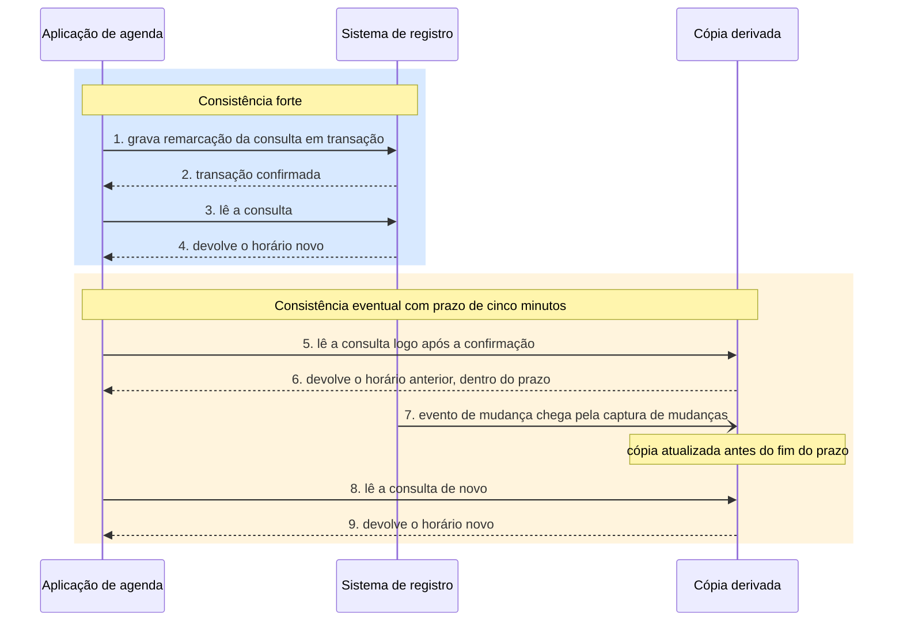

# Arquitetura de dados da solução

Este bloco identifica os dados que sustentam a mudança localizada no bloco 1 e responde a quem pertence cada entidade, onde ela é registrada com autoridade e com que atraso cada cópia pode refleti-la.

## Antes de começar

- [Arquitetura de dados](../referencia/glossario.md#arquitetura-de-dados)
- [Propriedade do dado](../referencia/glossario.md#propriedade-do-dado)
- [Fonte de verdade](../referencia/glossario.md#fonte-de-verdade)
- [Regime de consistência](../referencia/glossario.md#regime-de-consistencia)
- Capacidades afetadas, produzidas no [exercício 13](bloco-1-arquitetura-de-negocio.md#exercicio-13)

## Dados na solução

A **arquitetura de dados** é um subdomínio da arquitetura corporativa que trata dos dados, dos metadados e da informação usados na organização, e tem no modelo corporativo de dados seu artefato de visão geral (Lovatt, 2021, seção 2.5). Toda solução tem uma arquitetura de dados própria, e Lovatt exige que ela seja consistente com a arquitetura de dados da organização em que a solução vai operar, porque a inconsistência na definição ou no uso do dado produz erro em serviço de negócio ou faz a organização perder uma oportunidade.

O caso da produtora de vídeo, apresentado por Lovatt, mostra essa inconsistência. A produtora mantém o cadastro dos autores do conteúdo, funcionários ou contratados externos, e a área comercial mantém o cadastro de clientes. Alguns contratados externos também são clientes, mas as definições de cliente e de autor são diferentes e incompatíveis, de modo que a mudança de endereço informada por essa pessoa é registrada como cliente ou como autor, nunca nos dois, e a produtora passa a contatá-la com dados errados. A regra que Lovatt extrai do caso é que toda solução nova recebe como entrada os componentes relevantes da arquitetura de dados corporativa, e todo dado novo que ela cria é integrado a essa arquitetura o quanto antes, mesmo em caráter provisório.

### Dado, informação e metadado

Lovatt adota as definições da norma ISO/IEC 2382 de vocabulário de tecnologia da informação. Dado é a representação reinterpretável de informação, em forma adequada à comunicação, à interpretação ou ao processamento. Informação é o conhecimento sobre objetos, fatos, eventos, processos ou ideias que tem significado dentro de um contexto. Metadado é a categoria intermediária, o dado sobre o dado, que reúne descrições, regras, restrições e ligações entre itens de dado. O livro trata dado, informação e metadado numa única arquitetura de dados, sem negar a diferença entre eles, porque os três estão ligados de forma estreita na prática.

A Figura 1 aplica as três definições a um registro de consulta do Hospital Vale do Pousio, com valores fictícios. A linha gravada no banco é o dado, o dicionário de dados que dá nome, tipo e significado a cada campo é o metadado, e a frase que afirma que o paciente P-40213 faltou à consulta de cardiologia em 14/10/2026 é a informação obtida pela interpretação do dado com o metadado.

<figure markdown="span">
{ .module-diagram }
</figure>

*Figura 1 — Dado, metadado e informação num registro de consulta. Fonte: material do curso, com base em Lovatt (2021, seção 2.5).*

Em banco relacional, o metadado técnico fica num catálogo mantido pelo próprio gerenciador de banco de dados. No PostgreSQL, o catálogo do sistema e o esquema information_schema, definido pelo padrão SQL, descrevem as tabelas, as colunas, os tipos e as restrições de cada base, e os dicionários e catálogos de dados corporativos acrescentam a essas descrições o significado de negócio, artefato que Lovatt (2021, seção 2.5.3) lista como insumo da solução.

### Objetivos, atividades e artefatos

Os objetivos da arquitetura de dados que se sobrepõem aos da arquitetura de solução são atender às necessidades de dado e de informação do negócio, promover o entendimento do dado na organização, garantir consistência de uso e eliminar a duplicação de definições, cumprir a legislação e a regulação aplicáveis e governar o desenvolvimento de soluções novas (Lovatt, 2021, seção 2.5.1).

Os artefatos que entram na arquitetura de solução como insumo são os modelos e esquemas de dados, inclusive de mensagens e fluxos, as definições de dado, os dicionários e catálogos, e os projetos de bases de dados (Lovatt, 2021, seção 2.5.3). Entre eles, Lovatt destaca a grade, uma tabela que cruza entidades de dado com outros componentes, como funções de negócio ou aplicações, e que torna visível, durante a análise de impacto, quais componentes são atingidos por uma mudança em uma entidade.

### Entidade, generalização e especialização

O dado é uma abstração do mundo real e guarda só os detalhes que interessam ao negócio, restritos ainda pela legislação de dados pessoais, que exige necessidade de negócio e consentimento para o tratamento. Lovatt (2021, seção 2.5.5) descreve três operações de abstração com o Hospital Vale do Pousio, que quer convidar pacientes a comparecer a consultas.

| Operação | Definição | Exemplo no Hospital Vale do Pousio |
| --- | --- | --- |
| Entidade | Modelar uma coisa do mundo real como entidade de dado | Paciente, convite, clínica, consulta e profissional de saúde |
| Generalização | Reunir entidades distintas numa entidade mais abstrata | Paciente e profissional de saúde generalizados em pessoa |
| Especialização | Modelar uma entidade mais específica quando há diferença real de estrutura ou comportamento | Profissional de saúde especializado em enfermeiro especialista e médico |

A generalização tem efeito prático na solução, porque ajuda a reconhecer que uma entidade já existe na arquitetura corporativa com outro nome e pode ser reaproveitada sem receber uma definição nova.

A Figura 2 representa as duas operações do Hospital Vale do Pousio num diagrama de entidades simplificado, em que a seta de ponta vazada sai da entidade específica e aponta para a mais geral. Cada entidade lista apenas os atributos que acrescenta às entidades acima dela, e esses atributos são ilustrativos, porque não constam do livro de Lovatt.

<figure markdown="span">
{ .module-diagram }
</figure>

*Figura 2 — Generalização e especialização das entidades do Hospital Vale do Pousio. Fonte: material do curso, com base em Lovatt (2021, seção 2.5.5).*

### Fonte de verdade e regime de consistência

Kleppmann (2017) distingue dois tipos de sistema que guardam dado. O sistema de registro guarda a versão autoritativa do dado, e é nele que o dado é escrito primeiro. O sistema de dado derivado guarda dado transformado ou processado a partir do sistema de registro, como um cache, um índice de busca ou uma base analítica, e pode ser reconstruído a partir da origem. Nesta disciplina, o termo **fonte de verdade** designa o lugar em que a entidade é registrada com autoridade, e toda outra ocorrência da entidade é cópia derivada.

O sistema de registro costuma ser um banco relacional com transação ACID, sigla de atomicidade, consistência, isolamento e durabilidade, como o PostgreSQL ou o Oracle. A transação confirmada fica visível para as leituras seguintes no mesmo banco, e o gerenciador anota cada mudança confirmada num log de transações, que no PostgreSQL se chama write-ahead log.

As cópias derivadas mais comuns cumprem papéis distintos, e cada uma é alimentada a partir do sistema de registro.

- A réplica de leitura é uma cópia do próprio banco, alimentada pelo log de transações do servidor primário, que atende consultas e reduz a carga sobre ele.
- O cache, como o Redis, guarda em memória o resultado de leituras frequentes para reduzir o tempo de resposta e o número de acessos ao sistema de registro.
- O índice de busca, como o OpenSearch ou o Elasticsearch, reorganiza o dado para consultas por texto livre e por combinações de filtros que o banco relacional atende com lentidão.
- O data warehouse, como o BigQuery, o Snowflake ou o Redshift, guarda o dado em armazenamento colunar para consultas analíticas sobre grande volume histórico.

A captura de mudanças de dados, conhecida pela sigla CDC, propaga cada alteração confirmada no sistema de registro para as cópias. O Debezium é um conjunto de conectores de origem para o Kafka Connect que lê o log de transações do banco, no PostgreSQL por meio da decodificação lógica do write-ahead log, e emite um evento para cada inserção, atualização e exclusão de linha (Debezium, n.d.-a, n.d.-b). Por padrão, os eventos de cada tabela vão para um tópico próprio do Apache Kafka, o barramento de eventos que retém as mensagens em ordem dentro de cada partição e permite que cada consumidor leia no próprio ritmo.

<figure markdown="span">
{ .module-diagram }
</figure>

*Figura 3 — Fonte de verdade e cópias derivadas alimentadas por captura de mudanças e por eventos. Fonte: material do curso, com base em Kleppmann (2017) e Debezium (n.d.-a).*

Os produtos citados neste bloco são exemplos de cada categoria, e a escolha de banco, cache, índice, barramento e data warehouse para a ACME pertence à Aula 5.

Cada cópia derivada precisa de um **regime de consistência** declarado, que diz quando a cópia reflete a fonte de verdade. O regime é forte quando a cópia reflete a fonte imediatamente, e eventual quando reflete dentro de um prazo declarado, por exemplo cinco minutos ou um dia. Um regime eventual sem prazo declarado não pode ser verificado, e por isso não é aceito como decisão.

A Figura 4 coloca os dois regimes na mesma linha do tempo. A leitura feita no sistema de registro depois da confirmação da transação devolve o valor novo, enquanto a leitura feita na cópia derivada pode devolver o valor anterior até que o evento propagado pela captura de mudanças chegue, dentro do prazo declarado de cinco minutos do exemplo.

*Figura 4 — Consistência forte e consistência eventual com prazo declarado. Fonte: material do curso, com base em Kleppmann (2017).*

### Propriedade do dado

A **propriedade do dado** atribui cada entidade a um único responsável, que é a parte autorizada a gravá-la. As demais partes leem a entidade pela interface que o responsável oferece ou a recebem por evento publicado por ele. Dehghani (2022) aplica o mesmo princípio ao dado analítico, atribuindo a propriedade ao domínio de negócio mais próximo da origem do dado, como um dos quatro princípios da malha de dados, tema que esta disciplina apenas menciona.

O banco compartilhado entre aplicações contraria a propriedade do dado. Quando duas aplicações leem e gravam as mesmas tabelas, cada mudança de estrutura passa a exigir alteração coordenada em dois códigos-fonte, frequentemente mantidos por equipes distintas, e nenhuma das duas pode evoluir o modelo de dados sem a outra. O custo aparece no prazo de entrega de qualquer mudança que toque essas tabelas e na impossibilidade de extrair uma parte do sistema sem reescrever a outra.

A forma técnica mais comum da propriedade do dado é a prática de um banco por serviço, em que o dado persistente de cada serviço é privado e acessível apenas pela interface desse serviço (Richardson, n.d.). Os consumidores leem pela interface ou recebem os eventos que o dono publica no Kafka, diretamente ou por captura de mudanças com o Debezium, e dependem só do contrato da interface e do evento, que o dono mantém estável enquanto altera o esquema interno.

<figure markdown="span">
{ .module-diagram }
</figure>

*Figura 5 — Banco compartilhado comparado com um dono por entidade. Fonte: material do curso, com base em Richardson (n.d.) e Dehghani (2022).*

<figure markdown="span">
{ .module-diagram }
</figure>

*Figura 6 — Grade dado × aplicação com dono, consumidores e regime de consistência. Fonte: material do curso, com base em Lovatt (2021, seção 2.5.3).*

## Uso pelo arquiteto

O arquiteto usa a grade dado × aplicação para localizar o impacto de mudar uma entidade e para revelar entidades sem dono declarado ou com mais de uma aplicação que as grava. A grade também prepara o bloco 3, porque o dono de cada entidade é a origem natural das interfaces que a expõem, e o regime de consistência de cada consumidor é a exigência que o contrato de integração precisa garantir.

## Exercício 14

Este exercício é realizado fora do horário de aula, como atividade de aplicação do conceito apresentado neste bloco ao caso da instituição fictícia ACME.

A ACME é uma universidade privada brasileira com 38.400 alunos ativos, cujo sistema acadêmico, em operação desde 2004, passa por modernização incremental. O exercício parte das capacidades marcadas como afetadas no [exercício 13](bloco-1-arquitetura-de-negocio.md#exercicio-13), das responsabilidades distribuídas no esboço lógico do [exercício 9](../modulo-3-design-e-padroes/bloco-1-principios-de-design.md#exercicio-9) e dos fatos abaixo, reproduzidos da [arquitetura de linha de base](../caso-acme/linha-de-base.md).

- O banco Oracle, com 740 tabelas, é compartilhado entre o núcleo COBOL e a camada Java, sem separação de esquema por responsabilidade.
- Existem 2.300 pontos no código Java que leem ou gravam tabelas do núcleo diretamente, contornando as transações do núcleo, e o inventário não registra a distribuição desses pontos por entidade.
- Toda troca com o ERP financeiro e com o ambiente virtual de aprendizagem ocorre por arquivo, em lote noturno.

| Lote | Horário | Sentido | Conteúdo |
| --- | --- | --- | --- |
| Exportação de lançamentos financeiros | 23h10 | ACME para ERP | Mensalidade, multa e desconto do dia |
| Extração para o data warehouse | 02h30 | Oracle para data warehouse | Cópia integral de 140 tabelas |
| Carga de turmas e matrículas | 04h00 | ACME para ambiente virtual | Turma, matrícula e vínculo docente |
| Exportação de notas consolidadas | 05h10 | ACME para ambiente virtual | Nota consolidada e situação por disciplina |
| Retorno de baixas de pagamento | 05h30 | ERP para ACME | Confirmação de pagamento e inadimplência |
| Retorno de notas e frequência de atividades | 06h15 | Ambiente virtual para ACME | Nota de atividade avaliativa e presença |

O artefato fornecido é a grade dado × aplicação da linha de base, montada pelo material do curso a partir desses fatos, sem a coluna de dono.

| Entidade | Núcleo transacional | Portais Java | ERP financeiro | Ambiente virtual | Data warehouse |
| --- | --- | --- | --- | --- | --- |
| Aluno | Grava | Lê ou grava, por conector e por acesso direto ao banco, sem distribuição registrada por entidade | Não registrado | Não registrado | Recebe por lote às 02h30 |
| Matrícula | Grava | Lê ou grava, por conector e por acesso direto ao banco, sem distribuição registrada por entidade | Não registrado | Recebe por lote às 04h00 | Recebe por lote às 02h30 |
| Nota | Grava a nota consolidada | Lê ou grava, por conector e por acesso direto ao banco, sem distribuição registrada por entidade | Não registrado | Recebe por lote às 05h10 e devolve nota de atividade às 06h15 | Recebe por lote às 02h30 |
| Lançamento financeiro | Grava | Lê ou grava, por conector e por acesso direto ao banco, sem distribuição registrada por entidade | Recebe por lote às 23h10 e devolve baixa às 05h30 | Não registrado | Recebe por lote às 02h30 |
| Turma | Grava | Lê ou grava, por conector e por acesso direto ao banco, sem distribuição registrada por entidade | Não registrado | Recebe por lote às 04h00 | Recebe por lote às 02h30 |

1. Marque, para cada uma das cinco entidades, a aplicação ou o elemento do esboço lógico do exercício 9 que deve ser o dono na arquitetura alvo, com uma linha de justificativa.
2. Marque, para cada consumidor de cada entidade, o regime de consistência exigido, forte ou eventual com o prazo, usando os requisitos R6 e R7 da [página inicial do caso](../caso-acme/index.md) quando se aplicarem.
3. Indique qual capacidade marcada como afetada no exercício 13 depende de cada entidade.
4. Responda, em até três linhas, por que os 2.300 acessos diretos ao banco contrariam a propriedade do dado.

O dono marcado para a entidade nota é a origem do contrato de integração do exercício 15, no [bloco 3](bloco-3-arquitetura-de-aplicacoes-e-integracao.md).

## Fontes

As referências seguem o formato APA, 7ª edição, e constam da [bibliografia](../referencia/bibliografia.md) do curso. O trecho consultado aparece entre parênteses ao fim de cada entrada.

- Lovatt, M. (2021). *Solution architecture foundations*. BCS, The Chartered Institute for IT. (seção 2.5, arquitetura de dados corporativa e de solução, definições de dado, informação e metadado, objetivos, atividades, artefatos e grade de análise de impacto, generalização e especialização. O Hospital Vale do Pousio é a versão em português do caso Fallowdale Hospital, usado ao longo do livro)
- Kleppmann, M. (2017). *Designing data-intensive applications: The big ideas behind reliable, scalable, and maintainable systems*. O'Reilly Media. (parte III, sistemas de registro e dado derivado)
- Dehghani, Z. (2022). *Data mesh: Delivering data-driven value at scale*. O'Reilly Media. (princípio da propriedade do dado pelo domínio)
- Debezium. (n.d.-a). *Debezium features*. https://debezium.io/documentation/reference/stable/features.html (captura de mudanças baseada em log, conectores de origem para o Kafka Connect, captura de exclusões)
- Debezium. (n.d.-b). *Debezium connector for PostgreSQL*. https://debezium.io/documentation/reference/stable/connectors/postgresql.html (decodificação lógica do log de transações, evento por inserção, atualização e exclusão de linha, um tópico do Kafka por tabela)
- Richardson, C. (n.d.). *Pattern: Database per service*. Microservices.io. https://microservices.io/patterns/data/database-per-service.html (dado persistente privado ao serviço e acessível apenas pela interface dele)

**Material do curso.** O bloco usa as entradas [arquitetura de dados](../referencia/glossario.md#arquitetura-de-dados), [propriedade do dado](../referencia/glossario.md#propriedade-do-dado), [fonte de verdade](../referencia/glossario.md#fonte-de-verdade) e [regime de consistência](../referencia/glossario.md#regime-de-consistencia) do glossário, além do dossiê da instituição fictícia [ACME](../caso-acme/index.md) e da sua [arquitetura de linha de base](../caso-acme/linha-de-base.md).
