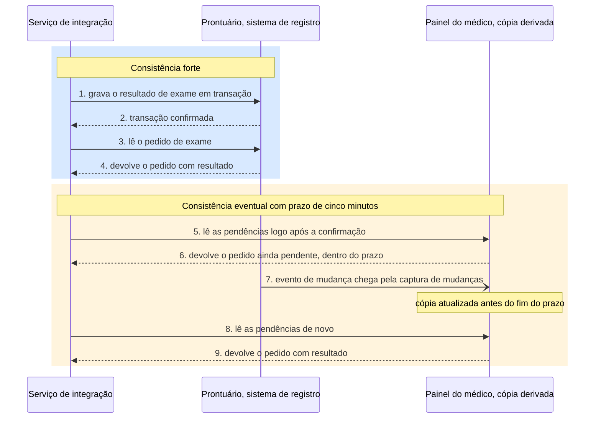
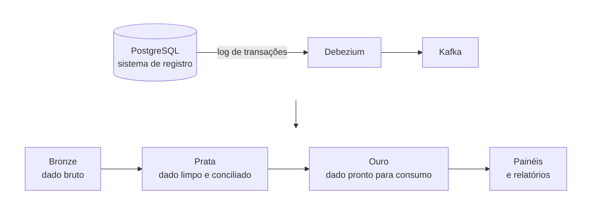
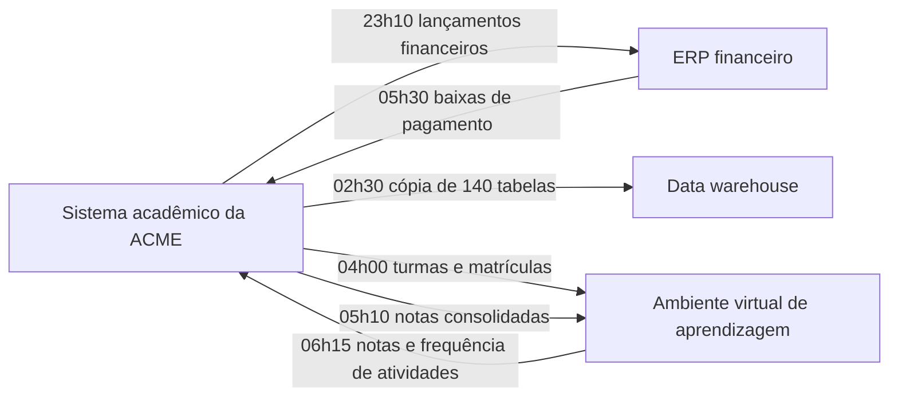
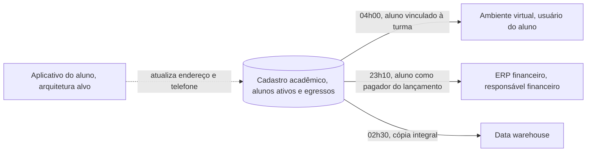
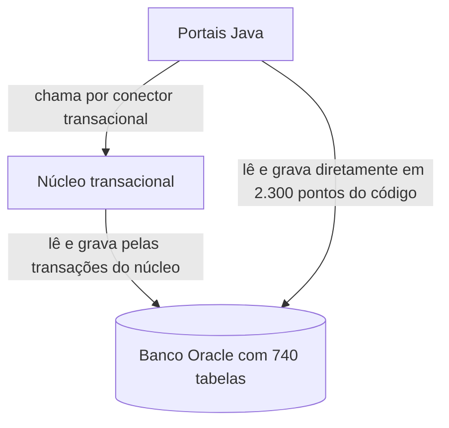

# Arquitetura de dados da solução

Este bloco identifica os dados que sustentam a mudança localizada no bloco 1 e responde ao que a solução recebe da arquitetura de dados corporativa, a quem pertence cada entidade, onde ela é registrada com autoridade, com que atraso cada cópia pode refleti-la e que obrigações o dado carrega.

## Antes de começar

- [Arquitetura de dados](../referencia/glossario.md#arquitetura-de-dados)
- [Modelo de dados corporativo](../referencia/glossario.md#modelo-de-dados-corporativo)
- [Fonte de verdade](../referencia/glossario.md#fonte-de-verdade)
- [Regime de consistência](../referencia/glossario.md#regime-de-consistencia)
- [Propriedade do dado](../referencia/glossario.md#propriedade-do-dado)
- [Dados mestres](../referencia/glossario.md#dados-mestres)
- Capacidades afetadas, produzidas no [exercício 13](bloco-1-arquitetura-de-negocio.md#exercicio-13)

## Dados na solução

A DAMA International, associação profissional que mantém o corpo de conhecimento em gestão de dados conhecido como DMBOK (*Data Management Body of Knowledge*), define a **arquitetura de dados** como a estrutura geral dos dados e dos recursos relacionados a dados, tratada como parte integrante da arquitetura corporativa. A referência vigente é a segunda edição revisada do DMBOK, publicada em 2024 e disponível em português, e a terceira edição está prevista para 2027 (DAMA International, 2024). Toda solução tem uma arquitetura de dados própria, mais específica que a corporativa, e essa arquitetura precisa ser consistente com a arquitetura de dados da organização, porque a inconsistência na definição ou no uso do dado produz erro em serviço de negócio.

A Produtora ACME, empresa de produção de vídeo, ilustra essa inconsistência. A produtora mantém o cadastro dos autores do conteúdo, funcionários ou contratados externos, e a área comercial mantém o cadastro de clientes. Alguns contratados externos também são clientes, mas as definições de cliente e de autor são incompatíveis, de modo que a mudança de endereço informada por essa pessoa é registrada como cliente ou como autor, nunca nos dois, e a produtora passa a contatá-la com dados errados. O problema é de dado mestre, tratado adiante, e dele decorre a regra de que toda solução nova recebe como entrada os componentes relevantes da arquitetura de dados corporativa e devolve a ela, o quanto antes, todo dado novo que cria.

A arquitetura de dados trata dado, informação e metadado num único domínio. Para o arquiteto de solução, o metadado aparece em forma concreta, como glossário de negócio, dicionário de dados, contrato de dados e registro de linhagem, e cada uma dessas formas é tratada nas seções seguintes.

### As áreas de gestão de dados

O DMBOK organiza a gestão de dados em onze áreas de conhecimento, coordenadas pela governança de dados, e a arquitetura de dados é uma delas. O arquiteto de solução pratica diretamente poucas dessas áreas, e cada uma delas entrega insumo ou impõe exigência à solução, como resume a tabela.

| Área do DMBOK | O que a solução recebe ou decide |
| --- | --- |
| Governança de dados | Quem decide sobre cada dado, inclusive qual sistema é o sistema de registro |
| Arquitetura de dados | Modelo de dados corporativo, panorama de dados e princípios |
| Modelagem e design de dados | Modelos lógico e físico da própria solução |
| Armazenamento e operações | Banco, cópias, retenção e recuperação |
| Segurança de dados | Classificação, controle de acesso e trilha de auditoria |
| Integração e interoperabilidade | Fluxos entre sistemas, por interface, evento ou lote |
| Dados mestres e de referência | Entidades compartilhadas, como cliente, aluno ou paciente |
| Data warehousing e inteligência de negócio | Destino analítico das cópias derivadas |
| Metadados | Glossário, dicionário, contrato e linhagem |
| Qualidade de dados | Dimensões de qualidade convertidas em requisito mensurável |
| Documentos e conteúdo | Dado não estruturado, como laudos e contratos digitalizados |

A interação entre as áreas ocorre pelos processos de governança. Um exemplo dado pela própria DAMA é a governança de dados mestres e de referência, que inclui determinar o sistema de registro de cada dado e as regras de negócio que se aplicam a ele (DAMA Denmark, 2020), decisão que este bloco trata como fonte de verdade.

### Modelo de dados corporativo

O **modelo de dados corporativo** reúne modelos de perspectivas e níveis de detalhe diferentes, que descrevem de forma consistente o entendimento da organização sobre entidades, atributos e relacionamentos. O DMBOK o organiza em quatro níveis, a visão conceitual com as áreas de assunto da organização, a visão de cada área de assunto com suas entidades e relacionamentos, o modelo lógico corporativo com entidades parcialmente atribuídas, e os modelos lógicos e físicos específicos de cada aplicação ou projeto (DAMA Rocky Mountain Chapter, 2023). O mapeamento entre níveis permite seguir uma entidade de cima a baixo, e a mesma entidade presente em modelos do mesmo nível liga esses modelos entre si.

A distinção entre os níveis de modelagem orienta o que o arquiteto de solução lê e o que ele decide. O modelo conceitual registra conceitos de negócio e seus relacionamentos, sem atributo técnico. O modelo lógico acrescenta atributos e chaves, ainda independente de tecnologia. O modelo físico traduz o lógico em tabelas, tipos e índices de um gerenciador de banco específico, como o PostgreSQL.

<figure markdown="span">
{ .module-diagram }
</figure>

*Figura 1 — Modelo de dados corporativo em quatro níveis, com o recorte que entra na solução e o que a solução produz. Fonte: material do curso, com base em DAMA Rocky Mountain Chapter (2023).*

A Figura 1 aplica os quatro níveis à modernização da comunicação com laboratórios do Hospital ACME, descrita no [bloco 1](bloco-1-arquitetura-de-negocio.md). A solução recebe o recorte das áreas de assunto que estão na zona de impacto, aqui a área de diagnóstico, e reaproveita as entidades que já existem, como pedido de exame e resultado. Quando a solução encontra uma entidade que parece nova, o arquiteto verifica se ela é uma especialização ou um sinônimo de entidade já modelada, como laboratório de apoio em relação a prestador de serviço, antes de propor definição nova. A solução produz o nível 4, o modelo físico da tabela de resultado no PostgreSQL e o mapeamento para o recurso *DiagnosticReport* do HL7 FHIR, e devolve ao modelo corporativo a diferença entre o estado atual e o proposto, que alimenta a análise de lacunas da Aula 6.

### Panorama de dados e linhagem

A edição revisada do DMBOK substituiu o conceito de desenho de fluxo de dados pelo de **panorama de dados** (*data landscape*), que descreve onde cada dado reside e como circula entre aplicações (DAMA International, n.d.). Na formulação da edição de 2017, os fluxos de dados relacionam o dado às aplicações dentro de um processo de negócio, aos repositórios em que ele é armazenado, aos segmentos de rede, aos papéis de negócio responsáveis por criar, atualizar, usar e excluir o dado, e às localidades, e constituem um tipo de documentação de linhagem (Steenbeek, 2017).

Para a solução, o panorama assume duas formas. A primeira é a grade dado × aplicação, uma matriz que cruza entidades com as aplicações que as gravam, leem ou recebem, e que torna visível, na análise de impacto, quais componentes são atingidos por uma mudança numa entidade. A segunda é o diagrama de fluxo entre sistemas, que mostra o sentido, o meio e o horário de cada troca, como os diagramas de integração do [bloco 3](bloco-3-arquitetura-de-aplicacoes-e-integracao.md).

<figure markdown="span">
{ .module-diagram }
</figure>

*Figura 2 — Grade dado × aplicação com dono, consumidores e regime de consistência. Fonte: material do curso, com base em Lovatt (2021).*

A **linhagem de dados** registra de onde cada conjunto de dados veio e por quais transformações passou, e permite responder, diante de um número errado num relatório, qual origem e qual processamento o produziram. O OpenLineage, projeto da LF AI & Data Foundation, padroniza a coleta desse registro com três entidades, a execução (*run*), o trabalho (*job*) e o conjunto de dados (*dataset*), e o Marquez é sua implementação de referência (OpenLineage, n.d.).

### Fonte de verdade e regime de consistência

Kleppmann (2017) distingue dois tipos de sistema que guardam dado. O sistema de registro guarda a versão autoritativa do dado, e é nele que o dado é escrito primeiro. O sistema de dado derivado guarda dado transformado ou processado a partir do sistema de registro, como um cache, um índice de busca ou uma base analítica, e pode ser reconstruído a partir da origem. Nesta disciplina, o termo **fonte de verdade** designa o lugar em que a entidade é registrada com autoridade, e toda outra ocorrência da entidade é cópia derivada.

O sistema de registro costuma ser um banco relacional com transação ACID, sigla de atomicidade, consistência, isolamento e durabilidade, como o PostgreSQL ou o Oracle, e o gerenciador anota cada mudança confirmada num log de transações, que no PostgreSQL se chama write-ahead log. As cópias derivadas mais comuns cumprem papéis distintos.

- A réplica de leitura é uma cópia do próprio banco, alimentada pelo log de transações do servidor primário, que atende consultas e reduz a carga sobre ele.
- O cache, como o Redis, guarda em memória o resultado de leituras frequentes para reduzir o tempo de resposta.
- O índice de busca, como o OpenSearch, reorganiza o dado para consultas por texto livre e por combinações de filtros.
- O data warehouse, como o BigQuery, o Snowflake ou o Redshift, guarda o dado em armazenamento colunar para consultas analíticas sobre grande volume histórico.

A captura de mudanças de dados, conhecida pela sigla CDC, propaga cada alteração confirmada no sistema de registro para as cópias. O Debezium é um conjunto de conectores de origem para o Kafka Connect que lê o log de transações do banco, no PostgreSQL por meio da decodificação lógica do write-ahead log, e emite um evento para cada inserção, atualização e exclusão de linha (Debezium, n.d.-a, n.d.-b). Por padrão, os eventos de cada tabela vão para um tópico próprio do Apache Kafka, que retém as mensagens em ordem dentro de cada partição e permite que cada consumidor leia no próprio ritmo.

<figure markdown="span">
{ .module-diagram }
</figure>

*Figura 3 — Fonte de verdade e cópias derivadas alimentadas por captura de mudanças e por eventos. Fonte: material do curso, com base em Kleppmann (2017) e Debezium (n.d.-a).*

Cada consumidor de uma entidade precisa de um **regime de consistência** declarado, que diz quando a leitura feita na fonte ou numa cópia reflete a fonte de verdade. O regime é forte quando a leitura reflete a fonte imediatamente, o que exige ler da própria fonte de verdade ou de cópia atualizada de forma síncrona, e eventual quando reflete dentro de um prazo declarado, por exemplo cinco minutos ou um dia. Um regime eventual sem prazo declarado não pode ser verificado, e por isso não é aceito como decisão. A Figura 4 coloca os dois regimes na mesma linha do tempo, com o resultado de exame do Hospital ACME gravado no prontuário e copiado para o painel de pendências do médico.

*Figura 4 — Consistência forte e consistência eventual com prazo declarado. Fonte: material do curso, com base em Kleppmann (2017).*

Os produtos citados neste bloco são exemplos de cada categoria, e a escolha de banco, cache, índice, barramento e data warehouse para a ACME pertence à Aula 5.

### Dados mestres e de referência

**Dados mestres** são as entidades de negócio compartilhadas por várias aplicações, como cliente, aluno, paciente, produto ou fornecedor, e dados de referência são os conjuntos de valores que classificam outros dados, como a tabela de países, de moedas ou de códigos de exame. O DMBOK define a gestão dessa área como a gestão do dado compartilhado para reduzir redundância e garantir melhor qualidade (DAMA Denmark, 2020). O caso da Produtora ACME é um problema típico de dado mestre, porque a mesma pessoa existe em dois cadastros com definições incompatíveis.

As soluções de gestão de dados mestres seguem quatro estilos de implementação, que se distinguem pelo lugar em que a escrita ocorre e pelo papel do repositório central, chamado *hub* (Carr, 2026).

| Estilo | Onde a escrita ocorre | Papel do hub |
| --- | --- | --- |
| Registro | Nos sistemas de origem | Guarda apenas o identificador global e as ligações entre os registros, sem devolver dado às origens |
| Consolidação | Nos sistemas de origem | Reúne as cópias num registro consolidado, usado para leitura e análise |
| Coexistência | Nos sistemas de origem e no hub | Sincroniza o registro consolidado de volta para as origens |
| Centralizado | No hub | É o sistema de registro, e as aplicações gravam e leem por ele |

Para a solução, o estilo escolhido define a fonte de verdade da entidade mestre e, portanto, o dono e os contratos que a expõem. Na Produtora ACME, o estilo de registro resolve a identificação da mesma pessoa nos dois cadastros com custo baixo, e o estilo centralizado resolve também a divergência de endereço, ao custo de alterar as duas aplicações para gravarem pelo hub.

### Propriedade do dado

A **propriedade do dado** atribui cada entidade a um único responsável, que é a parte autorizada a gravá-la. As demais partes leem a entidade pela interface que o responsável oferece ou a recebem por evento publicado por ele. Dehghani (2022) aplica o mesmo princípio ao dado analítico, atribuindo a propriedade ao domínio de negócio mais próximo da origem do dado, como um dos quatro princípios da malha de dados (*data mesh*).

O banco compartilhado entre aplicações contraria a propriedade do dado. Quando duas aplicações leem e gravam as mesmas tabelas, cada mudança de estrutura passa a exigir alteração coordenada em dois códigos-fonte, frequentemente mantidos por equipes distintas, e nenhuma das duas pode evoluir o modelo de dados sem a outra. A forma técnica mais comum da propriedade do dado é a prática de um banco por serviço, em que o dado persistente de cada serviço é privado e acessível apenas pela interface desse serviço (Richardson, n.d.). Os consumidores leem pela interface ou recebem os eventos que o dono publica no Kafka, no estilo da [arquitetura orientada a eventos](../modulo-3-design-e-padroes/bloco-2-estilos-arquiteturais.md#arquitetura-orientada-a-eventos) apresentada na Aula 3, e dependem só do contrato, que o dono mantém estável enquanto altera o esquema interno.

<figure markdown="span">
{ .module-diagram }
</figure>

*Figura 5 — Banco compartilhado comparado com um dono por entidade. Fonte: material do curso, com base em Richardson (n.d.) e Dehghani (2022).*

O **contrato de dados** formaliza o que o dono garante ao consumidor de um conjunto de dados. O Open Data Contract Standard (ODCS), mantido pelo projeto Bitol na LF AI & Data Foundation, descreve o contrato num arquivo YAML com seções para esquema, regras de qualidade, acordo de nível de serviço, papéis e servidores, e está na versão 3.2.0, publicada em setembro de 2026 (Bitol, 2026). A prática é recente, e o [contrato de integração](bloco-3-arquitetura-de-aplicacoes-e-integracao.md) do bloco 3 cumpre a mesma função para as interfaces entre aplicações.

### Requisitos de dados: qualidade e proteção

A qualidade de dados entra na solução como requisito mensurável. A edição revisada do DMBOK lista nove dimensões de qualidade, exatidão, validade, completude, integridade, unicidade, tempestividade, razoabilidade, consistência e atualidade (*currency*), esta última incluída na revisão (DAMA International, n.d.). Cada dimensão relevante recebe métrica e limite, como no requisito que exige o endereço do paciente confirmado nos últimos 12 meses, que é um requisito de atualidade.

A Lei Geral de Proteção de Dados Pessoais, Lei nº 13.709/2018, impõe à solução exigências que o arquiteto precisa traduzir em decisão de dados (Brasil, 2018).

| Exigência | Dispositivo da LGPD | Decisão de dados na solução |
| --- | --- | --- |
| Distinguir dado pessoal de dado pessoal sensível, que inclui dado referente à saúde, origem racial ou étnica e dado biométrico | Art. 5º, I e II | Classificar cada atributo e aplicar controle mais estrito ao sensível |
| Limitar o tratamento ao mínimo necessário para a finalidade | Art. 6º, III | Não copiar atributo pessoal para destino que não precisa dele |
| Eliminar o dado após o término do tratamento, com conservação autorizada para obrigação legal ou regulatória, entre outras hipóteses | Arts. 15 e 16 | Declarar retenção e rotina de eliminação por entidade, inclusive nas cópias derivadas |
| Manter registro das operações de tratamento | Art. 37 | Trilha de auditoria e linhagem do dado pessoal |
| Observar as medidas de segurança desde a concepção do produto ou serviço | Art. 46, § 2º | Incluir classificação e proteção no desenho da solução |
| Restringir a transferência internacional a hipóteses como país com proteção adequada ou cláusulas contratuais | Art. 33 | Verificar a região de cada serviço gerenciado e de cada cópia |

A LGPD se aplica independentemente do país em que os dados estejam localizados (art. 3º) e não exige que o dado permaneça no território nacional. A exigência de processamento no Brasil, quando existe, decorre de decisão da organização ou de contrato, e entra na solução como restrição registrada.

### Dado operacional e dado analítico

O dado operacional registra o estado corrente do negócio e atende às transações das aplicações, enquanto o dado analítico reúne fatos históricos e agregados para análise. As arquiteturas analíticas mais citadas são o data warehouse em modelagem dimensional, com tabelas de fatos e de dimensões organizadas em esquema estrela (Kimball Group, n.d.), o data lake, que guarda o dado bruto na forma em que a origem o fornece (Fowler, 2015), e o lakehouse, que oferece sobre formatos abertos de arquivo as funções de gestão de dados de um data warehouse e evita manter as duas camadas separadas (Armbrust et al., 2021). No lakehouse, a arquitetura medallion organiza os dados em três camadas, bronze com o dado bruto, prata com o dado limpo e conciliado e ouro com o dado pronto para consumo (Databricks, n.d.).

*Figura 6 — Caminho do dado operacional ao analítico, com captura de mudanças e camadas da arquitetura medallion. Fonte: material do curso, com base em Debezium (n.d.-a) e Databricks (n.d.).*

Para o arquiteto de solução, a escolha da plataforma analítica pertence em geral à arquitetura corporativa. A solução decide como o dado operacional chega a essa plataforma, com que regime de consistência e com quais atributos pessoais removidos ou pseudonimizados.

## Uso pelo arquiteto

O arquiteto recebe da arquitetura de dados corporativa o recorte do modelo corporativo na zona de impacto e usa a grade dado × aplicação para localizar o impacto de mudar uma entidade e para revelar entidades sem dono declarado ou com mais de uma aplicação que as grava. Para cada entidade, ele registra o dono, a fonte de verdade, o estilo de dado mestre quando a entidade é compartilhada, o regime de consistência de cada consumidor e as obrigações de qualidade e de proteção, e devolve ao modelo corporativo a diferença que a solução cria. O dono de cada entidade é a origem natural das interfaces que a expõem no [bloco 3](bloco-3-arquitetura-de-aplicacoes-e-integracao.md), e o regime de consistência de cada consumidor é a exigência que o [contrato de integração](../referencia/glossario.md#contrato-de-integracao) precisa garantir.

## Exercício 14

O exercício pede decisões de dados para a ACME, universidade privada brasileira com 38.400 alunos ativos e sistema acadêmico em operação desde 2004. Ele parte das [capacidades](../referencia/glossario.md#capacidade) marcadas como afetadas no [exercício 13](bloco-1-arquitetura-de-negocio.md#exercicio-13), das responsabilidades distribuídas no esboço lógico do [exercício 9](../modulo-3-design-e-padroes/bloco-1-principios-de-design.md#exercicio-9) e de fatos reproduzidos da [arquitetura de linha de base](../caso-acme/linha-de-base.md) e da [página inicial do caso](../caso-acme/index.md).

### Item 1: Dono de cada entidade

A grade dado × aplicação abaixo foi montada pelo material do curso a partir da linha de base e cruza as cinco entidades acadêmicas com as aplicações que as gravam, leem ou recebem, sem a coluna de dono.

| Entidade | Núcleo transacional | Portais Java | ERP financeiro | Ambiente virtual | Data warehouse |
| --- | --- | --- | --- | --- | --- |
| Aluno | Grava | Lê ou grava, por conector e por acesso direto ao banco, sem distribuição registrada por entidade | Recebe por lote às 23h10, como pagador do lançamento | Recebe por lote às 04h00, vinculado à turma | Recebe por lote às 02h30 |
| Matrícula | Grava | Lê ou grava, por conector e por acesso direto ao banco, sem distribuição registrada por entidade | Não registrado | Recebe por lote às 04h00 | Recebe por lote às 02h30 |
| Nota | Grava a nota consolidada | Lê ou grava, por conector e por acesso direto ao banco, sem distribuição registrada por entidade | Não registrado | Recebe por lote às 05h10 e devolve nota de atividade às 06h15 | Recebe por lote às 02h30 |
| Lançamento financeiro | Grava | Lê ou grava, por conector e por acesso direto ao banco, sem distribuição registrada por entidade | Recebe por lote às 23h10 e devolve baixa às 05h30 | Não registrado | Recebe por lote às 02h30 |
| Turma | Grava | Lê ou grava, por conector e por acesso direto ao banco, sem distribuição registrada por entidade | Não registrado | Recebe por lote às 04h00 | Recebe por lote às 02h30 |

1. Marque, para cada uma das cinco entidades, a aplicação ou o elemento do esboço lógico do exercício 9 que deve ser o dono na arquitetura alvo.
2. Justifique cada marcação em uma linha, citando a capacidade afetada do exercício 13 que a entidade sustenta.

O dono marcado para a entidade nota é a origem do contrato de integração do exercício 15, no [bloco 3](bloco-3-arquitetura-de-aplicacoes-e-integracao.md).

### Item 2: Regime de consistência por consumidor

Toda troca com o ERP financeiro e com o ambiente virtual de aprendizagem ocorre por arquivo, em lote noturno, e o data warehouse recebe uma extração diária. O diagrama mostra o sentido e o horário de cada um dos seis lotes da linha de base.

Dois requisitos do caso afetam o regime de consistência. O R7 define o prazo de propagação da nota até o ambiente virtual, e o R6 exige tempo de resposta do sistema de registro durante a matrícula, o que interessa à decisão de o consumidor ler a fonte com consistência forte.

| Código | Declaração |
| --- | --- |
| R6 | O portal sustenta 5.800 sessões simultâneas na abertura da matrícula, com percentil 95 do tempo de confirmação em até 4 segundos |
| R7 | A nota lançada pelo professor chega ao ambiente virtual de aprendizagem em até 10 minutos |

1. Marque, para cada consumidor de cada entidade na grade do item 1, o regime de consistência exigido, forte ou eventual com o prazo, usando o R7 como prazo de propagação da nota e o R6 como exigência de tempo de resposta para os consumidores que leem a fonte com consistência forte durante a matrícula.

### Item 3: Estilo de dado mestre para o aluno

O aluno é a entidade compartilhada da ACME, com 38.400 alunos ativos e 214.000 egressos com dados retidos. O cadastro acadêmico grava o aluno, e as demais aplicações recebem ou mantêm cópia dele, como mostra o diagrama.

1. Escolha o estilo de dado mestre, registro, consolidação, coexistência ou centralizado, para a entidade aluno na arquitetura alvo.
2. Registre a escolha em três linhas, com o contexto, a decisão e uma consequência, como os campos correspondentes do ADR apresentado no [bloco 4 da Aula 3](../modulo-3-design-e-padroes/bloco-4-registro-de-decisao-arquitetural.md).

### Item 4: Obrigações do dado pessoal do aluno

A tabela, montada pelo material do curso a partir da linha de base, lista atributos do aluno usados pela ACME e os destinos para os quais cada um é copiado. A cor ou raça autodeclarada e a condição de deficiência são coletadas para a extração anual do censo da educação superior.

| Atributo | Destinos na linha de base |
| --- | --- |
| Nome e CPF | Ambiente virtual, ERP financeiro e data warehouse |
| Endereço e telefone | ERP financeiro e data warehouse |
| Nota e situação por disciplina | Ambiente virtual e data warehouse |
| Cor ou raça autodeclarada | Data warehouse |
| Condição de deficiência | Data warehouse |
| Histórico escolar de egresso, 214.000 registros | Data warehouse |

O caso também registra o requisito R9, que exige trilha de auditoria de toda leitura de dado pessoal de aluno com retenção de 5 anos, e o R14, que proíbe processar dado pessoal de aluno fora do território nacional, com base em parecer do Jurídico de 28/04/2026.

1. Classifique cada atributo como dado pessoal ou dado pessoal sensível, conforme o art. 5º da LGPD.
2. Indique um destino que recebe atributo além do necessário para a finalidade, conforme o princípio da necessidade.
3. Indique qual hipótese do art. 16 da LGPD autoriza a ACME a conservar os históricos de egressos e se o R14 decorre da LGPD ou de decisão da instituição.

### Item 5: Acesso direto ao banco

O banco Oracle, com 740 tabelas, é compartilhado entre o núcleo COBOL e a camada Java, sem separação de esquema por responsabilidade. Existem 2.300 pontos no código Java que leem ou gravam tabelas do núcleo diretamente, contornando as transações do núcleo, e o inventário não registra a distribuição desses pontos por entidade.

1. Responda, em até três linhas, por que os 2.300 acessos diretos ao banco contrariam a propriedade do dado.

## Fontes

As referências seguem o formato APA, 7ª edição, e constam da [bibliografia](../referencia/bibliografia.md) do curso. O trecho consultado aparece entre parênteses ao fim de cada entrada.

- Armbrust, M., Ghodsi, A., Xin, R., & Zaharia, M. (2021). Lakehouse: A new generation of open platforms that unify data warehousing and advanced analytics. *Conference on Innovative Data Systems Research (CIDR '21)*. https://www.cidrdb.org/cidr2021/papers/cidr2021_paper17.pdf (definição de lakehouse e crítica à arquitetura de duas camadas)
- Bitol. (2026). *Open Data Contract Standard* (Versão 3.2.0). LF AI & Data Foundation. https://bitol-io.github.io/open-data-contract-standard/latest/ (estrutura do contrato de dados)
- Brasil. (2018). *Lei nº 13.709, de 14 de agosto de 2018. Lei Geral de Proteção de Dados Pessoais (LGPD)*. https://www.planalto.gov.br/ccivil_03/_ato2015-2018/2018/lei/l13709.htm (arts. 3º, 5º, 6º, 15, 16, 33, 37 e 46)
- Carr, A. (2026). *4 common master data management implementation styles*. Stibo Systems. https://www.stibosystems.com/blog/4-common-master-data-management-implementation-styles (estilos de registro, consolidação, coexistência e centralizado)
- DAMA Denmark. (2020). *Data management body of knowledge: Overview of the DMBOK2* [Apresentação]. https://www.dama-dk.org/onewebmedia/DAMA%20DMBOK2_PDF.pdf (onze áreas de conhecimento, definição de arquitetura de dados e de dados mestres e de referência, interação pela governança)
- DAMA International. (2024). *DAMA-DMBOK: Data management body of knowledge* (2nd ed., revised). Technics Publications. (obra de referência, consultada por meio das publicações da DAMA listadas nesta seção)
- DAMA International. (n.d.). *DMBOK 2.0 revision*. https://www.damadmbok.org/dmbok2-revisions (panorama de dados no lugar do desenho de fluxo de dados e nove dimensões de qualidade)
- DAMA Rocky Mountain Chapter. (2023). *DMBoK figure 23: Enterprise data model*. https://damarmc.org/news/13270755 (quatro níveis do modelo de dados corporativo)
- Databricks. (n.d.). *Medallion architecture*. https://www.databricks.com/glossary/medallion-architecture (camadas bronze, prata e ouro)
- Debezium. (n.d.-a). *Debezium features*. https://debezium.io/documentation/reference/stable/features.html (captura de mudanças baseada em log, conectores de origem para o Kafka Connect, captura de exclusões)
- Debezium. (n.d.-b). *Debezium connector for PostgreSQL*. https://debezium.io/documentation/reference/stable/connectors/postgresql.html (decodificação lógica do log de transações, evento por inserção, atualização e exclusão de linha, um tópico do Kafka por tabela)
- Dehghani, Z. (2022). *Data mesh: Delivering data-driven value at scale*. O'Reilly Media. (princípio da propriedade do dado pelo domínio)
- Fowler, M. (2015). *Data lake*. https://martinfowler.com/bliki/DataLake.html (dado bruto na forma fornecida pela origem)
- Kimball Group. (n.d.). *Dimensional modeling techniques*. https://www.kimballgroup.com/data-warehouse-business-intelligence-resources/kimball-techniques/dimensional-modeling-techniques/ (tabelas de fatos e de dimensões e esquema estrela)
- Kleppmann, M. (2017). *Designing data-intensive applications: The big ideas behind reliable, scalable, and maintainable systems*. O'Reilly Media. (parte III, sistemas de registro e dado derivado)
- Lovatt, M. (2021). *Solution architecture foundations*. BCS, The Chartered Institute for IT. (seção 2.5, arquitetura de dados corporativa e de solução, artefatos e grade de análise de impacto, generalização para reconhecer entidades existentes. O Hospital ACME é inspirado no caso Fallowdale Hospital, usado ao longo do livro, e a Produtora ACME é inspirada num caso de produção de conteúdo audiovisual apresentado na mesma obra)
- OpenLineage. (n.d.). *OpenLineage* [Repositório]. LF AI & Data Foundation. https://github.com/OpenLineage/OpenLineage (entidades run, job e dataset e implementação de referência Marquez)
- Richardson, C. (n.d.). *Pattern: Database per service*. Microservices.io. https://microservices.io/patterns/data/database-per-service.html (dado persistente privado ao serviço e acessível apenas pela interface dele)
- Steenbeek, I. (2017, 10 de setembro). *New vision on data lineage/flow in DAMA-DMBOK2*. Data Crossroads. https://datacrossroads.nl/2017/09/10/new-vision-on-data-lineage-flow-in-dama-dm-bok-2/ (fluxos de dados como documentação de linhagem, segundo o capítulo 4 do DMBOK2)

**Material do curso.** O bloco usa as entradas [arquitetura de dados](../referencia/glossario.md#arquitetura-de-dados), [modelo de dados corporativo](../referencia/glossario.md#modelo-de-dados-corporativo), [dados mestres](../referencia/glossario.md#dados-mestres), [propriedade do dado](../referencia/glossario.md#propriedade-do-dado), [fonte de verdade](../referencia/glossario.md#fonte-de-verdade) e [regime de consistência](../referencia/glossario.md#regime-de-consistencia) do glossário, além do dossiê da instituição fictícia [ACME](../caso-acme/index.md) e da sua [arquitetura de linha de base](../caso-acme/linha-de-base.md).
