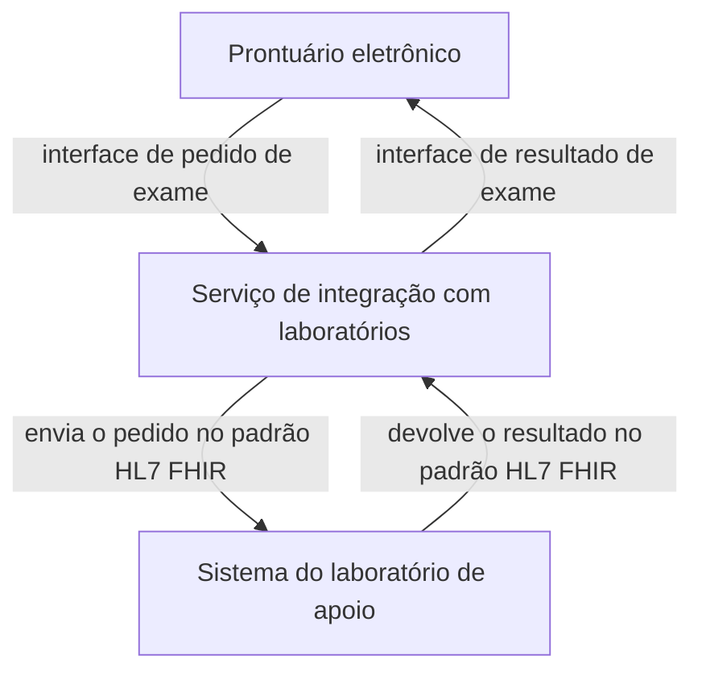
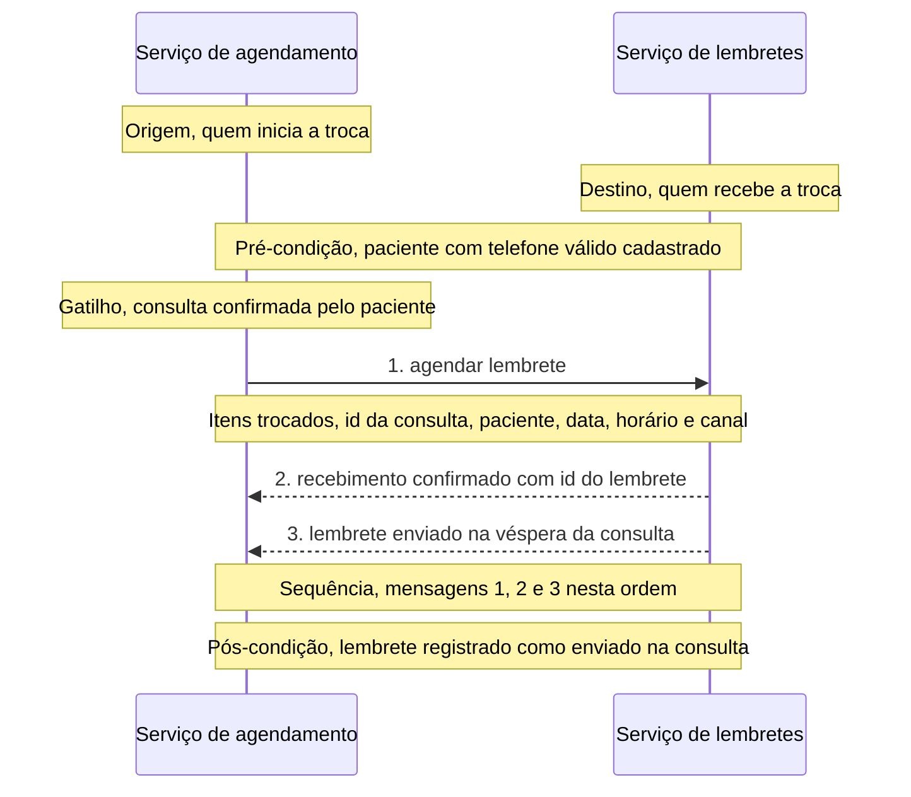
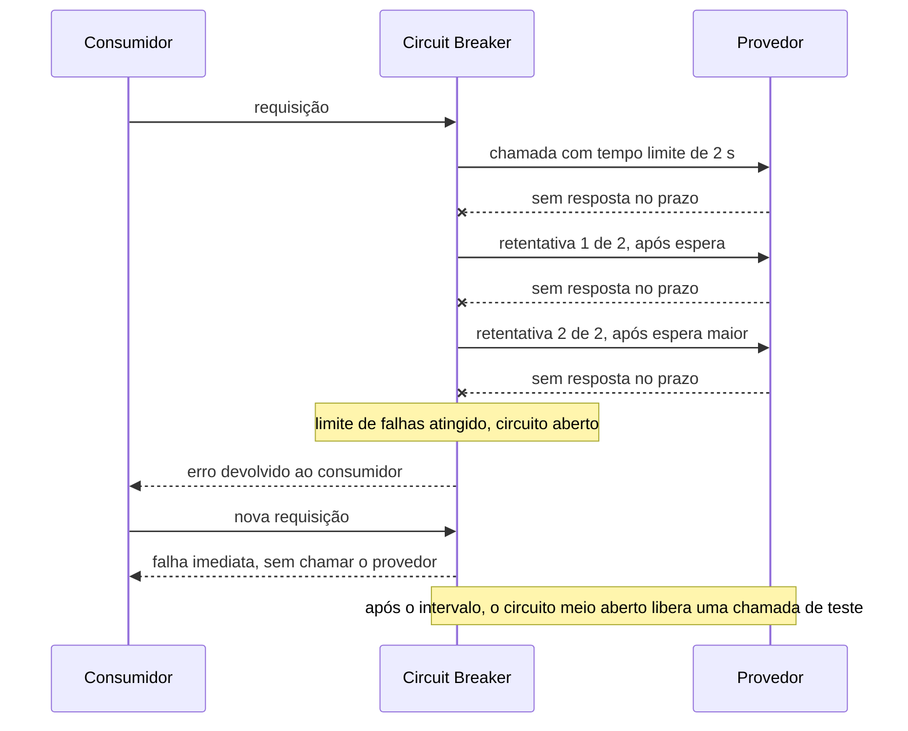
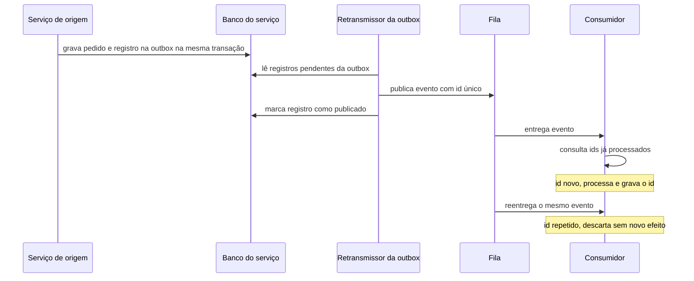
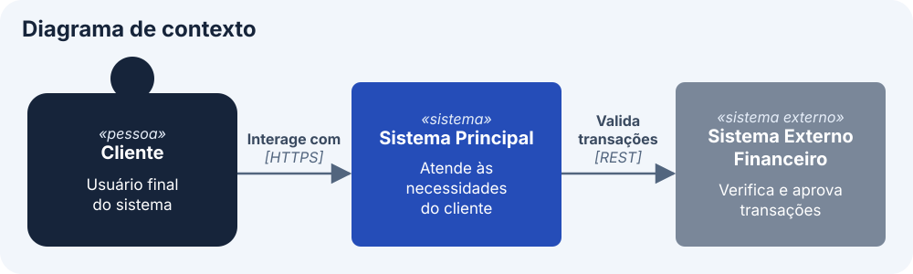
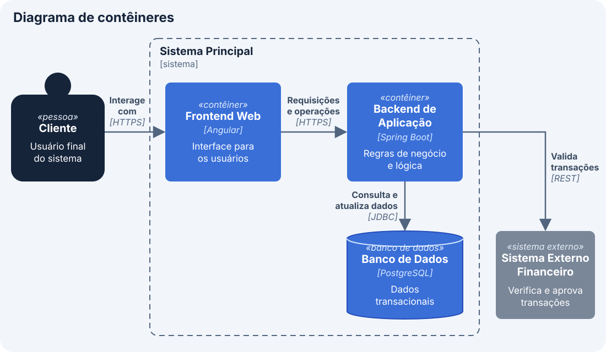
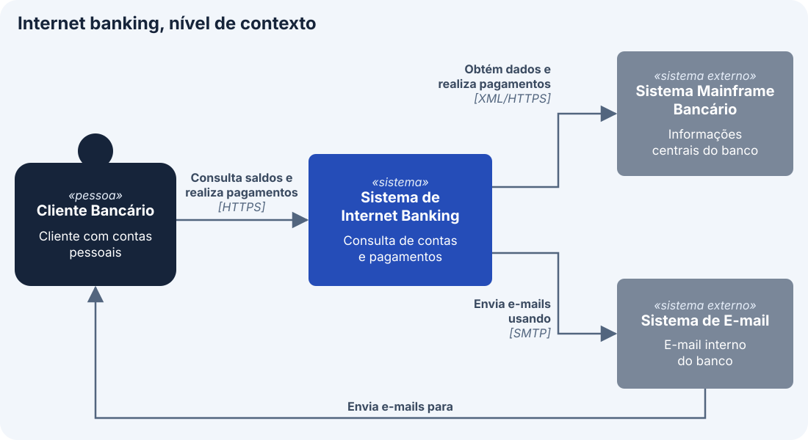
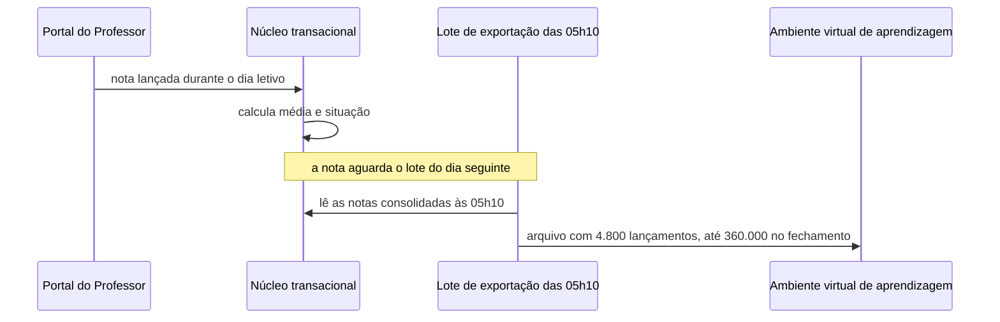

# Arquitetura de aplicações e integração

Este bloco identifica as aplicações e as interfaces que realizam a mudança, distingue o que governa uma integração entre padrão técnico, protocolo, especificação e contrato, e representa a fronteira da solução no diagrama de contexto do modelo C4.

## Antes de começar

- [Arquitetura de aplicações](../referencia/glossario.md#arquitetura-de-aplicacoes)
- [Padrão técnico](../referencia/glossario.md#padrao-tecnico)
- [Contrato de integração](../referencia/glossario.md#contrato-de-integracao)
- [Modelo C4](../referencia/glossario.md#modelo-c4)
- Dono de cada entidade, marcado no [exercício 14](bloco-2-arquitetura-de-dados.md#exercicio-14)

## Aplicações, interfaces e contexto

A arquitetura de aplicações é o subdomínio da arquitetura corporativa que mantém a visão do portfólio de aplicações da organização e dos serviços que elas oferecem, e que liga a arquitetura de negócio à arquitetura de dados. Aplicação é um conjunto de capacidades tecnológicas que fornece funções de negócio e gerencia ativos de dados, e componente de aplicação é a unidade que encapsula uma funcionalidade e a oferece por interfaces claramente definidas. As aplicações são o principal meio de gerir o dado ao longo do seu ciclo de vida, da aquisição ao processamento, ao armazenamento, à apresentação, ao arquivamento e à exclusão.

O bloco apresenta primeiro os conceitos de aplicação e de integração, cada um ilustrado em notação livre, sem convenção formal, e reúne no fim o modelo C4, a notação que a aula adota para representar a fronteira e a decomposição da solução.

### Aplicações e interfaces

Uma interface é o ponto pelo qual um componente de aplicação oferece sua funcionalidade a outro componente, a uma pessoa ou a um sistema externo, e a integração é a troca de dados e de chamadas que ocorre por essas interfaces. Cada aplicação expõe as entidades de que é dona, no sentido de [propriedade do dado](bloco-2-arquitetura-de-dados.md#propriedade-do-dado) apresentado no bloco 2, e consome por interface as entidades que pertencem a outras aplicações.

O diagrama abaixo, em notação livre, mostra as interfaces da mudança apresentada no [bloco 1](bloco-1-arquitetura-de-negocio.md) para o Hospital ACME, em que o prontuário eletrônico troca pedidos de exame e resultados com o sistema de cada laboratório de apoio por meio de um serviço de integração.



### Portfólio de aplicações

O artefato principal do domínio é o catálogo do portfólio de aplicações, que lista as aplicações em uso e planejadas, com quem as usa e como. O portfólio costuma ser um conjunto heterogêneo, adquirido ou construído em momentos diferentes da história da organização, e por isso a arquitetura de aplicações trabalha continuamente para racionalizá-lo. Para distinguir aplicações estratégicas de aplicações legadas, é frequente o uso de uma classificação em vermelho, âmbar e verde, que permite à arquitetura de solução escolher a opção mais estratégica. Nesta disciplina, verde indica aplicação estratégica a manter e evoluir, âmbar indica aplicação mantida por ora, com restrição de investimento, e vermelho indica aplicação a substituir ou a retirar.

A Figura 1 aplica a classificação a um portfólio ilustrativo do Hospital ACME, com cores atribuídas para fins didáticos. O módulo de anexos de laudo em PDF, que a central de exames usa para anexar ao prontuário os laudos baixados dos portais dos laboratórios de apoio, aparece em vermelho porque a modernização descrita no [bloco 1](bloco-1-arquitetura-de-negocio.md) passa a receber o resultado como dado estruturado, integrado ao prontuário no padrão HL7 FHIR.

<figure markdown="span">
{ .module-diagram }
</figure>

*Figura 1 — Portfólio de aplicações classificado em vermelho, âmbar e verde, com a ação associada a cada cor. Fonte: material do curso, com base em Lovatt (2021, seção 2.6.1).*

As aplicações se dividem em três tipos, ilustrados na tabela abaixo com exemplos do Hospital ACME.

| Tipo | Definição | Exemplo no Hospital ACME |
| --- | --- | --- |
| Aplicação de negócio | Ligada diretamente à atividade do negócio, própria da organização ou adquirida, inclusive como serviço | Prontuário eletrônico do paciente e agendamento ambulatorial pelo aplicativo |
| Aplicação genérica | Ferramenta usada para vários fins | Planilha para priorização eventual e correio eletrônico entre departamentos |
| Plataforma de aplicação | Conjunto de componentes tecnológicos que sustenta outras aplicações, em geral tratado no domínio de infraestrutura | Sistema gerenciador de banco de dados e barramento de serviços |

### Descrição de uma interface

O catálogo de interfaces de aplicações documenta as interfaces entre aplicações, o tipo e o nível de dependência entre elas e suas interfaces de programação, e as grades de referência cruzada relacionam aplicações a dados, a funções de negócio e a processos. O catálogo de interfaces é a fonte principal da análise de interfaces da solução. A arquitetura de software, por sua vez, responde pela estrutura e pelo comportamento de cada componente, inclusive suas interfaces internas e externas, e documenta como interfaces de programação o comportamento que outros sistemas consomem.

Cada ponto de contato entre blocos de construção da solução é descrito por seis atributos, e o conjunto dessas descrições forma o catálogo de interfaces da solução.

| Atributo | O que registra |
| --- | --- |
| Origem | O bloco de construção que inicia a troca |
| Destino | O bloco de construção que recebe a troca |
| Gatilho | O evento ou a condição que dispara a troca |
| Itens trocados | Os dados e as informações de apoio que passam pela interface |
| Sequência | A ordem das mensagens e das respostas |
| Pré e pós-condições | O que precisa valer antes da troca e o que passa a valer depois dela |

O diagrama de sequência abaixo, em notação livre, descreve uma interface genérica entre um serviço de agendamento e um serviço de lembretes, com uma nota para cada um dos seis atributos. A origem e o destino aparecem como participantes, o gatilho e as condições aparecem como notas, e a sequência corresponde à ordem vertical das três mensagens trocadas.



### Padrão técnico, protocolo, especificação e contrato

Em português, a palavra padrão traduz dois termos ingleses distintos, e a distinção entre eles importa neste bloco. O termo *pattern*, no sentido usado na Aula 3, designa uma solução recorrente para um problema em um contexto, enquanto o termo *standard* designa uma especificação adotada por uma organização ou por um organismo de normalização. Este bloco usa a expressão padrão técnico para *standard* e reserva padrão arquitetural e padrão de design para *pattern*, conforme as entradas do [glossário](../referencia/glossario.md#padrao-tecnico).

Um **padrão técnico** reúne a experiência de profissionais ao longo de muitos anos e situações, e a apresenta como especificação de processos a seguir, documentação a produzir e regras e parâmetros a observar. Por ser genérico, um padrão técnico costuma conter partes que não se aplicam a uma solução específica, e por isso o arquiteto precisa recortar a parte que se aplica antes de transformá-la em requisito técnico.

Um protocolo é o conjunto de regras que duas partes seguem para trocar mensagens, com formato, sequência e tratamento de erro definidos. Entre os protocolos da linha de base da ACME estão o LDAP na autenticação dos portais, o HTTPS nas chamadas ao gateway de pagamento e ao assinador digital, e um conector transacional proprietário entre os portais e o núcleo. O HTTP, base do HTTPS, tem sua semântica definida pelo RFC 9110 (Fielding et al., 2022).

Uma especificação de interface descreve de forma verificável uma interface particular, com operações ou mensagens, esquemas e erros. Para interfaces síncronas sobre HTTP, a especificação OpenAPI define uma descrição independente de linguagem de programação, que permite a pessoas e a programas entender as capacidades de um serviço sem acesso ao código-fonte (OpenAPI Initiative, 2026). Para interfaces orientadas a mensagens, a especificação AsyncAPI descreve canais, mensagens e operações de forma independente do protocolo de transporte (AsyncAPI Initiative, n.d.). Os dois trechos abaixo descrevem, num exemplo genérico de comércio eletrônico, uma consulta síncrona de pedido e a publicação de um evento de pedido confirmado.

```yaml
openapi: 3.2.1
info:
  title: Pedidos
  version: 1.0.0
paths:
  /pedidos/{id}:
    get:
      summary: Consulta um pedido
      parameters:
        - name: id
          in: path
          required: true
          schema:
            type: string
      responses:
        "200":
          description: Pedido encontrado
        "404":
          description: Pedido inexistente
```

```yaml
asyncapi: 3.1.0
info:
  title: Eventos de pedido
  version: 1.0.0
channels:
  pedidoConfirmado:
    address: pedidos.confirmados
    messages:
      pedidoConfirmado:
        payload:
          type: object
          properties:
            idPedido:
              type: string
            versao:
              type: integer
operations:
  publicarPedidoConfirmado:
    action: send
    channel:
      $ref: "#/channels/pedidoConfirmado"
```

A especificação depende de uma linguagem de esquema, que define a estrutura e as restrições de cada mensagem de forma que um programa consiga validá-la antes de processá-la. O JSON Schema é uma linguagem declarativa para definir a estrutura e as restrições de dados JSON, serve de base ao OpenAPI e ao AsyncAPI na descrição do corpo das mensagens e tem como versão corrente a 2020-12 (JSON Schema, n.d.). O Apache Avro é um sistema de serialização com esquemas escritos em JSON, em que o dado armazenado junto do seu esquema se torna autodescritivo (Apache Software Foundation, n.d.). Em fluxos de eventos, os esquemas Avro costumam ficar num registro de esquemas, como o Schema Registry da Confluent, que guarda as versões de cada esquema e verifica a compatibilidade da versão nova com as anteriores antes de aceitá-la (Confluent, n.d.). Os Protocol Buffers são um mecanismo neutro quanto a linguagem e plataforma para serializar dados estruturados, descritos em arquivos .proto a partir dos quais se gera código em cada linguagem, e são o formato usado por padrão no gRPC (Google, n.d.).

Um **contrato de integração** é a especificação de interface somada às garantias que provedor e consumidor acordam, como a política de versão, a garantia de entrega, a idempotência e o nível de serviço. Os seis campos que o contrato acrescenta aos seis atributos de interface aparecem na seção [Estrutura de um contrato](#estrutura-de-um-contrato), logo abaixo do exemplo da nota fiscal eletrônica.

A nota fiscal eletrônica brasileira mostra os quatro níveis separados. O padrão técnico é o próprio sistema da nota fiscal eletrônica, cujo manual de orientação do contribuinte, na versão 7.00 de novembro de 2020, fixa regras e leiautes para todas as empresas emissoras e adota o perfil de interoperabilidade WS-I Basic Profile para os serviços web. Os protocolos são o TLS 1.2 ou superior com autenticação mútua e o SOAP 1.2. A especificação é dada pelos esquemas XML das mensagens, como o esquema de envio da nota na versão 4.00, publicados no portal nacional. O nível de contrato corresponde às regras que cada serviço impõe ao emissor, como o uso obrigatório de certificado digital emitido por autoridade credenciada na ICP-Brasil, do tipo A1 ou A3, as regras de validação e os códigos de retorno, que nesse caso são fixadas pela administração tributária sem negociação com cada emissor.

<figure markdown="span">
{ .module-diagram }
</figure>

*Figura 2 — Padrão técnico, protocolo, especificação e contrato na nota fiscal eletrônica. Fonte: material do curso, com base no manual de orientação do contribuinte, versão 7.00 (2020).*

### Estrutura de um contrato

O contrato de integração usado nesta disciplina parte dos seis atributos de interface e acrescenta seis campos, que respondem ao que a especificação sozinha deixa em aberto.

| Campo | Pergunta que responde |
| --- | --- |
| Origem, Destino, Gatilho, Itens trocados, Sequência, Pré e pós-condições | Os seis atributos de interface apresentados acima |
| Protocolo | Por quais regras de troca as mensagens trafegam? |
| Formato e esquema | Como cada mensagem é estruturada e validada? |
| Semântica de erro | Que erros podem ocorrer e o que cada parte faz diante de cada um? |
| Versionamento | Como uma mudança é publicada sem quebrar o consumidor existente? |
| Garantia de entrega e idempotência | A mensagem pode se perder ou se repetir, e o que o consumidor faz com a repetição? |
| Nível de serviço | Que prazo, volume e disponibilidade o provedor garante? |

A escolha entre comunicação síncrona e assíncrona decide boa parte desses campos. Na comunicação síncrona, o consumidor espera a resposta, e a indisponibilidade do provedor chega ao consumidor, o que pede os padrões [Timeout](../modulo-3-design-e-padroes/bloco-3-padroes-arquiteturais-e-de-design.md#timeout), [Retry com limite](../modulo-3-design-e-padroes/bloco-3-padroes-arquiteturais-e-de-design.md#retry-com-limite) e [Circuit Breaker](../modulo-3-design-e-padroes/bloco-3-padroes-arquiteturais-e-de-design.md#circuit-breaker). Na comunicação assíncrona, o provedor publica e o consumidor processa depois, o que desacopla a disponibilidade das duas partes, mas exige garantia de publicação, por exemplo com o padrão [Transactional Outbox](../modulo-3-design-e-padroes/bloco-3-padroes-arquiteturais-e-de-design.md#transactional-outbox), e consumidor idempotente, condição que o mesmo padrão impõe. Todos esses padrões foram apresentados no [bloco 3 da Aula 3](../modulo-3-design-e-padroes/bloco-3-padroes-arquiteturais-e-de-design.md).

O primeiro diagrama, em notação livre, mostra a comunicação síncrona protegida pelos três mecanismos, com tempo limite de 2 segundos por chamada e no máximo duas retentativas antes de o Circuit Breaker abrir o circuito. Os valores numéricos são ilustrativos, porque cada contrato fixa os seus a partir do nível de serviço declarado pelo provedor.



O segundo diagrama, também em notação livre, mostra a comunicação assíncrona com Transactional Outbox, em que o serviço grava o dado de negócio e o evento a publicar na mesma transação do banco, e um retransmissor publica o evento na fila em seguida. O consumidor guarda o identificador de cada evento processado e descarta a reentrega com identificador repetido, o que torna segura a entrega pelo menos uma vez, em que a fila pode reentregar o mesmo evento após uma falha de confirmação.



### Estilos de integração

Cada estilo de integração combina um modo de comunicação com um protocolo e um formato de mensagem. O estilo de integração descreve uma troca entre duas partes e se distingue do [estilo arquitetural](../modulo-3-design-e-padroes/bloco-2-estilos-arquiteturais.md), apresentado no bloco 2 da Aula 3, que organiza a solução inteira. A Figura 3 posiciona os estilos mais usados por modo e por grau de acoplamento entre emissor e receptor. Entre os síncronos, o REST opera sobre recursos com os métodos e os códigos de estado do HTTP, em geral com corpo em JSON, e o gRPC é um framework de chamada remota de procedimento que usa Protocol Buffers como linguagem de definição de interface e como formato das mensagens, transportadas sobre HTTP/2 (gRPC Authors, n.d.-a, n.d.-b). O GraphQL é uma linguagem de consulta para APIs apoiada num sistema de tipos, em que o cliente pede exatamente os campos de que precisa numa única consulta (GraphQL Foundation, n.d.).

Entre os assíncronos, o webhook é uma chamada HTTP que o provedor faz a um endereço registrado pelo consumidor quando um evento ocorre, e a mensageria entrega mensagens por filas num intermediário como o RabbitMQ, que implementa os protocolos AMQP 0-9-1 e AMQP 1.0 (RabbitMQ, n.d.). O streaming de eventos grava os eventos num registro ordenado e retido, como os tópicos do Apache Kafka, base da [arquitetura orientada a eventos](../modulo-3-design-e-padroes/bloco-2-estilos-arquiteturais.md#arquitetura-orientada-a-eventos) vista na Aula 3, que um consumidor novo pode ler desde o início dentro do prazo de retenção, e a transferência de arquivo move lotes periódicos por SFTP. A posição horizontal na figura é aproximada e considera quanto o receptor precisa estar disponível no momento da troca e quanto ele conhece do emissor.

<figure markdown="span">
{ .module-diagram }
</figure>

*Figura 3 — Estilos de integração por modo de comunicação e grau de acoplamento, com o caso de uso típico de cada um. Fonte: material do curso, com base na documentação de gRPC, GraphQL e RabbitMQ.*

Em APIs HTTP, a idempotência de métodos como POST e PATCH, condição que o padrão [Retry com limite](../modulo-3-design-e-padroes/bloco-3-padroes-arquiteturais-e-de-design.md#retry-com-limite) da Aula 3 exige para repetir uma chamada com segurança, pode ser obtida com o cabeçalho Idempotency-Key, pelo qual o cliente envia um identificador único, recomendado no formato UUID, e o servidor reconhece a repetição de uma requisição já recebida sem repetir o efeito. O rascunho da IETF que define o cabeçalho prevê a resposta 409 quando a repetição chega enquanto a primeira requisição ainda é processada, e a resposta 422 quando a mesma chave chega com conteúdo diferente (Jena & Dalal, 2025). A revisão 07 do rascunho, de outubro de 2025, expirou em abril de 2026 sem publicação como RFC, e por isso o contrato que adotar o cabeçalho precisa declarar por escrito a semântica esperada, já que nenhuma norma vigente a fixa.

O gateway de API corresponde ao padrão [API Gateway](../modulo-3-design-e-padroes/bloco-3-padroes-arquiteturais-e-de-design.md#api-gateway), apresentado no bloco 3 da Aula 3, e é o componente que recebe as chamadas dos consumidores antes do provedor e aplica num ponto único as regras do contrato que não pertencem à lógica do serviço, como a autenticação do consumidor, o limite de taxa de requisições e o roteamento entre versões publicadas da interface. Kong, AWS API Gateway e Azure API Management são exemplos de produto dessa categoria, e a escolha de produto, de estilo de integração e de linguagem de esquema para a ACME pertence à Aula 5, junto com a plataforma arquitetural.

### Hierarquia de serviços

As relações entre os domínios se organizam numa hierarquia de camadas, em que cada camada depende apenas da imediatamente inferior. O serviço de negócio é a interface com o cliente e é realizado por processos de negócio. O processo é apoiado por serviços de aplicação, o serviço de aplicação é realizado por componentes de aplicação, e o componente de aplicação depende de serviços de tecnologia, como armazenamento, rede e processamento. Pessoas e informação atravessam todas as camadas. A hierarquia completa a afirmação do [bloco 1](bloco-1-arquitetura-de-negocio.md), de que todo componente da solução sustenta um ou mais serviços de negócio.

A Figura 4 reúne a hierarquia de serviços, à esquerda, e as quatro camadas que governam uma integração, apresentadas acima, à direita.

<figure markdown="span">
{ .module-diagram }
</figure>

*Figura 4 — Hierarquia de serviços e camadas do contrato de integração. Fonte: material do curso, com base em Lovatt (2021, seções 2.6 e 3.6.4).*

### Modelo C4

O [modelo C4](../referencia/glossario.md#modelo-c4) é a notação de modelagem adotada nesta aula para representar a solução em qualquer nível de detalhe e em qualquer domínio. Os diagramas anteriores deste bloco usam notação livre, escolhida para ilustrar cada conceito, e os diagramas de contexto, de contêineres e de implantação desta seção em diante seguem a convenção do C4, que o [bloco 4](bloco-4-arquitetura-de-infraestrutura.md) usa também no diagrama de contêineres da arquitetura alvo e no diagrama de implantação.

O diagrama solto e o modelo arquitetural diferem pela convenção. O diagrama solto nasce de uma conversa, usa símbolos escolhidos na hora e serve àquela conversa. O modelo tem convenção declarada, define o que cada forma significa e o que cada nível de detalhe pode ou não conter, e por isso continua legível para quem não participou da conversa. A diferença prática aparece quando duas pessoas desenham o mesmo sistema, porque a convenção declarada permite comparar os dois desenhos forma a forma. No C4, essa convenção fixa quatro níveis de abstração e quatro tipos principais de elemento, pessoa, sistema de software, contêiner e componente.

O **modelo C4**, criado por Brown (n.d.), é uma dessas convenções. Ele organiza a descrição do sistema em quatro níveis de abstração, que permitem compreensão progressiva de acordo com o público e o propósito da documentação. O nome vem das iniciais dos quatro níveis em inglês, Context, Containers, Components e Code, e cada nível tem nome próprio, de modo que o quarto nível se chama Código.

<figure markdown="span">
{ .module-diagram }
</figure>

*Figura 5 — Os quatro níveis de abstração do C4, com o público de cada nível. Fonte: material do curso, com base em Brown (n.d.).*

Cada nível responde a uma pergunta diferente e atende a um público diferente, e essa correspondência entre pergunta e público decide qual diagrama usar em cada situação.

| Nível | Pergunta que responde | Público |
| --- | --- | --- |
| Contexto | O que o sistema faz? | Partes interessadas não técnicas que precisam entender o escopo geral |
| Contêineres | Como o sistema funciona como um todo? | Arquitetos e desenvolvedores, para entender a estrutura de alto nível |
| Componentes | Como cada parte de um contêiner é estruturada? | Desenvolvedores que implementam ou mantêm o sistema |
| Código | Como a implementação de um componente é realizada? | Desenvolvedores em nível de detalhamento máximo |

Esta aula usa os dois primeiros níveis, contexto e contêineres, como notação de modelagem no restante deste bloco e no bloco 4, e o [bloco 4](bloco-4-arquitetura-de-infraestrutura.md) acrescenta o diagrama de implantação, um dos diagramas de apoio do modelo. Os níveis de componentes e de código existem e seguem a mesma lógica de decomposição, mas ficam fora do escopo da disciplina.

Três princípios organizam o uso das abstrações. A progressividade pede começar pela visão ampla e descer ao detalhe, alinhando o nível ao público e ao propósito. A coerência pede manter as abstrações alinhadas entre os níveis, para que o que aparece como contêiner no nível 2 não reapareça como sistema externo no nível 1. O foco no propósito pede que cada diagrama tenha um objetivo claro e responda à pergunta de um grupo específico de interessados.

### Diagrama de contexto

O **diagrama de contexto** fornece uma visão ampla do sistema modelado e de como ele se relaciona com os atores externos. Ele comunica os limites do sistema e as interações de alto nível, e por isso trabalha com apenas três tipos de elemento. Pessoas representam os atores humanos que interagem diretamente com o sistema, sejam usuários finais ou outras partes interessadas. Sistemas de software representam tanto o sistema sendo modelado quanto os outros sistemas com que ele se comunica. Relações demonstram como atores e sistemas externos interagem com o sistema principal, descrevendo o meio e o protocolo usados.

<figure markdown="span">
{ .module-diagram }
</figure>

*Figura 6 — Diagrama de contexto genérico, com os três tipos de elemento e as relações rotuladas por protocolo. Fonte: material do curso, com base em Brown (n.d.).*

O roteiro para montar esse diagrama tem cinco etapas. Identifique o sistema de interesse, determinando qual sistema é o foco do modelo. Defina os atores externos, identificando as pessoas que interagem com ele. Liste os sistemas externos que trocam informação diretamente com o sistema principal. Desenhe as relações, conectando pessoas e sistemas ao sistema principal, com descrição clara da interação e do protocolo. Acrescente descrição a cada elemento, para que o diagrama seja compreensível por todos os interessados, inclusive os que não participaram do desenho.

O exemplo em C4 abaixo aplica o mesmo nível ao sistema de agendamento de consultas da Clínica Odontológica ACME.

<figure markdown="span">
{ .module-diagram }
</figure>

*Figura 7 — Diagrama de contexto em C4 do sistema de agendamento da Clínica Odontológica ACME, com pessoas, sistema, sistemas externos e relações rotuladas por interação e protocolo. Fonte: material do curso, com base em Brown (n.d.).*

### Diagrama de contêineres

O diagrama de contêineres detalha os principais contêineres que compõem o sistema, com suas responsabilidades e com a forma como interagem entre si e com os sistemas externos. Contêineres representam as aplicações, bancos de dados ou outros serviços que compõem o sistema, cada um com responsabilidade específica e tecnologia declarada. Sistemas externos e relações continuam presentes, com o mesmo significado do nível de contexto apresentado acima.

<figure markdown="span">
{ .module-diagram }
</figure>

*Figura 8 — Diagrama de contêineres genérico, com a decomposição interna do sistema e a tecnologia de cada contêiner. Fonte: material do curso, com base em Brown (n.d.).*

O roteiro de montagem do diagrama de contêineres tem quatro etapas:

1. Identificar os sistemas externos com que o sistema principal interage diretamente, que são os mesmos do nível de contexto.
2. Definir os contêineres principais, como aplicação de interface, serviço de retaguarda ou banco de dados.
3. Descrever as relações entre contêineres e entre eles e os sistemas externos, especificando protocolo e direção.
4. Acrescentar a cada contêiner uma descrição curta da responsabilidade e da tecnologia usada.

No exemplo em C4 abaixo, o mesmo sistema de agendamento da Clínica Odontológica ACME se decompõe no nível de contêineres sem que os atores e os sistemas externos mudem.

<figure markdown="span">
{ .module-diagram }
</figure>

*Figura 9 — Diagrama de contêineres em C4 do sistema de agendamento da Clínica Odontológica ACME, com a tecnologia e a responsabilidade de cada contêiner e os mesmos sistemas externos da Figura 7. Fonte: material do curso, com base em Brown (n.d.).*

O par de sistemas externos, operadora de convênio e serviço de mensagens, é o mesmo nos dois níveis. Mudar esse conjunto entre um nível e outro quebra o princípio da coerência entre níveis, e a conferência precisa ser repetida sempre que os dois diagramas forem desenhados em momentos diferentes.

### Tecnologia no contêiner antes da definição tecnológica

O modelo C4 pede que cada contêiner declare sua tecnologia. Na arquitetura alvo construída nesta aula, a escolha de produto, de framework e de provedor ainda não foi feita, porque depende da plataforma arquitetural decidida na Aula 5. Por convenção do curso, os contêineres da arquitetura alvo levam o rótulo tecnologia a definir na Aula 5, e esse rótulo indica à Aula 5 exatamente quais decisões tecnológicas ela precisa tomar.

### Um exemplo completo nos dois níveis

O par de diagramas abaixo modela o sistema de internet banking do Banco ACME, primeiro no nível de contexto e depois no de contêineres. Ele interessa a esta disciplina por um detalhe, o sistema mainframe bancário aparece como sistema externo, fora da caixa do sistema modelado.

<figure markdown="span">
{ .module-diagram }
</figure>

*Figura 10 — Nível de contexto do sistema de internet banking, com o mainframe tratado como sistema externo. Fonte: material do curso, com base em Brown (n.d.).*

<figure markdown="span">
{ .module-diagram }
</figure>

*Figura 11 — Nível de contêineres do mesmo sistema, com a tecnologia declarada em cada contêiner e os mesmos dois sistemas externos do nível anterior. Fonte: material do curso, com base em Brown (n.d.).*

A posição do mainframe fora da caixa resulta de uma decisão de escopo tomada pelo Banco ACME, que tratou o mainframe como sistema mantido por outra equipe, com o qual o internet banking apenas se comunica. O critério que decide a posição de um componente é a fronteira de responsabilidade sobre o sistema, definida pela equipe ou pela organização que responde pela evolução e pela operação do componente.

## Uso pelo arquiteto

O arquiteto escreve o contrato de integração antes da implementação, porque o contrato permite que provedor e consumidor evoluam em separado e transforma em campo verificável a garantia que cada parte espera da outra. O dono de cada entidade, marcado na grade de dados, é a origem natural da interface que expõe essa entidade. O diagrama de contexto é a visão apresentada a quem decide escopo e relação com terceiros, e sua fronteira precisa coincidir com a declaração de escopo do primeiro ciclo.

O arquiteto escolhe o nível do diagrama pela audiência e pela decisão em pauta. Diante de uma parte interessada de negócio, que decide sobre escopo e sobre relação com terceiros, o diagrama de contexto é suficiente, porque nenhuma decisão sobre estrutura interna será tomada naquela reunião. Diante da equipe técnica, que precisa saber onde um requisito será implementado, o diagrama de contêineres é o nível mínimo útil, e o rótulo de cada relação com tipo, volume e latência transforma o diagrama na lista de exigências que a definição tecnológica da Aula 5 precisa atender.

## Exercício 15

A ACME é uma universidade privada brasileira com 38.400 alunos ativos, cujo sistema acadêmico, em operação desde 2004, passa por modernização incremental. O exercício usa o dono da entidade nota marcado no [exercício 14](bloco-2-arquitetura-de-dados.md#exercicio-14) e fatos reproduzidos da [página inicial do caso](../caso-acme/index.md), dos [dados operacionais](../caso-acme/dados-operacionais.md) e da [arquitetura de linha de base](../caso-acme/linha-de-base.md).

### Item 1: Classificação do portfólio

O catálogo abaixo lista as aplicações da ACME e os serviços externos registrados na linha de base, sem classificação.

| Aplicação | Ano | Tecnologia | Observação |
| --- | --- | --- | --- |
| Portal do Aluno | 2007 | JSF 1.2 e EJB 2.0 | 84 telas, sem versão responsiva, acesso direto ao banco |
| Portal do Professor | 2008 | JSF 1.2 e EJB 2.0 | 46 telas |
| Portal da Secretaria | 2008 | JSF 1.2 e EJB 2.0 | 62 telas |
| Portal do Gestor | 2009 | JSF 1.2 e EJB 2.0 | 28 telas, acesso direto ao banco |
| Núcleo transacional | 2004 | COBOL sobre CICS | 11 módulos, manutenção sob contrato até 30/09/2027 |
| ERP financeiro | Não informado | Produto contratado | Permanece por decisão da Reitoria de 12/03/2026 |
| Ambiente virtual de aprendizagem | Não informado | Produto contratado | Permanece por decisão da Reitoria de 12/03/2026 |
| Data warehouse institucional | Não informado | Não informado | Recebe cópia integral de 140 tabelas por lote |
| Assinador digital ICP-Brasil | Não informado | Serviço externo | Assinatura de histórico e diploma |
| Gateway de pagamento | Não informado | Serviço externo | Geração de boleto e cobrança em cartão, chamado pelo Portal do Aluno |
| Diretório corporativo | Não informado | LDAP | Autenticação de todos os perfis |

1. Classifique cada aplicação do catálogo em vermelho, âmbar ou verde, conforme a [classificação do portfólio](#portfolio-de-aplicacoes), com uma linha de justificativa.

### Item 2: Contrato da integração de notas

O requisito R7, declarado pela Educação a Distância, determina que a nota lançada pelo professor chegue ao ambiente virtual de aprendizagem em até 10 minutos. A exportação de notas consolidadas ocorre hoje em lote diário iniciado às 05h10, com 4.800 lançamentos em dia letivo comum e até 360.000 na janela de fechamento. A propagação em minutos exige o plano do ambiente virtual que oferece interfaces de programação, com acréscimo de 38% sobre o valor anual do contrato vigente. O diagrama abaixo, em notação livre, mostra o caminho atual da nota, do lançamento no Portal do Professor à carga no ambiente virtual pelo lote das 05h10.



O esqueleto do contrato da integração de notas entre a ACME e o ambiente virtual de aprendizagem traz os doze campos da [estrutura de um contrato](#estrutura-de-um-contrato).

| Campo | Resposta |
| --- | --- |
| Origem | |
| Destino | |
| Gatilho | |
| Itens trocados | |
| Sequência | |
| Pré e pós-condições | |
| Protocolo | |
| Formato e esquema | |
| Semântica de erro | |
| Versionamento | |
| Garantia de entrega e idempotência | |
| Nível de serviço | |

1. Preencha cada campo do esqueleto com resposta curta, usando como origem o dono da entidade nota marcado no exercício 14.
2. Declare se a integração é síncrona ou assíncrona e justifique o modo pelos padrões selecionados no [exercício 11](../modulo-3-design-e-padroes/bloco-3-padroes-arquiteturais-e-de-design.md#exercicio-11).
3. Indique o que acontece quando o professor corrige uma nota já enviada.

### Item 3: Erros de nível ou de fronteira no diagrama de contexto

O diagrama abaixo é um diagrama de contexto da arquitetura alvo do primeiro ciclo e contém dois erros de nível ou de fronteira, conforme os níveis descritos na seção [Diagrama de contexto](#diagrama-de-contexto).

<figure markdown="span">
{ .module-diagram }
</figure>

1. Aponte os dois erros do diagrama e descreva a correção de cada um.

O diagrama de contexto corrigido neste item é a base do diagrama de contêineres do exercício 16, no [bloco 4](bloco-4-arquitetura-de-infraestrutura.md).

## Fontes

As referências seguem o formato APA, 7ª edição, e constam da [bibliografia](../referencia/bibliografia.md) do curso. O trecho consultado aparece entre parênteses ao fim de cada entrada.

- Lovatt, M. (2021). *Solution architecture foundations*. BCS, The Chartered Institute for IT. (seção 2.6, arquitetura de aplicações, hierarquia de serviços, catálogo do portfólio, classificação em vermelho, âmbar e verde e tipos de aplicação, seção 2.8, interfaces na arquitetura de software, seção 3.6.4, análise de interfaces, e seção 4.3.1, padrões técnicos. O Hospital ACME é inspirado no caso Fallowdale Hospital, usado ao longo do livro)
- Fielding, R., Nottingham, M., & Reschke, J. (Eds.). (2022). *HTTP semantics* (RFC 9110). RFC Editor. https://www.rfc-editor.org/rfc/rfc9110 (semântica do HTTP)
- OpenAPI Initiative. (2026). *OpenAPI specification* (Versão 3.2.1). https://spec.openapis.org/oas/latest.html (finalidade e estrutura da descrição de interface HTTP)
- AsyncAPI Initiative. (n.d.). *AsyncAPI specification* (Versão 3.1.0). https://www.asyncapi.com/docs/reference/specification/latest (descrição de interfaces orientadas a mensagens, independente de protocolo)
- *Sistema Nota Fiscal Eletrônica: Manual de orientação do contribuinte, visão geral* (Versão 7.00). (2020). https://www.confaz.fazenda.gov.br/legislacao/arquivo-manuais/moc7-visao-geral.pdf (seções 4.2.3 e 4.4, certificado digital, protocolos de comunicação e esquemas das mensagens)
- Brown, S. (n.d.). *The C4 model for visualising software architecture*. https://c4model.com (sítio oficial do modelo C4)
- gRPC Authors. (n.d.-a). *Introduction to gRPC*. https://grpc.io/docs/what-is-grpc/introduction/ (Protocol Buffers como linguagem de definição de interface e como formato das mensagens)
- gRPC Authors. (n.d.-b). *FAQ*. https://grpc.io/docs/what-is-grpc/faq/ (transporte das chamadas sobre HTTP/2)
- GraphQL Foundation. (n.d.). *Learn GraphQL*. https://graphql.org/learn/ (linguagem de consulta para APIs, sistema de tipos e seleção dos campos pelo cliente)
- JSON Schema. (n.d.). *What is JSON Schema?* https://json-schema.org/overview/what-is-jsonschema (definição da linguagem e versão corrente 2020-12)
- Apache Software Foundation. (n.d.). *Apache Avro documentation*. https://avro.apache.org/docs/ (esquemas escritos em JSON e dado autodescritivo)
- Confluent. (n.d.). *Schema Registry for Confluent Platform*. https://docs.confluent.io/platform/current/schema-registry/index.html (repositório central de esquemas, formatos suportados e verificação de compatibilidade)
- Google. (n.d.). *Overview*. Protocol Buffers Documentation. https://protobuf.dev/overview/ (definição de Protocol Buffers e geração de código a partir de arquivos .proto)
- RabbitMQ. (n.d.). *Which protocols does RabbitMQ support?* https://www.rabbitmq.com/docs/protocols (suporte a AMQP 0-9-1 e AMQP 1.0)
- Jena, J., & Dalal, S. (2025). *The Idempotency-Key HTTP header field* (Internet-Draft draft-ietf-httpapi-idempotency-key-header-07). IETF. https://datatracker.ietf.org/doc/draft-ietf-httpapi-idempotency-key-header/ (finalidade do cabeçalho, respostas 409 e 422 e estado expirado do rascunho, consultado em 03/10/2026)
- Mendes, M. (2026b). *Guias de projeto de arquitetura de software* [Material de curso, versão arquivada]. https://github.com/aulas-marco/projeto-arquitetura-software/tree/30f15cd (guias 3.1, 3.2 e 3.3, fonte dos quatro níveis, dos princípios de abstração, dos elementos dos diagramas de contexto e de contêineres, e dos dois roteiros de montagem)

**Material do curso.** O bloco usa as entradas [arquitetura de aplicações](../referencia/glossario.md#arquitetura-de-aplicacoes), [padrão técnico](../referencia/glossario.md#padrao-tecnico), [protocolo](../referencia/glossario.md#protocolo), [especificação de interface](../referencia/glossario.md#especificacao-de-interface), [contrato de integração](../referencia/glossario.md#contrato-de-integracao) e [modelo C4](../referencia/glossario.md#modelo-c4) do glossário, além do dossiê da instituição fictícia [ACME](../caso-acme/index.md).
