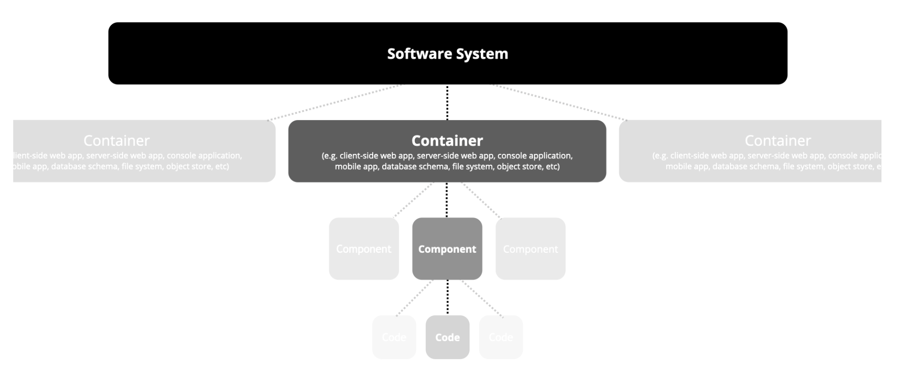
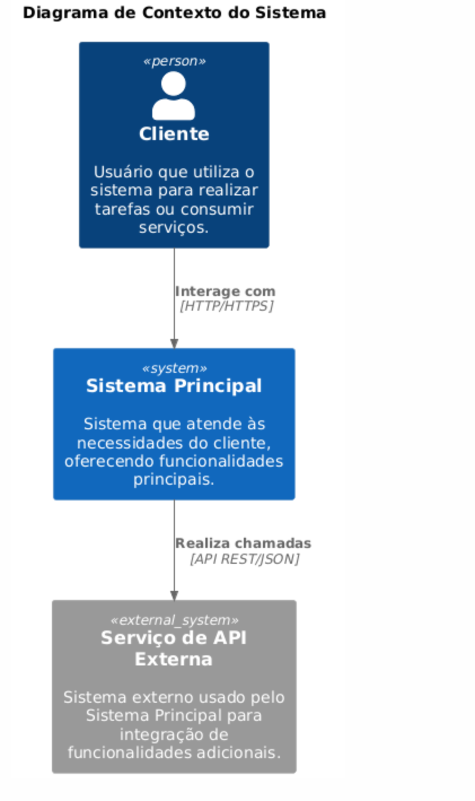
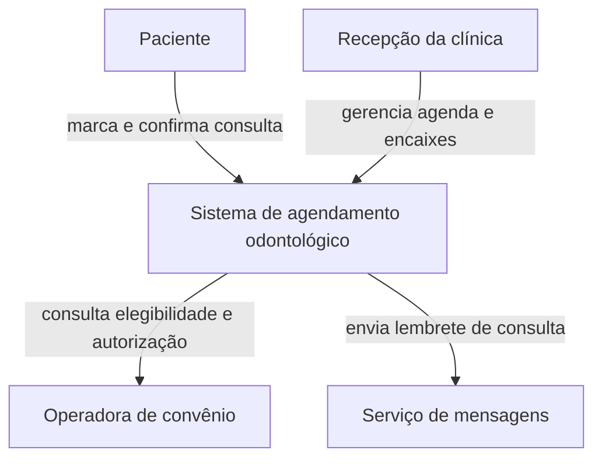
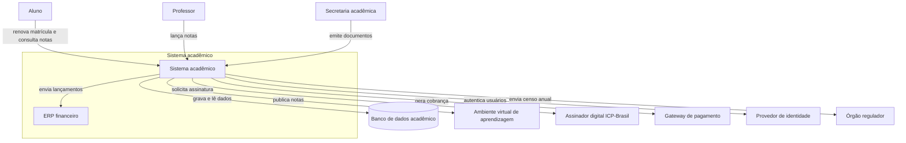

# Arquitetura de aplicações e integração

Este bloco identifica as aplicações e as interfaces que realizam a mudança, distingue o que governa uma integração entre padrão técnico, protocolo, especificação e contrato, e representa a fronteira da solução no diagrama de contexto do modelo C4.

## Antes de começar

- [Arquitetura de aplicações](../referencia/glossario.md#arquitetura-de-aplicacoes)
- [Padrão técnico](../referencia/glossario.md#padrao-tecnico)
- [Contrato de integração](../referencia/glossario.md#contrato-de-integracao)
- [Modelo C4](../referencia/glossario.md#modelo-c4)
- Dono de cada entidade, marcado no [exercício 14](bloco-2-arquitetura-de-dados.md#exercicio-14)

## Aplicações, interfaces e contexto

A arquitetura de aplicações é o subdomínio da arquitetura corporativa que mantém a visão do portfólio de aplicações da organização e dos serviços que elas oferecem, e que liga a arquitetura de negócio à arquitetura de dados (Lovatt, 2021, seção 2.6). Lovatt define aplicação como um conjunto de capacidades tecnológicas que fornece funções de negócio e gerencia ativos de dados, e componente de aplicação como a unidade que encapsula uma funcionalidade e a oferece por interfaces claramente definidas. As aplicações são o principal meio de gerir o dado ao longo do seu ciclo de vida, da aquisição ao processamento, ao armazenamento, à apresentação, ao arquivamento e à exclusão.

### Portfólio de aplicações

Lovatt (2021, seção 2.6, figura 2.4) organiza as relações entre os domínios numa hierarquia de camadas, em que cada camada depende apenas da imediatamente inferior. O serviço de negócio é a interface com o cliente e é realizado por processos de negócio. O processo é apoiado por serviços de aplicação, o serviço de aplicação é realizado por componentes de aplicação, e o componente de aplicação depende de serviços de tecnologia, como armazenamento, rede e processamento. Pessoas e informação atravessam todas as camadas. A hierarquia completa a afirmação do bloco 1, de que todo componente da solução sustenta um ou mais serviços de negócio.

O artefato principal do domínio é o catálogo do portfólio de aplicações, que lista as aplicações em uso e planejadas, com quem as usa e como. O portfólio costuma ser um conjunto heterogêneo, adquirido ou construído em momentos diferentes da história da organização, e por isso a arquitetura de aplicações trabalha continuamente para racionalizá-lo. Para distinguir aplicações estratégicas de aplicações legadas, Lovatt (2021, seção 2.6.1) registra o uso frequente de uma classificação em vermelho, âmbar e verde, que permite à arquitetura de solução escolher a opção mais estratégica. Nesta disciplina, verde indica aplicação estratégica a manter e evoluir, âmbar indica aplicação mantida por ora, com restrição de investimento, e vermelho indica aplicação a substituir ou a retirar.

Lovatt distingue três tipos de aplicação, ilustrados no Hospital Vale do Pousio.

| Tipo | Definição | Exemplo no Hospital Vale do Pousio |
| --- | --- | --- |
| Aplicação de negócio | Ligada diretamente à atividade do negócio, própria da organização ou adquirida, inclusive como serviço | Prontuário do paciente e agendamento ambulatorial |
| Aplicação genérica | Ferramenta usada para vários fins | Planilha para priorização eventual e correio eletrônico entre departamentos |
| Plataforma de aplicação | Conjunto de componentes tecnológicos que sustenta outras aplicações, em geral tratado no domínio de infraestrutura | Sistema gerenciador de banco de dados e barramento de serviços |

O catálogo de interfaces de aplicações documenta as interfaces entre aplicações, o tipo e o nível de dependência entre elas e suas interfaces de programação, e as grades de referência cruzada relacionam aplicações a dados, a funções de negócio e a processos. Lovatt indica o catálogo de interfaces como fonte principal da análise de interfaces da solução. A arquitetura de software, por sua vez, responde pela estrutura e pelo comportamento de cada componente, inclusive suas interfaces internas e externas, e documenta como interfaces de programação o comportamento que outros sistemas consomem (Lovatt, 2021, seção 2.8).

### Descrição de uma interface

Lovatt (2021, seção 3.6.4) pede que cada ponto de contato entre blocos de construção da solução seja descrito por seis atributos, e o conjunto dessas descrições forma o catálogo de interfaces da solução.

| Atributo | O que registra |
| --- | --- |
| Origem | O bloco de construção que inicia a troca |
| Destino | O bloco de construção que recebe a troca |
| Gatilho | O evento ou a condição que dispara a troca |
| Itens trocados | Os dados e as informações de apoio que passam pela interface |
| Sequência | A ordem das mensagens e das respostas |
| Pré e pós-condições | O que precisa valer antes da troca e o que passa a valer depois dela |

### Padrão técnico, protocolo, especificação e contrato

Em português, a palavra padrão traduz dois termos ingleses distintos, e a distinção entre eles importa neste bloco. O termo *pattern*, no sentido usado na Aula 3, designa uma solução recorrente para um problema em um contexto, enquanto o termo *standard* designa uma especificação adotada por uma organização ou por um organismo de normalização. Este bloco usa a expressão padrão técnico para *standard* e reserva padrão arquitetural e padrão de design para *pattern*, conforme as entradas do [glossário](../referencia/glossario.md#padrao-tecnico).

Um **padrão técnico** reúne a experiência de profissionais ao longo de muitos anos e situações, e a apresenta como especificação de processos a seguir, documentação a produzir e regras e parâmetros a observar (Lovatt, 2021, seção 4.3.1). Por ser genérico, um padrão técnico costuma conter partes que não se aplicam a uma solução específica, e por isso o arquiteto precisa recortar a parte que se aplica antes de transformá-la em requisito técnico.

Um protocolo é o conjunto de regras que duas partes seguem para trocar mensagens, com formato, sequência e tratamento de erro definidos. A arquitetura de linha de base da ACME usa três protocolos, o LDAP na autenticação dos portais, o HTTPS nas chamadas ao gateway de pagamento e ao assinador digital, e um conector transacional proprietário entre os portais e o núcleo. O HTTP, base do HTTPS, tem sua semântica definida pelo RFC 9110 (Fielding et al., 2022).

Uma especificação de interface descreve de forma verificável uma interface particular, com operações ou mensagens, esquemas e erros. Para interfaces síncronas sobre HTTP, a especificação OpenAPI define uma descrição independente de linguagem de programação, que permite a pessoas e a programas entender as capacidades de um serviço sem acesso ao código-fonte (OpenAPI Initiative, 2026). Para interfaces orientadas a mensagens, a especificação AsyncAPI descreve canais, mensagens e operações de forma independente do protocolo de transporte (AsyncAPI Initiative, n.d.). Os dois trechos abaixo descrevem, num exemplo genérico de comércio eletrônico, uma consulta síncrona de pedido e a publicação de um evento de pedido confirmado.

```yaml
openapi: 3.2.1
info:
  title: Pedidos
  version: 1.0.0
paths:
  /pedidos/{id}:
    get:
      summary: Consulta um pedido
      parameters:
        - name: id
          in: path
          required: true
          schema:
            type: string
      responses:
        "200":
          description: Pedido encontrado
        "404":
          description: Pedido inexistente
```

```yaml
asyncapi: 3.1.0
info:
  title: Eventos de pedido
  version: 1.0.0
channels:
  pedidoConfirmado:
    address: pedidos.confirmados
    messages:
      pedidoConfirmado:
        payload:
          type: object
          properties:
            idPedido:
              type: string
            versao:
              type: integer
operations:
  publicarPedidoConfirmado:
    action: send
    channel:
      $ref: "#/channels/pedidoConfirmado"
```

Um **contrato de integração** é a especificação de interface somada às garantias que provedor e consumidor acordam, como a política de versão, a garantia de entrega, a idempotência e o nível de serviço. A especificação diz o que trafega, e o contrato diz também o que cada parte pode esperar da outra quando algo falha ou muda.

A nota fiscal eletrônica brasileira mostra os quatro níveis separados. O padrão técnico é o próprio sistema da nota fiscal eletrônica, cujo manual de orientação do contribuinte, na versão 7.00 de novembro de 2020, fixa regras e leiautes para todas as empresas emissoras e adota o perfil de interoperabilidade WS-I Basic Profile para os serviços web. Os protocolos são o TLS 1.2 ou superior com autenticação mútua e o SOAP 1.2. A especificação é dada pelos esquemas XML das mensagens, como o esquema de envio da nota na versão 4.00, publicados no portal nacional. O nível de contrato corresponde às regras que cada serviço impõe ao emissor, como o uso obrigatório de certificado digital emitido por autoridade credenciada na ICP-Brasil, do tipo A1 ou A3, as regras de validação e os códigos de retorno, que nesse caso são fixadas pela administração tributária sem negociação com cada emissor.

### Estrutura de um contrato

O contrato de integração usado nesta disciplina parte dos seis atributos de Lovatt e acrescenta seis campos, que respondem ao que a especificação sozinha deixa em aberto.

| Campo | Pergunta que responde |
| --- | --- |
| Origem, Destino, Gatilho, Itens trocados, Sequência, Pré e pós-condições | Os seis atributos de interface de Lovatt |
| Protocolo | Por quais regras de troca as mensagens trafegam? |
| Formato e esquema | Como cada mensagem é estruturada e validada? |
| Semântica de erro | Que erros podem ocorrer e o que cada parte faz diante de cada um? |
| Versionamento | Como uma mudança é publicada sem quebrar o consumidor existente? |
| Garantia de entrega e idempotência | A mensagem pode se perder ou se repetir, e o que o consumidor faz com a repetição? |
| Nível de serviço | Que prazo, volume e disponibilidade o provedor garante? |

A escolha entre comunicação síncrona e assíncrona decide boa parte desses campos. Na comunicação síncrona, o consumidor espera a resposta, e a indisponibilidade do provedor chega ao consumidor, o que pede tempo limite, retentativa com limite e Circuit Breaker. Na comunicação assíncrona, o provedor publica e o consumidor processa depois, o que desacopla a disponibilidade das duas partes, mas exige garantia de publicação, por exemplo com Transactional Outbox, e consumidor idempotente. Os três padrões foram apresentados no [bloco 3 da Aula 3](../modulo-3-design-e-padroes/bloco-3-padroes-arquiteturais-e-de-design.md).

<figure markdown="span">
{ .module-diagram }
</figure>

*Figura 1 — Hierarquia de serviços e camadas do contrato de integração. Fonte: material do curso, com base em Lovatt (2021, seções 2.6 e 3.6.4).*

### Modelo C4

Um diagrama solto e um modelo arquitetural não são a mesma coisa. O diagrama solto nasce de uma conversa, usa símbolos escolhidos na hora e serve àquela conversa. O modelo tem convenção declarada, define o que cada forma significa e o que cada nível de detalhe pode ou não conter, e por isso continua legível para quem não estava na sala. A diferença prática aparece quando duas pessoas desenham o mesmo sistema. Com convenção, os dois desenhos são comparáveis. Sem convenção declarada, os dois desenhos não podem ser comparados, porque cada autor atribui às formas um significado próprio que o leitor desconhece.

O **modelo C4**, criado por Brown (n.d.), é uma dessas convenções. Ele organiza a descrição do sistema em quatro níveis de abstração, que permitem compreensão progressiva de acordo com o público e o propósito da documentação. O nome vem das iniciais dos quatro níveis em inglês, Context, Containers, Components e Code. O modelo inteiro se chama C4 porque tem quatro níveis, e cada nível tem nome próprio, o que significa que o quarto nível se chama Código, não C4 outra vez.



*Os quatro níveis de abstração do C4. Fonte: [c4model.com](https://c4model.com), reproduzido do material base do professor.*

Cada nível responde a uma pergunta diferente e atende a um público diferente. É essa correspondência, e não a quantidade de detalhe, que decide qual diagrama usar em cada situação.

| Nível | Pergunta que responde | Público |
| --- | --- | --- |
| Contexto | O que o sistema faz? | Partes interessadas não técnicas que precisam entender o escopo geral |
| Contêineres | Como o sistema funciona como um todo? | Arquitetos e desenvolvedores, para entender a estrutura de alto nível |
| Componentes | Como cada parte de um contêiner é estruturada? | Desenvolvedores que implementam ou mantêm o sistema |
| Código | Como a implementação de um componente é realizada? | Desenvolvedores em nível de detalhamento máximo |

Esta aula cobre os dois primeiros níveis, o de contexto neste bloco e o de contêineres no [bloco 4](bloco-4-arquitetura-de-infraestrutura.md). Os níveis de componentes e de código existem e seguem a mesma lógica de decomposição, mas ficam fora do escopo da disciplina.

Três princípios organizam o uso das abstrações. A progressividade pede começar pela visão ampla e descer ao detalhe, alinhando o nível ao público e ao propósito. A coerência pede manter as abstrações alinhadas entre os níveis, para que o que aparece como contêiner no nível 2 não reapareça como sistema externo no nível 1. O foco no propósito pede que cada diagrama tenha um objetivo claro e responda à pergunta de um grupo específico de interessados.

### Diagrama de contexto

O **diagrama de contexto** fornece uma visão ampla do sistema modelado e de como ele se relaciona com os atores externos. Ele comunica os limites do sistema e as interações de alto nível, e por isso trabalha com apenas três tipos de elemento. Pessoas representam os atores humanos que interagem diretamente com o sistema, sejam usuários finais ou outras partes interessadas. Sistemas de software representam tanto o sistema sendo modelado quanto os outros sistemas com que ele se comunica. Relações demonstram como atores e sistemas externos interagem com o sistema principal, descrevendo o meio e o protocolo usados.



*Diagrama de contexto genérico, com os três tipos de elemento e as relações rotuladas por protocolo. Fonte: material base do professor.*

O roteiro para montar esse diagrama tem cinco etapas. Identifique o sistema de interesse, determinando qual sistema é o foco do modelo. Defina os atores externos, identificando as pessoas que interagem com ele. Liste os sistemas externos que trocam informação diretamente com o sistema principal. Desenhe as relações, conectando pessoas e sistemas ao sistema principal, com descrição clara da interação e do protocolo. Acrescente descrição a cada elemento, para que o diagrama seja compreensível por todos os interessados, inclusive os que não participaram do desenho.

O mesmo nível em notação Mermaid, que é a notação usada neste site, aplicado a uma plataforma de agendamento de consultas odontológicas.



## Uso pelo arquiteto

O arquiteto escreve o contrato de integração antes da implementação, porque o contrato permite que provedor e consumidor evoluam em separado e transforma em campo verificável a garantia que cada parte espera da outra. O dono de cada entidade, marcado na grade de dados, é a origem natural da interface que expõe essa entidade. O diagrama de contexto é a visão apresentada a quem decide escopo e relação com terceiros, e sua fronteira precisa coincidir com a declaração de escopo do primeiro ciclo.

## Exercício 15

Este exercício é realizado fora do horário de aula, como atividade de aplicação do conceito apresentado neste bloco ao caso da instituição fictícia ACME.

A ACME é uma universidade privada brasileira com 38.400 alunos ativos, cujo sistema acadêmico, em operação desde 2004, passa por modernização incremental. O exercício usa o dono da entidade nota marcado no [exercício 14](bloco-2-arquitetura-de-dados.md#exercicio-14) e os fatos abaixo, reproduzidos da [página inicial do caso](../caso-acme/index.md), dos [dados operacionais](../caso-acme/dados-operacionais.md) e da [arquitetura de linha de base](../caso-acme/linha-de-base.md).

- R7, a nota lançada pelo professor chega ao ambiente virtual de aprendizagem em até 10 minutos, declarado pela Educação a Distância.
- A exportação de notas consolidadas para o ambiente virtual ocorre hoje em lote diário iniciado às 05h10, com 4.800 lançamentos em dia letivo comum e até 360.000 na janela de fechamento.
- A propagação em minutos exige o plano do ambiente virtual que oferece interfaces de programação, com acréscimo de 38% sobre o valor anual do contrato vigente.

O primeiro artefato é o catálogo das aplicações da ACME, montado a partir da linha de base, sem classificação.

| Aplicação | Ano | Tecnologia | Observação |
| --- | --- | --- | --- |
| Portal do Aluno | 2007 | JSF 1.2 e EJB 2.0 | 84 telas, sem versão responsiva |
| Portal do Professor | 2008 | JSF 1.2 e EJB 2.0 | 46 telas |
| Portal da Secretaria | 2008 | JSF 1.2 e EJB 2.0 | 62 telas |
| Portal do Gestor | 2009 | JSF 1.2 e EJB 2.0 | 28 telas, acesso direto ao banco |
| Núcleo transacional | 2004 | COBOL sobre CICS | 11 módulos, manutenção sob contrato até 30/09/2027 |
| ERP financeiro | Não informado | Produto contratado | Permanece por decisão da Reitoria de 12/03/2026 |
| Ambiente virtual de aprendizagem | Não informado | Produto contratado | Permanece por decisão da Reitoria de 12/03/2026 |
| Data warehouse institucional | Não informado | Não informado | Recebe cópia integral de 140 tabelas por lote |
| Assinador digital ICP-Brasil | Não informado | Serviço externo | Assinatura de histórico e diploma |
| Diretório corporativo | Não informado | LDAP | Autenticação de todos os perfis |

O segundo artefato é o esqueleto do contrato da integração de notas entre a ACME e o ambiente virtual de aprendizagem.

| Campo | Resposta |
| --- | --- |
| Origem | |
| Destino | |
| Gatilho | |
| Itens trocados | |
| Sequência | |
| Pré e pós-condições | |
| Protocolo | |
| Formato e esquema | |
| Semântica de erro | |
| Versionamento | |
| Garantia de entrega e idempotência | |
| Nível de serviço | |

O terceiro artefato é um diagrama de contexto da arquitetura alvo do primeiro ciclo, que contém dois erros de nível.



1. Classifique cada aplicação do primeiro artefato em vermelho, âmbar ou verde, com uma linha de justificativa.
2. Preencha cada campo do segundo artefato com resposta curta. Declare se a integração é síncrona ou assíncrona, justificando o modo pelos padrões selecionados no [exercício 11](../modulo-3-design-e-padroes/bloco-3-padroes-arquiteturais-e-de-design.md#exercicio-11), use como origem o dono da entidade nota marcado no exercício 14 e indique o que acontece quando o professor corrige uma nota já enviada.
3. Aponte os dois erros de nível do terceiro artefato e descreva a correção de cada um.

O diagrama de contexto corrigido neste exercício é a base do diagrama de contêineres do exercício 16, no [bloco 4](bloco-4-arquitetura-de-infraestrutura.md).

## Fontes

As referências seguem o formato APA, 7ª edição, e constam da [bibliografia](../referencia/bibliografia.md) do curso. O trecho consultado aparece entre parênteses ao fim de cada entrada.

- Lovatt, M. (2021). *Solution architecture foundations*. BCS, The Chartered Institute for IT. (seção 2.6, arquitetura de aplicações, hierarquia de serviços, catálogo do portfólio, classificação em vermelho, âmbar e verde e tipos de aplicação, seção 2.8, interfaces na arquitetura de software, seção 3.6.4, análise de interfaces, e seção 4.3.1, padrões técnicos. O Hospital Vale do Pousio é a versão em português do caso Fallowdale Hospital, usado ao longo do livro)
- Fielding, R., Nottingham, M., & Reschke, J. (Eds.). (2022). *HTTP semantics* (RFC 9110). RFC Editor. https://www.rfc-editor.org/rfc/rfc9110 (semântica do HTTP)
- OpenAPI Initiative. (2026). *OpenAPI specification* (Versão 3.2.1). https://spec.openapis.org/oas/latest.html (finalidade e estrutura da descrição de interface HTTP)
- AsyncAPI Initiative. (n.d.). *AsyncAPI specification* (Versão 3.1.0). https://www.asyncapi.com/docs/reference/specification/latest (descrição de interfaces orientadas a mensagens, independente de protocolo)
- *Sistema Nota Fiscal Eletrônica: Manual de orientação do contribuinte, visão geral* (Versão 7.00). (2020). https://www.confaz.fazenda.gov.br/legislacao/arquivo-manuais/moc7-visao-geral.pdf (seções 4.2.3 e 4.4, certificado digital, protocolos de comunicação e esquemas das mensagens)
- Brown, S. (n.d.). *The C4 model for visualising software architecture*. https://c4model.com (sítio oficial do modelo C4)
- Mendes, M. (2026b). *Guias de projeto de arquitetura de software* [Material de curso, versão arquivada]. https://github.com/aulas-marco/projeto-arquitetura-software/tree/30f15cd (guias 3.1, 3.2 e 3.3, fonte dos quatro níveis, dos princípios de abstração, dos elementos do diagrama de contexto, do roteiro de montagem e das duas figuras reproduzidas nesta página)

**Material do curso.** O bloco usa as entradas [arquitetura de aplicações](../referencia/glossario.md#arquitetura-de-aplicacoes), [padrão técnico](../referencia/glossario.md#padrao-tecnico), [protocolo](../referencia/glossario.md#protocolo), [especificação de interface](../referencia/glossario.md#especificacao-de-interface), [contrato de integração](../referencia/glossario.md#contrato-de-integracao) e [modelo C4](../referencia/glossario.md#modelo-c4) do glossário, além do dossiê da instituição fictícia [ACME](../caso-acme/index.md).
