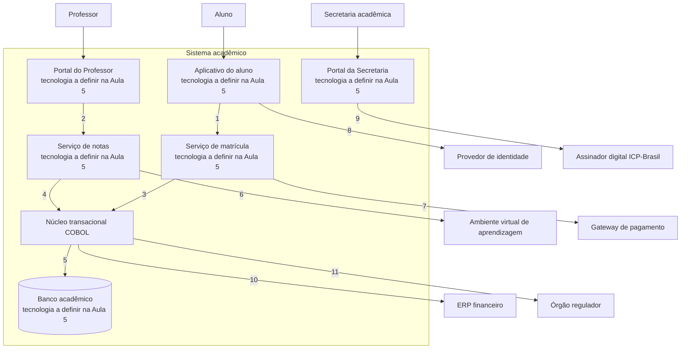

# Arquitetura de infraestrutura da solução

Este bloco conclui o detalhamento por domínios e responde onde a solução executa, como suas partes se conectam e o que cada interface exige, sem escolher produto ou provedor, decisão reservada à Aula 5.

## Antes de começar

- [Arquitetura de infraestrutura](../referencia/glossario.md#arquitetura-de-infraestrutura)
- [Modelo C4](../referencia/glossario.md#modelo-c4)
- [Bloco de construção da solução](../referencia/glossario.md#bloco-de-construcao-da-solucao)
- Diagrama de contexto corrigido no [exercício 15](bloco-3-arquitetura-de-aplicacoes-e-integracao.md#exercicio-15)

## Infraestrutura e contêineres

A **arquitetura de infraestrutura** é a arquitetura dos componentes e serviços tecnológicos que sustentam as atividades da organização, chamada de arquitetura de tecnologia no TOGAF (Lovatt, 2021, seção 2.7). Ela inclui equipamentos, sistemas operacionais, plataformas intermediárias, redes, comunicações, capacidade de processamento e padrões técnicos, e também ativos intangíveis, como contratos com fornecedores.

### Infraestrutura na solução

Os objetivos da arquitetura de infraestrutura são maximizar a eficácia e a eficiência do provimento e do uso da infraestrutura, eliminar duplicação de componentes e manter a infraestrutura alinhada às necessidades operacionais do negócio, que mudam com a estratégia e com a tecnologia disponível (Lovatt, 2021, seção 2.7.1). Muitos componentes de infraestrutura são invisíveis às partes interessadas de negócio, embora sustentem requisitos não funcionais como desempenho e confiabilidade, e por isso os modelos de infraestrutura servem de base para as visões de quem tem essas preocupações.

Os artefatos do domínio incluem o catálogo de tecnologia de infraestrutura, o modelo técnico de referência, o catálogo de padrões técnicos, a visão de configuração, a matriz entre aplicação e tecnologia e o modelo de plataforma (Lovatt, 2021, seção 2.7.2). A declaração formal da infraestrutura exigida por uma solução, chamada de definição tecnológica da solução, e o modelo técnico de referência são tratados na Aula 5. Este bloco permanece no nível lógico, com os contêineres que a solução precisa e as exigências de cada interface entre eles.

### A solução como grafo

Lovatt (2021, seção 7.5) propõe representar a solução como um grafo, em que cada bloco de construção é um vértice e cada interface é uma aresta. O grau de um vértice é o número de arestas ligadas a ele, e a soma dos graus de todos os vértices, dividida por dois, dá o número de interfaces da solução. Registrar o número de interfaces de cada bloco de construção permite, portanto, calcular o total de interfaces que a solução precisa sustentar.

Num exemplo genérico com cinco blocos de construção, dois blocos têm grau 3 e três blocos têm grau 2. A soma dos graus é 12, e a solução tem 6 interfaces. Cada uma dessas interfaces é examinada separadamente quanto ao tipo e ao volume de tráfego que passa por ela, porque é desse exame que sai a exigência de comunicação que a infraestrutura precisa atender. Lovatt lembra que nem toda interface usa rede, já que uma passagem entre dois processos pode ser manual, mas recomenda que todas sejam examinadas para que nenhuma seja esquecida.

<figure markdown="span">
{ .module-diagram }
</figure>

*Figura 1 — Solução como grafo de blocos de construção e interfaces. Fonte: material do curso, com base em Lovatt (2021, seção 7.5).*

### Camadas de execução

Uma camada de execução é o nível de abstração em que um bloco de construção da solução recebe processamento, memória e rede, e cada camada define quais responsabilidades ficam com a equipe da solução e quais ficam com a operação de infraestrutura ou com o provedor de nuvem. A escolha da camada para cada contêiner pertence à definição tecnológica da solução, tratada na Aula 5, mas o arquiteto precisa conhecer as camadas para declarar o que cada contêiner exige de isolamento, de elasticidade e de tempo de inicialização. A lista abaixo define as cinco camadas representadas na Figura 2, do servidor físico à função sem servidor, e acrescenta os conceitos de nó e de cluster do Kubernetes.

- Servidor físico é o equipamento dedicado em que o sistema operacional executa diretamente sobre o hardware, com toda a capacidade reservada a uma carga e com a manutenção do equipamento a cargo da organização que o possui.
- Máquina virtual é um computador simulado por um hipervisor, como VMware ESXi ou KVM, ou oferecido como serviço, como o Amazon EC2, e cada máquina virtual tem sistema operacional próprio sobre uma fatia do servidor físico.
- Contêiner é um processo isolado que compartilha o núcleo do sistema operacional do hospedeiro e leva a aplicação e as dependências dela numa imagem, formato popularizado pelo Docker e executado também por alternativas como o Podman.
- Orquestrador é a plataforma que distribui contêineres por um conjunto de máquinas, reinicia instâncias que falham e ajusta o número de réplicas, papel cumprido pelo Kubernetes, em que o pod é a menor unidade implantável e agrupa um ou mais contêineres com rede e armazenamento compartilhados (The Kubernetes Authors, n.d.-b).
- No Kubernetes, o nó é a máquina virtual ou física que executa pods, e o cluster é o conjunto de nós gerenciados por um plano de controle, que mantém em cada nó os serviços necessários para executar pods (The Kubernetes Authors, n.d.-a).
- Função sem servidor é uma unidade de código executada em resposta a um evento ou a uma chamada, com servidores, capacidade, escalonamento e atualizações gerenciados pelo provedor, como no AWS Lambda e no Azure Functions (Amazon Web Services, n.d.-b).

<figure markdown="span">
{ .module-diagram }
</figure>

*Figura 2 — Camadas de execução, responsável por camada e itens declarados pelo arquiteto. Fonte: material do curso, com base em Lovatt (2021, seção 2.7), The Kubernetes Authors (n.d.-a, n.d.-b) e Amazon Web Services (n.d.-b).*

O que o arquiteto declara diminui à medida que a plataforma assume camadas. Num servidor físico ou numa máquina virtual, a declaração inclui processadores, memória, disco e sistema operacional, enquanto num contêiner ela se concentra na imagem, nas portas e nos limites de recursos, e numa função sem servidor ela se reduz ao código, ao gatilho, à memória reservada e ao tempo máximo de execução, que no AWS Lambda é de 15 minutos por invocação (Amazon Web Services, n.d.-b).

Sistemas corporativos antigos acrescentam uma sexta plataforma de execução, o mainframe com monitor transacional, em que um monitor como o IBM CICS ou o IBM IMS TM coordena transações curtas de muitos usuários simultâneos sobre programas e bases de dados do próprio mainframe. Essa plataforma não se encaixa nas colunas da Figura 2, porque a capacidade é contratada e operada como um conjunto, e um bloco de construção que permanece no mainframe aparece no diagrama de implantação como nó próprio, ligado aos demais nós por uma conexão cuja latência e cuja largura de banda o arquiteto precisa declarar.

### Topologia de implantação

A topologia de implantação é a disposição dos nós de execução e de rede da solução, com a localização física ou lógica de cada nó e os caminhos que as requisições e os dados percorrem entre eles. Os elementos que aparecem na maior parte das topologias de soluções em nuvem estão listados abaixo, cada um com exemplos de serviço da AWS e da Microsoft Azure.

- DNS é o serviço que traduz o nome do sistema para o endereço do ponto de entrada e que pode direcionar o usuário para outro endereço quando o primeiro deixa de responder, papel cumprido pelo Amazon Route 53 e pelo Azure DNS.
- CDN é uma rede de servidores distribuídos geograficamente que guarda cópias do conteúdo estático perto do usuário, como Amazon CloudFront e Azure Front Door, e reduz a latência percebida e a carga sobre os serviços de origem.
- Balanceador de carga é o componente que recebe as requisições e as distribui entre as réplicas de um serviço, retirando da distribuição as réplicas que deixam de responder à verificação de saúde, como o Elastic Load Balancing da AWS e o Azure Load Balancer.
- Região é uma área geográfica separada do provedor, e zona de disponibilidade é um dos vários locais isolados dentro de uma região, de modo que distribuir instâncias entre zonas protege a aplicação da falha de um único local (Amazon Web Services, n.d.-a).
- Conexão dedicada é um enlace privado entre a rede da organização e o provedor, que não passa pela internet pública, como o AWS Direct Connect (Amazon Web Services, n.d.-c) e o Azure ExpressRoute (Microsoft, 2026).
- VPN é um túnel cifrado que atravessa a internet pública entre o centro de dados local e o provedor, com custo de implantação menor que o da conexão dedicada e com latência que depende das condições da internet.

<figure markdown="span">
{ .module-diagram }
</figure>

*Figura 3 — Topologia de implantação com DNS, CDN, balanceador de carga, duas zonas de disponibilidade e conexão ao centro de dados local. Fonte: material do curso, com base em Amazon Web Services (n.d.-a, n.d.-c) e Microsoft (2026).*

O número de zonas de disponibilidade decorre da disponibilidade exigida. Com réplicas numa única zona, a solução fica indisponível sempre que aquela zona falha, e com réplicas em duas zonas a indisponibilidade simultânea das duas passa a ser o evento que interrompe o serviço. Num cálculo ilustrativo, que supõe falhas independentes entre as zonas, duas zonas com 99,5% de disponibilidade cada resultam em 1 − 0,005 × 0,005, ou 99,9975%, valor que não considera falhas da região inteira nem de componentes compartilhados entre as zonas.

A redundância entre zonas também tem custo de capacidade. Se o pico de uso exige quatro réplicas do serviço, cada zona precisa sustentar as quatro réplicas sozinha para que a falha de uma zona não reduza o desempenho, o que leva a oito réplicas provisionadas ou a uma regra de escalonamento automático capaz de dobrar a capacidade da zona remanescente em poucos minutos.

Lovatt (2021, seção 2.7.4) observa que muitos componentes de infraestrutura são invisíveis às partes interessadas de negócio, embora sustentem requisitos não funcionais de desempenho e confiabilidade, e a topologia é o artefato em que essa ligação aparece de modo verificável. O requisito de disponibilidade define o número de zonas e a replicação do banco, o requisito de tempo de resposta define a capacidade de cada réplica e a presença de CDN, e o requisito de integração com sistemas que permanecem no centro de dados local define a escolha entre conexão dedicada e VPN. A seleção de provedor, de região e de serviços para a ACME pertence à definição tecnológica da Aula 5.

### Diagrama de implantação

O diagrama de implantação é o diagrama de apoio do modelo C4 que mostra como instâncias de sistemas de software e de contêineres do modelo estático são implantadas na infraestrutura de um ambiente de implantação, como produção, homologação ou desenvolvimento (Brown, n.d.). A notação do modelo C4 e os diagramas de contexto e de contêineres estão no [bloco 3](bloco-3-arquitetura-de-aplicacoes-e-integracao.md#modelo-c4), e o público do diagrama de implantação é técnico, de dentro e de fora da equipe de desenvolvimento, incluindo arquitetos de software, desenvolvedores, arquitetos de infraestrutura e pessoal de operação e suporte.

O diagrama de implantação segue quatro regras de construção, derivadas da definição publicada no sítio oficial do modelo C4 (Brown, n.d.):

1. Cada diagrama cobre um único ambiente de implantação, e a solução que tem produção, homologação e desenvolvimento recebe três diagramas, porque a quantidade de réplicas e de zonas costuma variar entre os ambientes.
2. O nó de implantação representa o lugar onde uma instância executa e pode ser infraestrutura física, máquina virtual, contêiner Docker ou ambiente de execução, e os nós se aninham, como um ambiente de execução dentro de um contêiner Docker, dentro de uma máquina virtual, dentro de uma zona de disponibilidade.
3. Cada instância de contêiner corresponde a um contêiner do [diagrama de contêineres](bloco-3-arquitetura-de-aplicacoes-e-integracao.md#diagrama-de-conteineres) e leva o mesmo nome, e um contêiner com quatro réplicas aparece como quatro instâncias sem que o diagrama de contêineres mude.
4. Os nós de infraestrutura, como DNS, balanceador de carga e firewall, aparecem como elementos de apoio, ligados às instâncias que atendem.

O contêiner do modelo C4 é uma unidade executável ou de armazenamento de dados, como uma aplicação web, um serviço ou um banco, e pode ser implantado num contêiner Docker, numa máquina virtual ou numa função sem servidor, de modo que os dois usos da palavra contêiner precisam ser distinguidos no texto que acompanha o diagrama. O exemplo abaixo mostra o ambiente de produção de um sistema genérico de agendamento, com os nós aninhados da região até as instâncias de contêiner.

<figure markdown="span">
{ .module-diagram }
</figure>

*Figura 4 — Diagrama de implantação genérico do ambiente de produção, com nós aninhados, nós de infraestrutura e instâncias de contêiner. Fonte: material do curso, com base em Brown (n.d.).*

As setas do diagrama de implantação repetem as interfaces do grafo da Figura 1, agora com a indicação do nó em que cada extremidade executa, e por isso o diagrama mostra quais interfaces atravessam a fronteira entre zonas, entre a região e o centro de dados local ou entre a solução e a internet. Na fase lógica, os nós recebem nomes genéricos, como máquina virtual Linux ou nó do cluster Kubernetes, e o nome do serviço do provedor só aparece depois da definição tecnológica da Aula 5.

## Uso pelo arquiteto

O arquiteto usa a visão de infraestrutura para converter cada contêiner do diagrama de contêineres e cada interface do grafo em exigências de execução e de comunicação que a Aula 5 recebe como entrada. Para cada contêiner, ele registra a camada de execução compatível, o número de réplicas e de zonas de disponibilidade imposto pelo requisito de disponibilidade e a capacidade necessária no pico, e para cada interface registra o modo de comunicação, o volume, a latência e se ela cruza a fronteira entre a nuvem e o centro de dados local, caso em que exige conexão dedicada ou VPN. O diagrama de implantação desse estágio usa nós genéricos, como máquina virtual, cluster de contêineres ou função sem servidor, e não nomeia provedor, região nem produto, porque a definição tecnológica da solução e o modelo técnico de referência, que fazem essa escolha, são o assunto da Aula 5.

## Exercício 16

Este exercício é realizado fora do horário de aula, como atividade de aplicação do conceito apresentado neste bloco ao caso da instituição fictícia ACME.

A ACME é uma universidade privada brasileira com 38.400 alunos ativos, cujo sistema acadêmico, em operação desde 2004, passa por modernização incremental. O exercício parte do diagrama de contexto corrigido no [exercício 15](bloco-3-arquitetura-de-aplicacoes-e-integracao.md#exercicio-15) e dos fatos abaixo, reproduzidos dos [dados operacionais](../caso-acme/dados-operacionais.md), da [arquitetura de linha de base](../caso-acme/linha-de-base.md) e da [página inicial do caso](../caso-acme/index.md).

| Fato | Valor |
| --- | --- |
| Sessões simultâneas no pico, nos 30 minutos seguintes à abertura da matrícula | 5.800 |
| Matrículas confirmadas nesses 30 minutos | 2.400 |
| Sessões simultâneas em dia letivo comum | 640 |
| Lançamentos de nota exportados ao ambiente virtual em dia letivo comum | 4.800 |
| Lançamentos de nota exportados na janela de fechamento | até 360.000 |
| Requisito R6 | Percentil 95 do tempo de confirmação da matrícula em até 4 segundos, com 5.800 sessões simultâneas |
| Requisito R7 | Nota lançada pelo professor no ambiente virtual em até 10 minutos |

O artefato fornecido é o diagrama de contêineres da arquitetura alvo do primeiro ciclo, coerente com o diagrama de contexto corrigido no exercício 15. Cada contêiner novo leva o rótulo tecnologia a definir na Aula 5, e as relações estão apenas numeradas, sem rótulo de comunicação.

1. Rotule cada relação numerada com o modo de comunicação, síncrono ou assíncrono, e com o volume e a latência exigidos, usando os fatos da tabela quando se aplicarem e escrevendo não informado quando o dossiê não trouxer o dado.
2. Indique quais relações sustentam diretamente os requisitos R6 e R7.
3. Responda, em uma frase, por que o núcleo transacional COBOL permanece como contêiner na arquitetura alvo do primeiro ciclo.

As relações rotuladas neste exercício são a lista de exigências de comunicação que a definição tecnológica da Aula 5 recebe como entrada.

## Fontes

As referências seguem o formato APA, 7ª edição, e constam da [bibliografia](../referencia/bibliografia.md) do curso. O trecho consultado aparece entre parênteses ao fim de cada entrada.

- Lovatt, M. (2021). *Solution architecture foundations*. BCS, The Chartered Institute for IT. (seção 2.7, arquitetura de infraestrutura, objetivos, artefatos e relação com a solução, e seção 7.5, infraestrutura de rede e solução como grafo)
- Brown, S. (n.d.). *The C4 model for visualising software architecture*. https://c4model.com (diagrama de implantação, https://c4model.com/diagrams/deployment, escopo de um ambiente, nós de implantação aninhados, nós de infraestrutura, instâncias de contêiner e público técnico)
- Amazon Web Services. (n.d.-a). *Regions and zones*. Amazon EC2 User Guide. https://docs.aws.amazon.com/AWSEC2/latest/UserGuide/using-regions-availability-zones.html (definição de região e de zona de disponibilidade e distribuição de instâncias entre zonas)
- Amazon Web Services. (n.d.-b). *What is AWS Lambda?* AWS Lambda Developer Guide. https://docs.aws.amazon.com/lambda/latest/dg/welcome.html (computação sem servidor, infraestrutura gerenciada pelo provedor e limite de 15 minutos por invocação)
- Amazon Web Services. (n.d.-c). *What is Direct Connect?* AWS Direct Connect User Guide. https://docs.aws.amazon.com/directconnect/latest/UserGuide/Welcome.html (ligação por fibra entre a rede interna e a AWS sem passar por provedores de internet)
- Microsoft. (2026). *Azure ExpressRoute overview: Connect over a private connection*. Microsoft Learn. https://learn.microsoft.com/en-us/azure/expressroute/expressroute-introduction (conexão privada entre a rede local e a nuvem da Microsoft, que não passa pela internet pública)
- The Kubernetes Authors. (n.d.-a). *Nodes*. Kubernetes Documentation. https://kubernetes.io/docs/concepts/architecture/nodes/ (nó como máquina virtual ou física gerenciada pelo plano de controle, com os serviços necessários para executar pods)
- The Kubernetes Authors. (n.d.-b). *Pods*. Kubernetes Documentation. https://kubernetes.io/docs/concepts/workloads/pods/ (pod como menor unidade implantável, com um ou mais contêineres e rede e armazenamento compartilhados)

**Material do curso.** O bloco usa as entradas [arquitetura de infraestrutura](../referencia/glossario.md#arquitetura-de-infraestrutura), [modelo C4](../referencia/glossario.md#modelo-c4) e [bloco de construção da solução](../referencia/glossario.md#bloco-de-construcao-da-solucao) do glossário, além do dossiê da instituição fictícia [ACME](../caso-acme/index.md) e dos seus [dados operacionais](../caso-acme/dados-operacionais.md).
