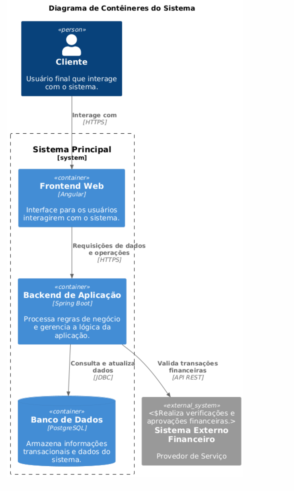
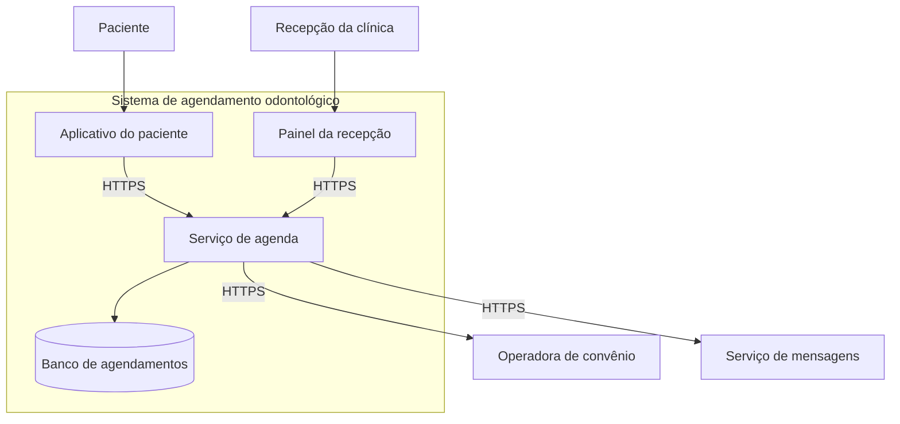
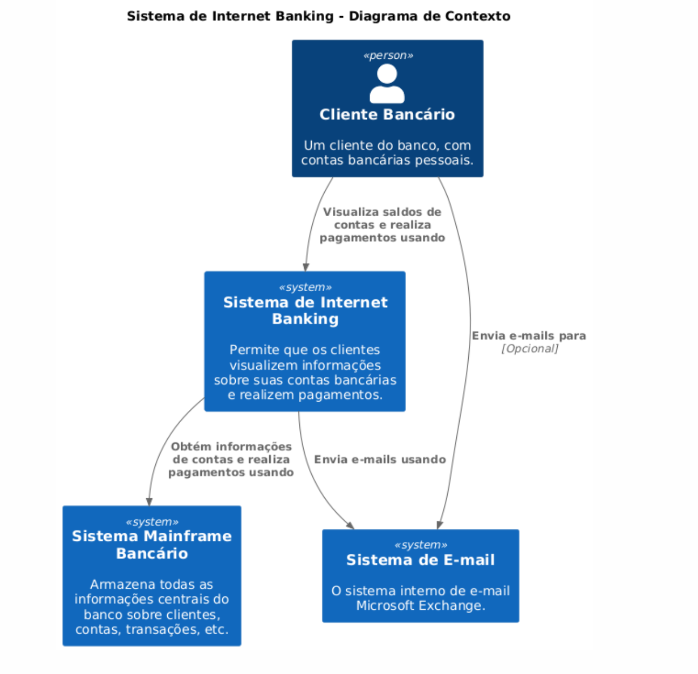
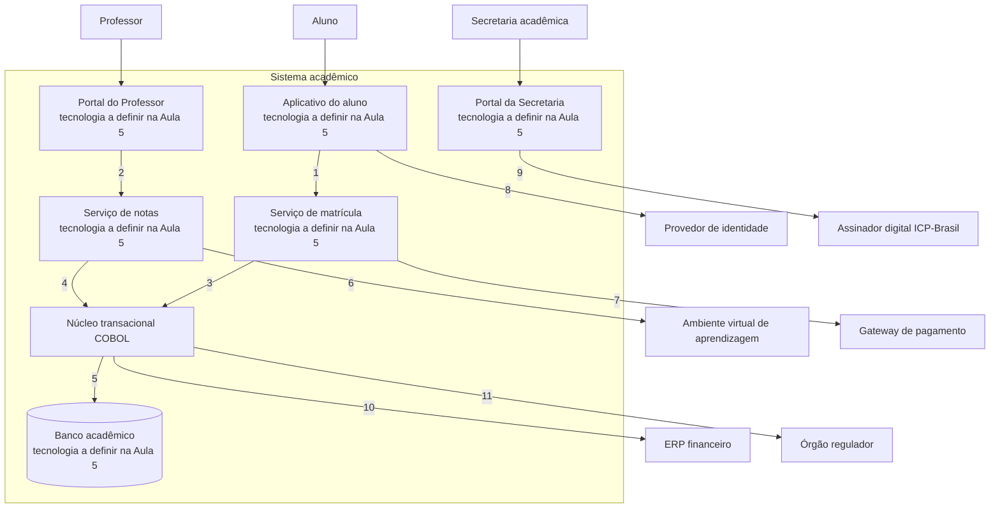

# Arquitetura de infraestrutura da solução

Este bloco conclui o detalhamento por domínios e responde onde a solução executa, como suas partes se conectam e o que cada interface exige, sem escolher produto ou provedor, decisão reservada à Aula 5.

## Antes de começar

- [Arquitetura de infraestrutura](../referencia/glossario.md#arquitetura-de-infraestrutura)
- [Modelo C4](../referencia/glossario.md#modelo-c4)
- [Bloco de construção da solução](../referencia/glossario.md#bloco-de-construcao-da-solucao)
- Diagrama de contexto corrigido no [exercício 15](bloco-3-arquitetura-de-aplicacoes-e-integracao.md#exercicio-15)

## Infraestrutura e contêineres

A **arquitetura de infraestrutura** é a arquitetura dos componentes e serviços tecnológicos que sustentam as atividades da organização, chamada de arquitetura de tecnologia no TOGAF (Lovatt, 2021, seção 2.7). Ela inclui equipamentos, sistemas operacionais, plataformas intermediárias, redes, comunicações, capacidade de processamento e padrões técnicos, e também ativos intangíveis, como contratos com fornecedores.

### Infraestrutura na solução

Os objetivos da arquitetura de infraestrutura são maximizar a eficácia e a eficiência do provimento e do uso da infraestrutura, eliminar duplicação de componentes e manter a infraestrutura alinhada às necessidades operacionais do negócio, que mudam com a estratégia e com a tecnologia disponível (Lovatt, 2021, seção 2.7.1). Muitos componentes de infraestrutura são invisíveis às partes interessadas de negócio, embora sustentem requisitos não funcionais como desempenho e confiabilidade, e por isso os modelos de infraestrutura servem de base para as visões de quem tem essas preocupações.

Os artefatos do domínio incluem o catálogo de tecnologia de infraestrutura, o modelo técnico de referência, o catálogo de padrões técnicos, a visão de configuração, a matriz entre aplicação e tecnologia e o modelo de plataforma (Lovatt, 2021, seção 2.7.2). A declaração formal da infraestrutura exigida por uma solução, chamada de definição tecnológica da solução, e o modelo técnico de referência são tratados na Aula 5. Este bloco permanece no nível lógico, com os contêineres que a solução precisa e as exigências de cada interface entre eles.

### A solução como grafo

Lovatt (2021, seção 7.5) propõe representar a solução como um grafo, em que cada bloco de construção é um vértice e cada interface é uma aresta. O grau de um vértice é o número de arestas ligadas a ele, e a soma dos graus de todos os vértices, dividida por dois, dá o número de interfaces da solução. Registrar o número de interfaces de cada bloco de construção permite, portanto, calcular o total de interfaces que a solução precisa sustentar.

Num exemplo genérico com cinco blocos de construção, dois blocos têm grau 3 e três blocos têm grau 2. A soma dos graus é 12, e a solução tem 6 interfaces. Cada uma dessas interfaces é examinada separadamente quanto ao tipo e ao volume de tráfego que passa por ela, porque é desse exame que sai a exigência de comunicação que a infraestrutura precisa atender. Lovatt lembra que nem toda interface usa rede, já que uma passagem entre dois processos pode ser manual, mas recomenda que todas sejam examinadas para que nenhuma seja esquecida.

<figure markdown="span">
{ .module-diagram }
</figure>

*Figura 1 — Solução como grafo de blocos de construção e interfaces. Fonte: material do curso, com base em Lovatt (2021, seção 7.5).*

### Diagrama de contêineres

O **diagrama de contêineres** detalha os principais contêineres que compõem o sistema, com suas responsabilidades e com a forma como interagem entre si e com os sistemas externos. Contêineres representam as aplicações, bancos de dados ou outros serviços que compõem o sistema, cada um com responsabilidade específica e tecnologia declarada. Sistemas externos e relações continuam presentes, com o mesmo significado do nível de contexto apresentado no [bloco 3](bloco-3-arquitetura-de-aplicacoes-e-integracao.md).

*Diagrama de contêineres genérico, com a decomposição interna do sistema e a tecnologia de cada contêiner. Fonte: material base do professor.*

O roteiro de montagem do diagrama de contêineres tem quatro etapas:

1. Identificar os sistemas externos com que o sistema principal interage diretamente, que são os mesmos do nível de contexto.
2. Definir os contêineres principais, como aplicação de interface, serviço de retaguarda ou banco de dados.
3. Descrever as relações entre contêineres e entre eles e os sistemas externos, especificando protocolo e direção.
4. Acrescentar a cada contêiner uma descrição curta da responsabilidade e da tecnologia usada.

No nível de contêineres, o sistema de agendamento odontológico apresentado no bloco 3 se decompõe sem que os atores e os sistemas externos mudem.

O par de sistemas externos, operadora de convênio e serviço de mensagens, é o mesmo nos dois níveis. Mudar esse conjunto entre um nível e outro quebra o princípio da coerência entre níveis, e a conferência precisa ser repetida sempre que os dois diagramas forem desenhados em momentos diferentes.

### Tecnologia no contêiner antes da definição tecnológica

O modelo C4 pede que cada contêiner declare sua tecnologia. Na arquitetura alvo construída nesta aula, a escolha de produto, de framework e de provedor ainda não foi feita, porque depende da plataforma arquitetural decidida na Aula 5. Por convenção do curso, os contêineres da arquitetura alvo levam o rótulo tecnologia a definir na Aula 5, e esse rótulo indica à Aula 5 exatamente quais decisões tecnológicas ela precisa tomar.

### Um exemplo completo nos dois níveis

O par de diagramas abaixo modela um sistema de internet banking, primeiro no nível de contexto e depois no de contêineres. Ele interessa a esta disciplina por um detalhe, o sistema mainframe bancário aparece como sistema externo, fora da caixa do sistema modelado.

*Nível de contexto do sistema de internet banking, com o mainframe tratado como sistema externo. Fonte: material base do professor.*

*Nível de contêineres do mesmo sistema, com a tecnologia declarada em cada contêiner e os mesmos dois sistemas externos do nível anterior. Fonte: material base do professor.*

A posição do mainframe fora da caixa resulta de uma decisão de escopo tomada pelo banco, que tratou o mainframe como sistema mantido por outra equipe, com o qual o internet banking apenas se comunica. O critério que decide a posição de um componente é a fronteira de responsabilidade sobre o sistema, e a idade ou a tecnologia do componente não interferem nessa decisão.

## Uso pelo arquiteto

O arquiteto escolhe o nível do diagrama pela audiência e pela decisão em pauta. Diante de uma parte interessada de negócio, que decide sobre escopo e sobre relação com terceiros, o diagrama de contexto é suficiente, porque nenhuma decisão sobre estrutura interna será tomada naquela reunião. Diante da equipe técnica, que precisa saber onde um requisito será implementado, o diagrama de contêineres é o nível mínimo útil, e o rótulo de cada relação com tipo, volume e latência transforma o diagrama na lista de exigências que a definição tecnológica da Aula 5 precisa atender.

## Exercício 16

Este exercício é realizado fora do horário de aula, como atividade de aplicação do conceito apresentado neste bloco ao caso da instituição fictícia ACME.

A ACME é uma universidade privada brasileira com 38.400 alunos ativos, cujo sistema acadêmico, em operação desde 2004, passa por modernização incremental. O exercício parte do diagrama de contexto corrigido no [exercício 15](bloco-3-arquitetura-de-aplicacoes-e-integracao.md#exercicio-15) e dos fatos abaixo, reproduzidos dos [dados operacionais](../caso-acme/dados-operacionais.md), da [arquitetura de linha de base](../caso-acme/linha-de-base.md) e da [página inicial do caso](../caso-acme/index.md).

| Fato | Valor |
| --- | --- |
| Sessões simultâneas no pico, nos 30 minutos seguintes à abertura da matrícula | 5.800 |
| Matrículas confirmadas nesses 30 minutos | 2.400 |
| Sessões simultâneas em dia letivo comum | 640 |
| Lançamentos de nota exportados ao ambiente virtual em dia letivo comum | 4.800 |
| Lançamentos de nota exportados na janela de fechamento | até 360.000 |
| Requisito R6 | Percentil 95 do tempo de confirmação da matrícula em até 4 segundos, com 5.800 sessões simultâneas |
| Requisito R7 | Nota lançada pelo professor no ambiente virtual em até 10 minutos |

O artefato fornecido é o diagrama de contêineres da arquitetura alvo do primeiro ciclo, coerente com o diagrama de contexto corrigido no exercício 15. Cada contêiner novo leva o rótulo tecnologia a definir na Aula 5, e as relações estão apenas numeradas, sem rótulo de comunicação.

1. Rotule cada relação numerada com o modo de comunicação, síncrono ou assíncrono, e com o volume e a latência exigidos, usando os fatos da tabela quando se aplicarem e escrevendo não informado quando o dossiê não trouxer o dado.
2. Indique quais relações sustentam diretamente os requisitos R6 e R7.
3. Responda, em uma frase, por que o núcleo transacional COBOL permanece como contêiner na arquitetura alvo do primeiro ciclo.

As relações rotuladas neste exercício são a lista de exigências de comunicação que a definição tecnológica da Aula 5 recebe como entrada.

## Fontes

As referências seguem o formato APA, 7ª edição, e constam da [bibliografia](../referencia/bibliografia.md) do curso. O trecho consultado aparece entre parênteses ao fim de cada entrada.

- Lovatt, M. (2021). *Solution architecture foundations*. BCS, The Chartered Institute for IT. (seção 2.7, arquitetura de infraestrutura, objetivos, artefatos e relação com a solução, e seção 7.5, infraestrutura de rede e solução como grafo)
- Brown, S. (n.d.). *The C4 model for visualising software architecture*. https://c4model.com (sítio oficial do modelo C4)
- Mendes, M. (2026b). *Guias de projeto de arquitetura de software* [Material de curso, versão arquivada]. https://github.com/aulas-marco/projeto-arquitetura-software/tree/30f15cd (guias 3.1, 3.2 e 3.3, fonte dos elementos do diagrama de contêineres, do roteiro de montagem e das três figuras reproduzidas nesta página)

**Material do curso.** O bloco usa as entradas [arquitetura de infraestrutura](../referencia/glossario.md#arquitetura-de-infraestrutura), [modelo C4](../referencia/glossario.md#modelo-c4) e [bloco de construção da solução](../referencia/glossario.md#bloco-de-construcao-da-solucao) do glossário, além do dossiê da instituição fictícia [ACME](../caso-acme/index.md) e dos seus [dados operacionais](../caso-acme/dados-operacionais.md).
