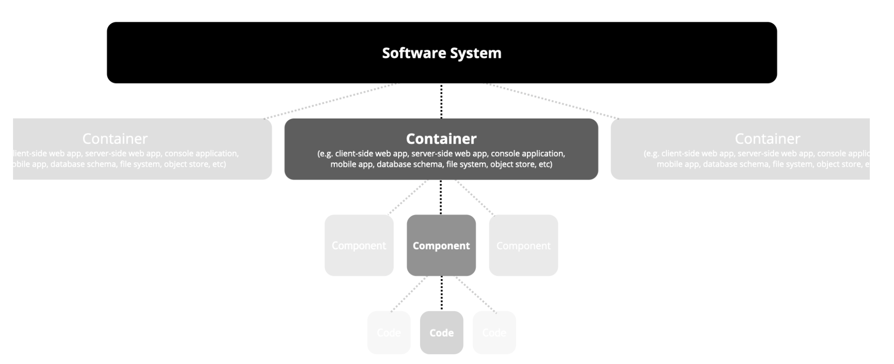
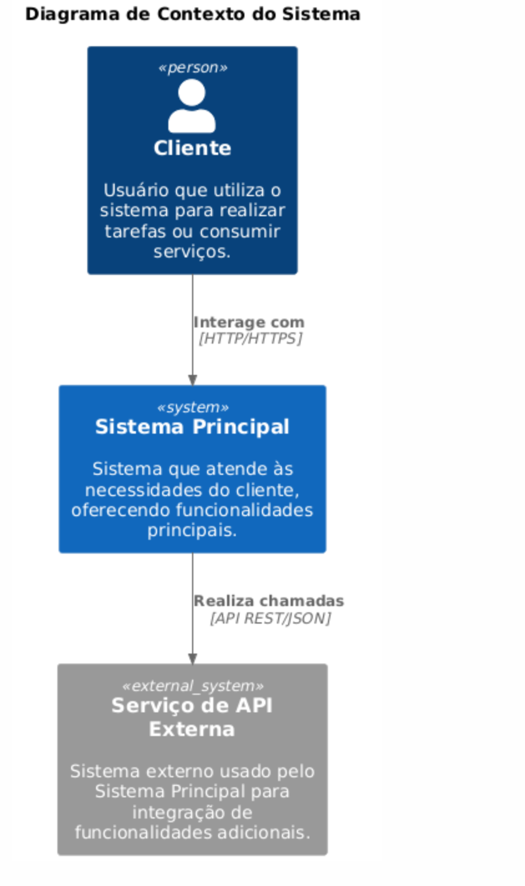
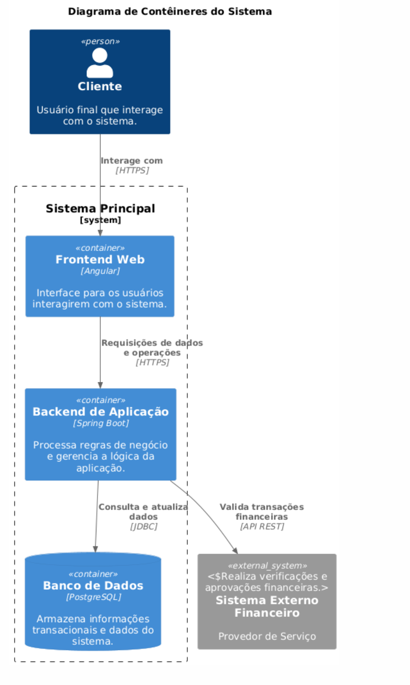
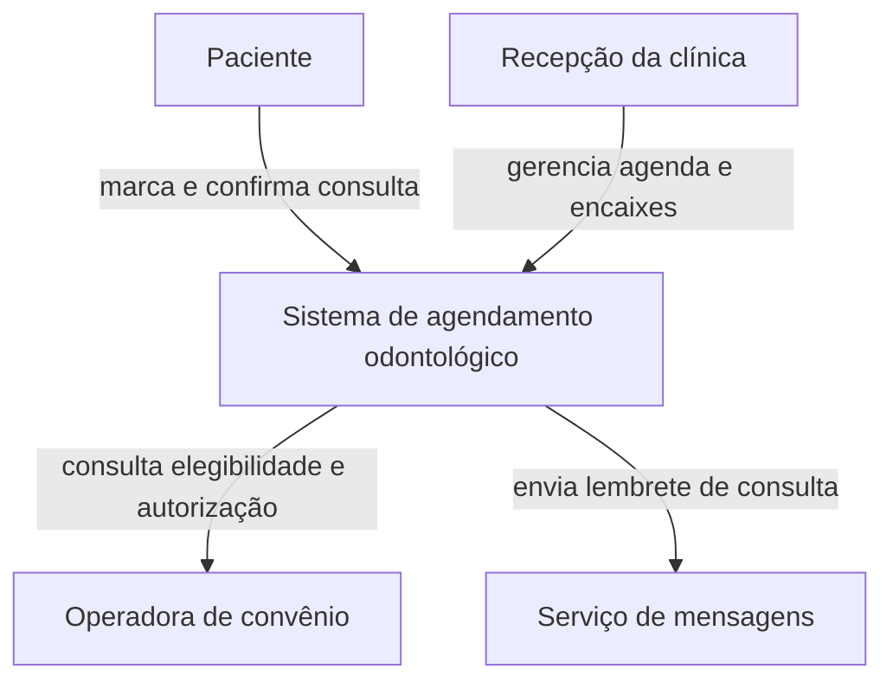
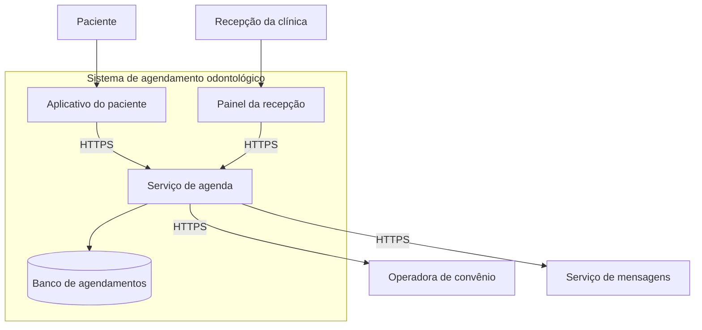
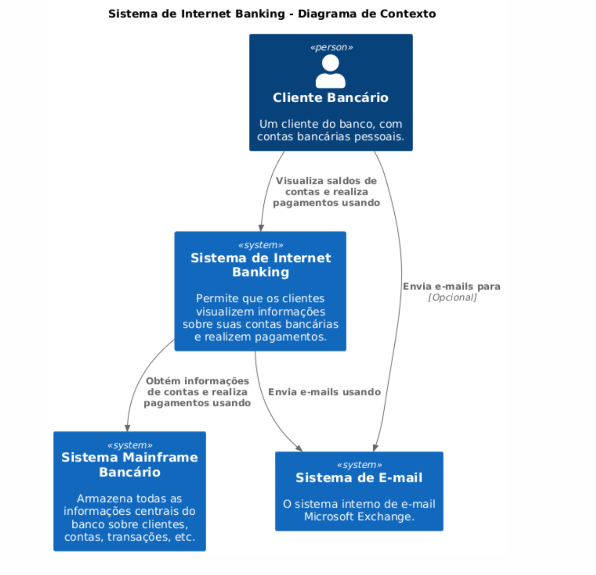

# Representação de modelos e C4

Este bloco fecha a aula tratando de uma pergunta anterior às duas decisões já registradas, como representar o sistema de forma que estilo e plataforma fiquem visíveis num modelo, não apenas descritos em texto.

## Antes de começar

- [Modelo C4](../referencia/glossario.md#modelo-c4)

## Conceito

Um diagrama solto e um modelo arquitetural não são a mesma coisa. O diagrama solto nasce de uma conversa, usa símbolos escolhidos na hora e serve àquela conversa. O modelo tem convenção declarada, define o que cada forma significa e o que cada nível de detalhe pode ou não conter, e por isso continua legível para quem não estava na sala. A diferença prática aparece quando duas pessoas desenham o mesmo sistema. Com convenção, os dois desenhos são comparáveis. Sem convenção, cada um inventa a sua e o desenho vira ilustração.

O **modelo C4**, criado por Brown (n.d.), é uma dessas convenções. Ele organiza a descrição do sistema em quatro níveis de abstração, que permitem compreensão progressiva de acordo com o público e o propósito da documentação. O nome vem das iniciais dos quatro níveis em inglês, Context, Containers, Components e Code. O modelo inteiro se chama C4 porque tem quatro níveis, e cada nível tem nome próprio, o que significa que o quarto nível se chama Código, não C4 outra vez.

*Os quatro níveis de abstração do C4. Fonte: [c4model.com](https://c4model.com), reproduzido do material base do professor.*

Cada nível responde a uma pergunta diferente e atende a um público diferente. É essa correspondência, e não a quantidade de detalhe, que decide qual diagrama usar em cada situação.

| Nível | Pergunta que responde | Público |
| --- | --- | --- |
| Contexto | O que o sistema faz? | Partes interessadas não técnicas que precisam entender o escopo geral |
| Contêineres | Como o sistema funciona como um todo? | Arquitetos e desenvolvedores, para entender a estrutura de alto nível |
| Componentes | Como cada parte de um contêiner é estruturada? | Desenvolvedores que implementam ou mantêm o sistema |
| Código | Como a implementação de um componente é realizada? | Desenvolvedores em nível de detalhamento máximo |

Esta aula cobre os dois primeiros níveis. Os níveis de componentes e de código existem e seguem a mesma lógica de decomposição, mas ficam fora do escopo aqui.

Três princípios organizam o uso das abstrações. A progressividade pede começar pela visão ampla e descer ao detalhe, alinhando o nível ao público e ao propósito. A coerência pede manter as abstrações alinhadas entre os níveis, para que o que aparece como contêiner no nível 2 não reapareça como sistema externo no nível 1. O foco no propósito pede que cada diagrama tenha um objetivo claro e responda à pergunta de um grupo específico de interessados.

### Nível 1, diagrama de contexto

O **diagrama de contexto** fornece uma visão ampla do sistema modelado e de como ele se relaciona com os atores externos. Ele comunica os limites do sistema e as interações de alto nível, e por isso trabalha com apenas três tipos de elemento. Pessoas representam os atores humanos que interagem diretamente com o sistema, sejam usuários finais ou outras partes interessadas. Sistemas de software representam tanto o sistema sendo modelado quanto os outros sistemas com que ele se comunica. Relações demonstram como atores e sistemas externos interagem com o sistema principal, descrevendo o meio e o protocolo usados.

*Diagrama de contexto genérico, com os três tipos de elemento e as relações rotuladas por protocolo. Fonte: material base do professor.*

O roteiro para montar esse diagrama tem cinco etapas. Identifique o sistema de interesse, determinando qual sistema é o foco do modelo. Defina os atores externos, identificando as pessoas que interagem com ele. Liste os sistemas externos que trocam informação diretamente com o sistema principal. Desenhe as relações, conectando pessoas e sistemas ao sistema principal, com descrição clara da interação e do protocolo. Acrescente descrição a cada elemento, para que o diagrama seja compreensível por todos os interessados, inclusive os que não participaram do desenho.

### Nível 2, diagrama de contêineres

O **diagrama de contêineres** detalha os principais contêineres que compõem o sistema, com suas responsabilidades e com a forma como interagem entre si e com os sistemas externos. Contêineres representam as aplicações, bancos de dados ou outros serviços que compõem o sistema, cada um com responsabilidade específica e tecnologia declarada. Sistemas externos e relações continuam presentes, com o mesmo significado do nível anterior.

*Diagrama de contêineres genérico, com a decomposição interna do sistema e a tecnologia de cada contêiner. Fonte: material base do professor.*

O roteiro aqui tem quatro etapas. Identifique os sistemas externos com que o sistema principal interage diretamente, que são os mesmos do nível 1. Defina os contêineres principais, como aplicação de interface, serviço de retaguarda ou banco de dados. Descreva as relações entre contêineres e entre eles e os sistemas externos, especificando protocolo e direção. Acrescente a cada contêiner uma descrição curta da responsabilidade e da tecnologia usada.

Os mesmos dois níveis em notação Mermaid, que é a notação usada neste site, aplicados a uma plataforma de agendamento de consultas odontológicas.

No nível de contêineres, o mesmo sistema se decompõe sem que os atores e os sistemas externos mudem.

Note que o par de sistemas externos, operadora de convênio e serviço de mensagens, é o mesmo nos dois níveis. Mudar esse conjunto entre um nível e outro quebra o princípio da coerência, e vale conferir isso sempre que os dois diagramas forem desenhados em momentos diferentes.

### Um exemplo completo nos dois níveis

O par de diagramas abaixo modela um sistema de internet banking, primeiro no nível de contexto e depois no de contêineres. Ele interessa a esta disciplina por um detalhe, o sistema mainframe bancário aparece como sistema externo, fora da caixa do sistema modelado.

*Nível de contexto do sistema de internet banking, com o mainframe tratado como sistema externo. Fonte: material base do professor.*

*Nível de contêineres do mesmo sistema, com a tecnologia declarada em cada contêiner e os mesmos dois sistemas externos do nível anterior. Fonte: material base do professor.*

A decisão de colocar o mainframe fora da caixa é uma decisão de escopo, não uma regra do modelo. Ali, o banco tratou o mainframe como sistema de terceiro, mantido por outra equipe, com o qual o internet banking apenas conversa. Na ACME, o núcleo COBOL sobre CICS é mantido pela mesma organização e faz parte do sistema acadêmico, então ele fica dentro da caixa, como contêiner. O critério é a fronteira de responsabilidade sobre o sistema, não a idade nem a tecnologia do componente.

## Uso pelo arquiteto

O arquiteto escolhe o nível pela audiência, não pela quantidade de informação que gostaria de mostrar. Diante de uma parte interessada de negócio, que decide sobre escopo e sobre relação com terceiros, o diagrama de contexto é suficiente e o de contêineres é ruído, porque ninguém naquela mesa vai decidir sobre tecnologia interna. Diante da própria equipe técnica, que precisa saber onde um requisito será implementado, o diagrama de contexto é vago demais e o de contêineres é o mínimo útil.

O erro simétrico também existe. Levar o diagrama de contêineres a uma reunião de orçamento costuma deslocar a discussão para escolhas de tecnologia que não estavam em pauta, e levar o diagrama de contexto a uma reunião técnica costuma terminar com alguém desenhando o nível seguinte no quadro branco.

## Exercício 16

A ACME é a universidade privada brasileira em modernização incremental do sistema acadêmico. O núcleo transacional em COBOL sobre o monitor CICS concentra as regras acadêmicas, uma camada web em JSF e EJB serve os portais de acesso, um banco Oracle guarda o estado, e as integrações com o ERP financeiro e com o ambiente virtual de aprendizagem são resolvidas por arquivo, em lote noturno, conforme a [arquitetura de linha de base](../caso-acme/linha-de-base.md).

1. Desenhe o diagrama de contexto da ACME, identificando o sistema acadêmico como caixa única, os atores humanos e os sistemas externos, seguindo as cinco etapas do roteiro apresentado no Conceito.
2. Desenhe o diagrama de contêineres, decompondo o sistema acadêmico nos contêineres que a linha de base descreve, com a tecnologia de cada um, seguindo as quatro etapas do roteiro. Mantenha os mesmos sistemas externos que você usou no item 1.
3. Justifique em uma frase por que uma parte interessada de negócio precisaria ver apenas o diagrama do item 1.

Entregue os dois diagramas em Mermaid ou em desenho livre, à sua escolha. Um erro comum no item 1 é detalhar contêiner interno, o que mistura os dois níveis. Se o núcleo COBOL aparecer no diagrama de contexto, o item está no nível errado.

## Fontes

As referências seguem o formato APA, 7ª edição, e constam da [bibliografia](../referencia/bibliografia.md) do curso. O trecho consultado aparece entre parênteses ao fim de cada entrada.

- Brown, S. (n.d.). *The C4 model for visualising software architecture*. https://c4model.com (sítio oficial do modelo C4)
- Mendes, M. (2026b). *Guias de projeto de arquitetura de software* [Material de curso, versão arquivada]. https://github.com/aulas-marco/projeto-arquitetura-software/tree/30f15cd (guias 3.1, 3.2 e 3.3, fonte dos quatro níveis, dos princípios de abstração, dos elementos de cada diagrama, dos dois roteiros de montagem e das três figuras reproduzidas nesta página)

**Material do curso.** Glossário, entrada [modelo C4](../referencia/glossario.md#modelo-c4). Dossiê da instituição fictícia [ACME](../caso-acme/index.md) e [arquitetura de linha de base](../caso-acme/linha-de-base.md).
